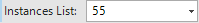
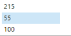
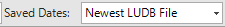
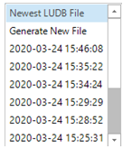

# Debug Table Population

A [Table Population](/articles/07_table_population/01_table_population_overview.md) is a Fabric Studio component that defines and executes the mapping and data[ transformation rules](/articles/07_table_population/05_table_population_mode.md) from a data source, like a DB table or Input file, into a target [Logical Unit (LU) table.](/articles/03_logical_units/01_LU_overview.md) 

The Table Population window is used to define and display the transformation rules that are applied to data when it is loaded into a Fabric database.

The following is an example of the Table Population window:

The The new population debug uses get/ref sync commands over the local fabric server and not the existing Sqlite files from the data viewer as before.

The Population window has a **Debug** option which activates a [GET LUI](/articles/02_fabric_architecture/04_fabric_commands.md#get-lui-commands) Fabric command over the local Fabric debug server.  

The mapped data is displayed in the Population Window working area and errors, if they exist, are displayed in the [Log window](02_fabric_studio_log_files.md). 

In the Table Population a source object can return one or many records whereby each output record is mapped and populated into a target LU table. A Debug process can be executed on each record in the population.

### How do I Use the Debug Toolbar?

The **Debug Toolbar** is used to test the Table Population map by executing its population logic on a selected [Instance ID](/articles/01_fabric_overview/02_fabric_glossary.md#instance-id).
* When the execution is successful, the values of the Input and Output fields are displayed in the working area above the connection lines between the source and the target. 
* If there is an error, it is displayed in the Fabric Studio [Server Log](02_fabric_studio_log_files.md) section.

The **Debug Toolbar** has the following icons:

<table>
<tbody>
<tr>
<td width="200pxl">&nbsp; </td>
<td width="700pxl">

Sync Mode. Sync mode values:

<li><strong>Sync On</strong>. This is the default value. Set the&nbsp;<a href="/articles/14_sync_LU_instance/02_sync_modes.md">sync mode</a> to ON when running the <a href="/articles/02_fabric_architecture/04_fabric_commands.md#get-lui-commands">GET LUI</a> command on the selected Instance.</li>
<li><strong>Sync Force</strong>. Set the&nbsp;<a href="/articles/14_sync_LU_instance/02_sync_modes.md">sync mode</a> to FORCE when running the <a href="/articles/02_fabric_architecture/04_fabric_commands.md#get-lui-commands">GET LUI</a> command on the selected Instance.</li>
<li><strong>New</strong>. Delete the LUI (Instance) from the local Fabric debug server and and run GET LUI with a sync ON mode to get the selected Instance.</li>
<li><strong>Attach</strong>. Listens to external sync in the local Fabric debug server which activates the population debug. Displays the input and output values for the table population.</li>
</td>
</tr>
<tr>
<td width="200pxl">&nbsp; </td>
<td width="700pxl">

If checked, the sync of the Instance will be committed on local Fabric debug server. Otherwise, the sync transaction is rollbacked on the local Fabric debug server. By default, this checkbox is unchecked.

</td>
</tr>
<tr>
<td width="200pxl">&nbsp; </td>
<td width="700pxl">

Populate the LUI (instance ID) for the debug.

</td>
</tr>
<tr>
<td width="200pxl">&nbsp; </td>
<td width="364">

Displays the current record&rsquo;s number.

</td>
</tr>
<tr>
<td width="200pxl">&nbsp; </td>
<td width="364">

Execute Debug, Debug Next Record, and Stop Debug.

</td>
</tr>
</tbody>
</table>

==========================

<table>
<tbody>
<tr>
<td width="200pxl">&nbsp; </td>
<td width="500pxl">

Enable / Disable Debug.

By default, the Debug icon is disabled. To enable Debug Mode and display its icons on the toolbar, click the Debug icon.

</td>
</tr>
<tr>
<td width="200pxl">&nbsp; </td>
<td width="364">

Displays a list of <a href="/articles/01_fabric_overview/02_fabric_glossary.md#instance-id">Instance IDs</a> for which the LUDB file exists.

Either search for the Instance ID or select it from the dropdown list of debugged Instance IDs.

</td>
</tr>
<tr>
<td width="200pxl">&nbsp; </td>
<td width="364">

Displays a list of existing LUDB files.

Click to select the file from the existing LUDB files or generate a new one. By default, the newest LUDB file is selected for the Debug&rsquo;s execution. &nbsp;&nbsp;

</td>
</tr>
<tr>
<td width="200pxl">&nbsp; </td>
<td width="364">

Displays the current record&rsquo;s number.

</td>
</tr>
<tr>
<td width="200pxl">&nbsp; </td>
<td width="364">

Execute Debug Mode: Options include Debug, Debug Next Record or Debug Next Instance which enable moving between the returned records.

</td>
</tr>
</tbody>
</table>

<table>
<tbody>
<tr>
<td width="200pxl">&nbsp; </td>
<td width="500pxl">

Enable / Disable Debug.

By default, the Debug icon is disabled. To enable Debug Mode and display its icons on the toolbar, click the Debug icon.

</td>
</tr>
<tr>
<td width="200pxl">&nbsp; </td>
<td width="364">

Displays a list of <a href="/articles/01_fabric_overview/02_fabric_glossary.md#instance-id">Instance IDs</a> for which the LUDB file exists.

Either search for the Instance ID or select it from the dropdown list of debugged Instance IDs.

</td>
</tr>
<tr>
<td width="200pxl">&nbsp; </td>
<td width="364">

Displays a list of existing LUDB files.

Click to select the file from the existing LUDB files or generate a new one. By default, the newest LUDB file is selected for the Debug&rsquo;s execution. &nbsp;&nbsp;

</td>
</tr>
<tr>
<td width="200pxl">&nbsp; </td>
<td width="364">

Displays the current record&rsquo;s number.

</td>
</tr>
<tr>
<td width="200pxl">&nbsp; </td>
<td width="364">

Execute Debug Mode: Options include Debug, Debug Next Record or Debug Next Instance which enable moving between the returned records.

</td>
</tr>
</tbody>
</table>

