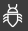
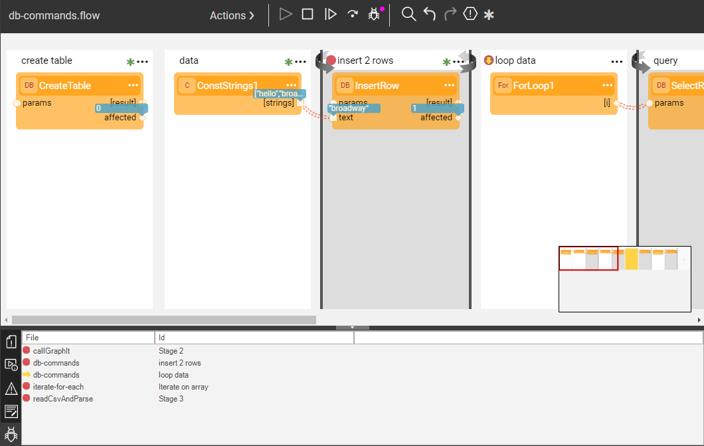

# Breakpoints Panel

Fabric Studio provides an ability to view all active breakpoints. 

Click  icon in the **Server / Activity Logs area** to open the Breakpoints panel which displays a list of breakpoints in the open Fabric files (currently only [Broadway flows](/articles/19_Broadway/18_broadway_flow_window.md) are supported). This breakpoints list includes the File name (for example, a Broadway flow name) and the ID where the breakpoint was set in a file (for example, the Stage name).

The panel is refreshed every 1 sec, but only when it is open and visible to the user. The yellow arrow sign on the panel indicates the breakpoint at which the flow has stopped.

Double-click on the breakpoint in the panel to bring the related file to the front.

Known limitation: if the breakpoints panel displays several flows with the same name that belong to different [Logical Units](/articles/03_logical_units/01_LU_overview/md), the double-click will open the first flow with such name that it finds (now necessarily the correct one).

