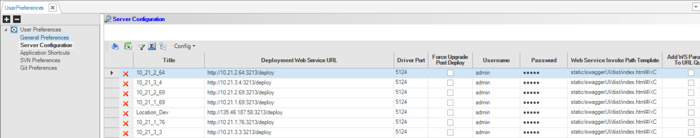

# Sync Modes

## Set Sync Command 
The Fabric **SET SYNC** command is used to define the synchronization mode of an instance from source systems. The default value is On.

* Syntax: SET SYNC [SYNC MODE];

## Sync Modes
<table style="width: 600px;">
<tbody>
<tr>
<td style="width: 90px;">

<strong>Sync Mode</strong>

</td>
<td style="width: 160px;">

<strong>Description</strong>

</td>
<td style="width: 350px;">

<strong>When is an Instance Synced?</strong>

</td>
</tr>
<tr>
<td style="width: 76px;">

ON

</td>
<td style="width: 146px;">

Run a sync according to the <a href="/articles/14_sync_LU_instance/04_sync_methods.md">Sync method</a> which can be None, Time Interval, Inherited or Decision Function.

</td>
<td style="width: 316px;">
<ul>
<li>The <a href="/articles/03_logical_units/03_LU_schema_window.md"> LU Schema </a> has changed and is redeployed.</li>
<li>First sync, the instance does not yet exist in Fabric.</li>
<li>Sync the instance according to the predefined Sync method set for each <a href="/articles/06_LU_tables/01_LU_tables_overview.md">LU table</a> and <a href="/articles/07_table_population/01_table_population_overview.md">table population object.</a></li>
</ul>
</td>
</tr>
<tr>
<td style="width: 76px;">

OFF

</td>
<td style="width: 146px;">

Don't sync.

</td>
<td style="width: 316px;">

Synchronization is not performed, however if the LU instance already exists in Fabric, it will bring the existing LU instance data based on the most updated LU Schema definition.

If the LU instance does not yet exist in Fabric, &nbsp;the following warning message is displayed:<i>Instance '&lt;LU Name&gt;:&lt;Instance ID&gt;' was not found and Sync is disabled.</i>

</td>
</tr>
<tr>
<td style="width: 76px;">

FORCE

</td>
<td style="width: 146px;">

Always sync.

</td>
<td style="width: 316px;">

Synchronization is performed on every operation on the Fabric LU instance, regardless of the sync method definitions of the LU.

The only exception is when using a <a href="/articles/14_sync_LU_instance/05_sync_decision_functions.md">Decision function</a>. If the Decision function returns False, the data is not synced.

</td>
</tr>
<tr>
<td style="width: 76px;">

DELTA

</td>
<td style="width: 146px;"> 

Delta sync.

</td>
<td style="width: 316px;">

Valid in the iidFinder in Delta Partition mode when there is no delta will be running in Sync Off mode otherwsie Sync On.

</td>
</tr>
</tbody>
</table>

Note that the sync returns an error message when a source is not available. To change this, use the [set ignore_source_exception true](/articles/14_sync_LU_instance/03_sync_ignore_source_exception.md) command.

## Sync On Protection

Sync On Protection improves the response time of multiple GET LUI requests on the same LUI and Fabric node. For example, when executing a stress test by running a Web Service with the same LUI on multiple threads. 

In principle, since each request requires a write lock in the LUI's MicroDB, multiple requests on the same LUI and Fabric node are executed sequentially if their Sync mode is set to ON. This means that even when LUI populations are not run, a short check can take a long time before the last GET is successful.

To avoid checking each LUI, Fabric implements Sync mode (Sync is set to ON) only on the first GET request on the LUI. Remaining requests are executed in parallel to the first request, and are executed with the Sync mode set to OFF.

SYNC_PROTECTION can be edited in the config.ini file: 

1. The default value is zero. When Sync is set to ON, Fabric implements the Sync only on the first request.
2. If this parameter is set to -1, Sync On Protection is disabled and Fabric implements the Sync on each request. All requests have Sync set to ON in this case. 
3. This parameter can be set in milliseconds. For example, if set to 1000, all Sync requests executed on the same LUI and Fabric node during the 1000ms after the first request run with the Sync mode set to OFF.  After 1000ms, and until the first GET request on the LUI is completed, Fabric sets the Sync mode to ON.

SYNC_PROTECTION can be disabled on the session level using the SET SYNC_PROTECTION=off command.

## Fabric Studio Server Configuration - Force Upgrade Post Deploy Checkbox
The **Force Upgrade Post Deploy** checkbox is defined for each predefined Fabric server in the [Server Configuration](/articles/04_fabric_studio/04_user_preferences.md#what-is-the-purpose-of-the-server-configuration-tab) window:

This checkbox defines the Sync mode of the first GET of each LU instance (LUI) after the LU is deployed to the server:
* If checked, the Sync mode is set to Force.
* When unchecked, the Sync mode is set to On.

**Notes**
* Checking / unchecking the **Force Upgrade Post Deploy** checkbox impacts the LU only after redeployment of the LU to the checked / unchecked Fabric server. It does not impact the LU instances retroactively.
* Sync mode is set to Force only for the first GET of each LUI after the redeployment of the LU.  
* Sync mode is set to Force for the first GET of each LUI even if the **Force Upgrade Post Deploy** checkbox is later unchecked. The LU is redeployed, and the instance is not synchronized while the **Force Upgrade Post Deploy** checkbox is still checked.

**Example 1**
* Set the [Sync Method](/articles/14_sync_LU_instance/04_sync_methods.md) of the Customer LU to **None**.
* Get Customer 1.
* Update the source DB of Customer 1. 
* Check the **Force Upgrade Post Deploy** checkbox of the Fabric development server and redeploy the Customer LU to this server. 
* Get Customer 1 again. The customer is synchronized and their data is updated since the  **Force Upgrade Post Deploy** checkbox set the sync mode to Force.
* Update the source data of Customer 1 again. 
* Get Customer 1 again. This time Customer 1 is **not** synchronized since the Sync mode is set back to On for the Customer after the first sync that was initiated by checking the **Force Upgrade Post Deploy** checkbox.

**Example 2**
* Set the [Sync Method](/articles/14_sync_LU_instance/04_sync_methods.md) of the Customer LU to **None**.
* Get Customers 1 and 2.
* Update the source DB of Customers 1 and 2.
* Check the **Force Upgrade Post Deploy** checkbox of the Fabric development server and redeploy the Customer LU to this server.
* Get Customer 2 again. This Customer is synchronized and their data is updated. 
* Uncheck the **Force Upgrade Post Deploy** checkbox of the Fabric development server and redeploy the Customer LU to this server. 
* Get Customers 1 and 2 again: 
  * Customer 1 is synchronized since this is their first GET after checking the **Force Upgrade Post Deploy** checkbox, even though this checkbox was later unchecked.
  * Customer 2 is **not** synchronized since it was already synchronized after checking the **Force Upgrade Post Deploy** checkbox.

[Click for more information about the Get LUI Fabric Command](/articles/02_fabric_architecture/04_fabric_commands.md#get-lui-commands).

## Get Sync Mode
The Fabric UserCode class holds the method that returns the Sync mode set for the current session: 

~~~java
public static String getSyncMode();
~~~

This method can be invoked by a [Decision function](/articles/14_sync_LU_instance/05_sync_decision_functions.md). For example:
If the Sync Mode is Force, then return True to sync the instance. Else, do not sync the instance.

To view the list of Fabric APIs, click **http://[Fabric IP address]:3213/static/doc/user-api/index.html**.

## Always Sync
The Always Sync mode enables synchronizing the attached LUI when running SELECT queries on the LUI. The sync of the LUI is executed before the execution of the SELECT queries. 

* Syntax: set always_sync=[true/false];

To define an Always Sync mode either:
- Set the ALWAYS_SYNC parameter of the [config.ini](/articles/02_fabric_architecture/04_fabric_commands.md#fabric-commands) file to True. The default value is False. 
- Run the **SET ALWAYS_SYNC=TRUE** command to set it to True on the session level. 

