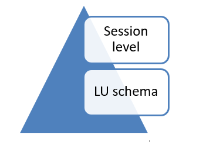

# Sync Timeout

By default, a sync transaction is not limited by time. However, you can limit the sync time of an LUI to avoid bottlenecks and stuck instances.

If a timeout is set and the sync exceeds the predefined timeout, Fabric rollbacks the changes and throws the following exception: *Timeout occurred*.

A sync timeout can be defined either per session or at an LU schema level.

### How Do I Set the Sync Timeout on an LU Schema?
The Sync property in the LU Schema Properties tab has the following setting:
* Timeout (sec) – Set a timeout in seconds for syncing LUI.
* By default, this field = 0 whereby no timeout is defined for the LU schema, however it can be edited so that the Sync Timeout is defined in seconds.

[Click for more information about Sync Properties.](/articles/14_sync_LU_instance/04_sync_methods.md)

### How Do I Set The Sync Timeout on a Session Level?
Use the following command to override the Timeout set for the LU schema:
* set sync_timeout;

Syntax: 
* set sync_timeout=<sync_timeout_sec>;
* set sync_timeout='' - to set timeout back to LU default value

For example:
* set sync_timeout=60;
* set sync_timeout='';

When Sync Timeout is defined on a session level, it applies to each sync on the LUIs, regardless of the Timeout value in the LU schema.

