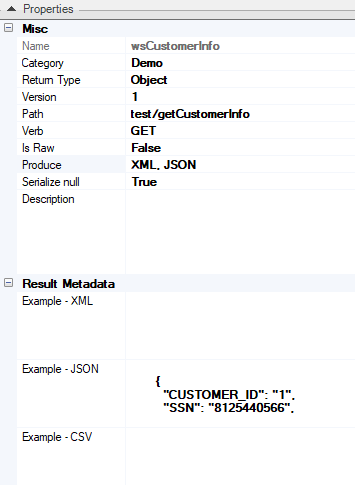
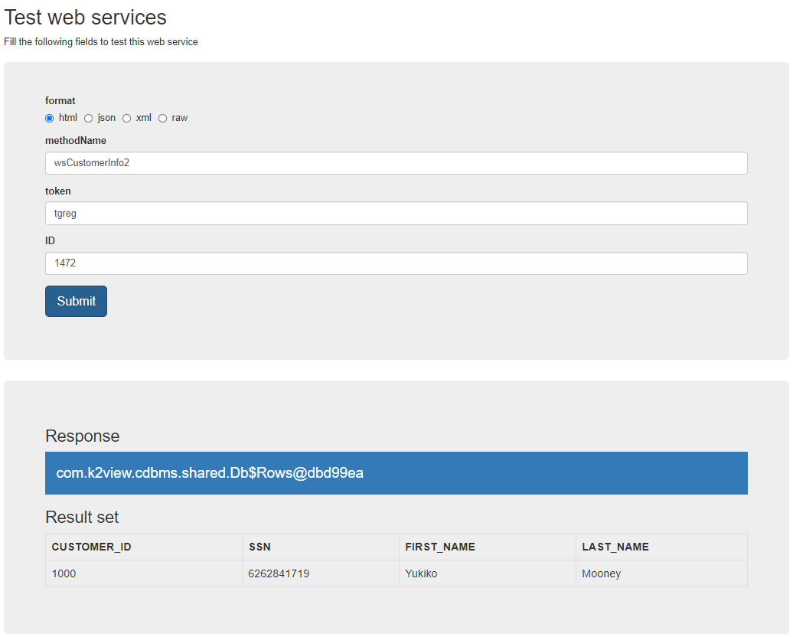

# **Web Service Properties** 

Fabric Web Services properties include the definitions, methods, categories and essential metadata that contribute to the main functionalities and characteristics of the Web Service.  

**Web Service Properties** are located on the top right corner of the **Web Service** window. 

 

 The following are the Web Services properties:

 <table width="900pxl">
<tbody>
<tr>
<td width="200pxl" valign="top" >
 <p><strong>Property</strong></p>
</td>
<td width="700pxl" valign="top" >
<p><strong>Description</strong></p>
</td>
</tr>
<tr>
<td  width="200pxl" valign="top">
<p>Name</p>
</td>
<td width="700pxl" valign="top"> 
 <p>Name of the assigned Web Service function. The assigned name should be meaningful and should have a ws% prefix.</p>
</td>
</tr>
<tr>
<td width="200pxl" valign="top">
<p>Category</p>
</td>
<td width="700pxl" valign="top">
 <p>Characteristics or class of the Web Service. Note that each category has a separate Java file.</p>
 </td>
</tr>
<tr>
<td width="200pxl" valign="top"><p>Return Type</p></td>
<td width="700pxl" valign="top">
<p>Type of Output value returned from the Web Service that is displayed in a dropdown list. For example, String, Long, Map, List, Customized Class or Object. Output values in the list can be overridden with new values.&nbsp; Fabric knows how to serialize complex structures automatically when sent as JSON in the request body. </p>
</td>
</tr>
<tr>
<td width="200pxl" valign="top"><p><h5>Version</h5></p></td>
<td width="700pxl" valign="top">
<p>Representation of the Web Service&rsquo;s versioning control status. A version is incorporated into the Web Service&rsquo;s URL and is used to enable several Web Service versions that are all related to the same service. By default, the version is populated by 1.</p>
<p><strong>Versioning Logic</strong>&nbsp;</p>
<ul>
<li>If the version is not part of the URL, the API will respond with the latest version.</li>
<li>If the version is part of the URL and the API version exists, the API will respond with the specified version.</li>
<li>If the version is part of the URL and the latest API version is lower, the API will respond with the latest version.</li>
<li>If the version is part of the URL and is lower than the lowest API version, the API will return the correct error response code.</li>
<li>If the version is part of the URL and is in between two API versions, the API will respond with the lower version.</li>
</ul>
</td>
</tr>
<tr>
<td width="200pxl" valign="top"><p><h5>Path</h5></p></td>
<td width="700pxl" valign="top">
<p>The URL path of the Web Service. The actual name to be called by external applications when using the Web Service.</p>
<p>The URL path requires permissions and should be unique per Path / Version / Response Format / Request Format.</p>
<p>Web Service Permissions:&nbsp;<strong>set on the URL with the parameter **token=** and its value.</strong>&nbsp;</p>
<p>For example, two Web Services sharing the same URL path:</p>
<ul>
<li>wsGetCustomerInfo version is set to 1.</li>
<li>wsGetCustomerInfoDev&nbsp;version is set to 2.</li>
</ul>
<p>For example:</p>
<p>http://localhost:3213/api/v1/getCustomerInfo?token=t1&amp;format=json&amp;customerId=543; When the above URL is run it invokes wsGetCustomerInfo. When the URL version is modified from v1 to v2, wsGetCustomerInfoDev is invoked.</p>
</td>
</tr>
<tr>
<td width="200pxl" valign="top"><p><h5>Verb</h5></p></td>
<td width="700pxl" valign="top">
<p>Methods supported by the Web Service, as follows:&nbsp;</p>
<ul>
<li><strong>GET</strong>, get data.&nbsp;</li>
<li><strong>POST</strong>, create new data based on the data provided.&nbsp;</li>
<li><strong>PUT</strong>, update data.&nbsp;</li>
<li><strong>DELETE</strong>, delete data.</li>
 </ul> 
<p>To select a method, click the dropdown list and enable it. Note that at least one method should be selected.</p>
</td>
</tr>
<tr>
<td width="200pxl" valign="top"><p><h5>Is Raw</h5></p></td>
<td width="700pxl" valign="top">
<p>Indicates whether the output structure should be manipulated automatically by Fabric.</p>
<p>Values are True or False.</p>
<p>Default = False. When True, Fabric brings the data response as is without parsing or formatting the response to be aligned with the Web Service's output format.</p>
</td>
</tr>
<tr>
<td width="200pxl" valign="top"><p><h5>Produce</h5></p></td>
<td width="700pxl" valign="top">
<p>Web Service&rsquo;s output format.</p>
<p>Default format: JSON</p>
<p>Additional formats: XML and CSV.</p>
 <p>To select the format/s, click the dropdown menu and enable them.</p>
</td>
</tr>
<tr>
<td width="200pxl" valign="top"><p><h5>Serialize null</h5></p></td>
<td width="700pxl" valign="top">
    <p>If True, display fields with a null value in the response. Else, ignore fields with null values. The default is True.</p>
    </td>    
</tr>    
<tr>
 <td width="200pxl" valign="top"><p><h5>Custom Payload</h5></p></td>
<td width="700pxl" valign="top"><p>Indicates whether input parameters are automatically acquired by Fabric from the input stream as defined in the input parameters pane, or if this is implemented by the implementor manually. <br/>Default is False, whereby input parameters are automatically handled by Fabric.</td>
</tr>
<tr>
<td width="200pxl" valign="top"><p><h5>Description</h5></p></td>
<td width="700pxl" valign="top"><p>Web Service&rsquo;s description on Swagger.</td>
</tr>
<tr>
<td width="200pxl" valign="top"><p><h5>Result Metadata</h5></p></td>
<td width="700pxl" valign="top">
<p>Response example to be displayed in Swagger before the Web Service call.</p>
<p>Set example-JSON, example-XML and example-CSV.</p>
</td>
</tr>
</tbody>
</table>    


## How Do I Generate HTML Format or Legacy JSON/XML ? 

To generate these formats, open the Java Logic file and add the following tag above the public class which encapsulates the Web Services defined in the specific Logic category:

```java 
@legacy
public class Logic extends WebServiceUserCode {...}
```

Then add the UNKNOWN value to the Produce function call in the line where the Web Service is defined: 

```java 
@webService(path = "test/getCustomerInfo", verb = {MethodType.GET, MethodType.POST, MethodType.PUT, MethodType.DELETE}, version = "1", isRaw = false, produce = {Produce.UNKNOWN})
```

Modify the Properties panel of the Web Service with Produce = "UNKNOWN" and Return Type = "Object". 

After deploying the Web Service, call it from the browser using the appropriate token, parameter and format.

Example with HTML format:
```html 
http://localhost:3213/api/test/getCustomerInfo?ID=1000&token=tgreg&format=html
```
The response is displayed in the body of the browser's web page:



[](/articles/15_web_services_and_graphit/03_create_a_web_service.md)[](/articles/15_web_services_and_graphit/04_web_services_function_basic_structure.md)
