# Create Custom-Built Web Service with Graphit

As a powerful low-code utility, Graphit enables web service planning and generation in a visualized layout, as well as inline testing capabilities. To learn more about Graphit utility - read [here](/articles/15_web_services_and_graphit/17_Graphit/01_graphit_overview.md).

A Graphit file is structured as a hierarchical representation of nodes, where each node defines an entry element in the structure of the JSON, XML or CSV document. 

<studio>

1. Go to **Project Tree**, click on **Web Services** > **Graphit** > right-click & choose **New Graphit File**. 

    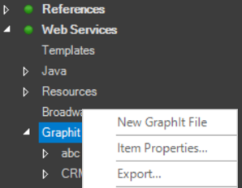

    A Graphit file opens, containing a newly created Graphit node, which should be populated.

2. Start with choosing, via a drop-down list, any of the below commands/functions (node types): 

    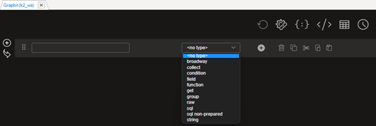

    Initiate the example by choosing a **get** command

    It is useful to place the **get** command - a function that retrieves the LUI (Logical Unit Instance) - in the beginning of the Graphit layout although it can be implemented on any of the nodes. 

3. From the open pop-up window, select an LU from the drop-down list and then click **Add**.

     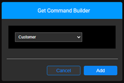
    Once this 1st node is created it will looks like this:

    

    You can later change the **get** command, when needed, by clicking on the  icon, triggering the *Get Command Builder* pop-up window again.

4. Click on the plus icon in order to add a sibling node to the example layout.

5. Name the newly created node by populating the left-hand-field.
    Note that only nodes with a tag name are displayed in the output document, when a Graphit web service is called.

6. Choose an **sql** command, as the node type, using the drop-down arrow. 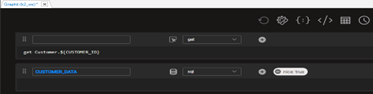

7. Click on the query builder icon  on the 2nd node, to generate a query in a Query Builder window.
    Read [here](https://support.k2view.com/Academy/articles/11_query_builder/01_query_builder_overview.html) for more information about Query Builder.

    Following the creation of the 2nd node and its population, a message pops up, asking whether you want to create table fields, i.e. laying out and exposing the SQL fields in the Graphit; choose **YES**.

    

    The below image shows the **nested nodes layout result** 

    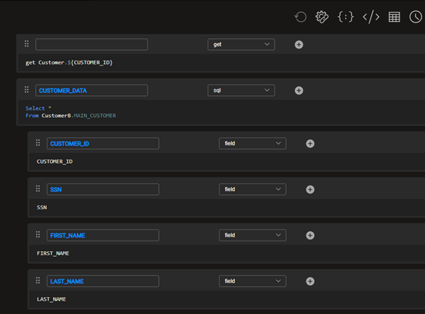

    Note that exposing the SQL fields is optional and even if you choose **NO**, the fields will be displayed in the output document. Yet, exposing them allows you to manipulate them. Sometimes it is preferred by implementors for a better visualized output document, seeing a full layout of the structure.

8. **Save** the Graphit file. A pop-up message will appear, asking you to assign a **Name** and a **Category** for your Graphit file.

    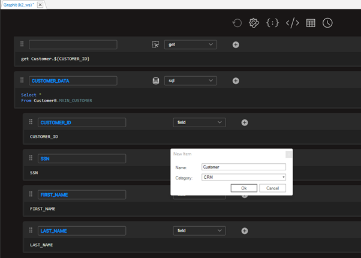

    Once **Ok**'ed, the newly created Graphit file name appears in the **Project tree**, under its category.

    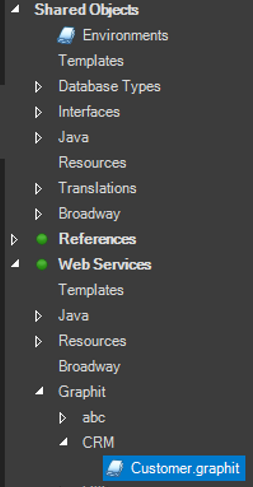

    You can see that it has automatically received a **'.graphit' suffix**.

</studio>

<web>

1. Go to **Project Tree**, click on **Implementation** -> **Logical Units / Data Products** -> **Web Services**
2. Expand **Web Services** -> right-click on **Graphit/Demo** and choose **New Graphit**

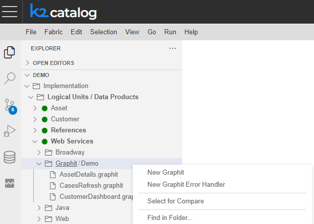

3. Click on **Choose Category** to select an existing category name for the Graphit file

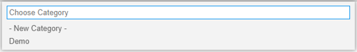

or click on **New Category** to enter a new category name, followed by *Enter* for saving it

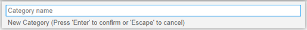

The following step is to enter a name for your new Graphit file, followed by *Enter* for saving it. Note that the name should contain only alpha-numeric characters.

Using the file name you can control and set both the web-service version and its verb. For more information - read [here](09_custom_ws_properties.md#Graphit). The popup itself provides some hints about the recommended naming conventions.

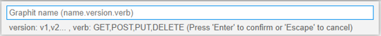

Once the Graphit file is saved, its name appears at the **top of its layout**

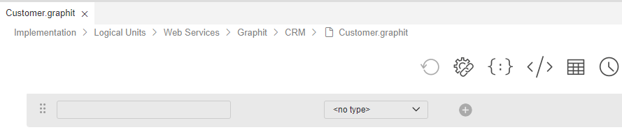

as well as in the **Project tree**, under its category.

You can see that it has automatically received a **'.graphit' suffix**.

</web>

To learn more about editing a Graphit file - using the Graphit Editor - read [here](/articles/15_web_services_and_graphit/17_Graphit/02_graphit_basic_editing.md).

> NOTE: Prior to  Fabric 7, Graphit files were located only under Java/resources folder. This option is still available, for backward compatibility.

