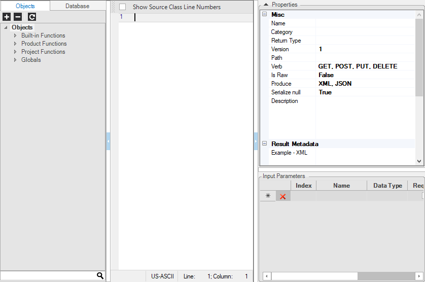
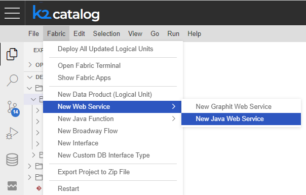

# Create Custom Java Web Service

The following steps discuss how a new Java based Web Service is created and include options (steps 2-8) for generating parts of code automatically:

<studio>

1. Go to **Project Tree**, right click **Web Services** > **New Web Service** to display the **Function Editor** window.

   

   

2. Click either the **Objects** or **Database** tab (left pane) and then either > **DB Interface**, **Newest Reference File**, or **Newest** **LU File**.

3. Select the preferred **DB Connection**. To access Fabric, select **Newest**  [**LU Name**](/articles/03_logical_units/01_LU_overview.md). Note that for the newest file of an LU to be part of the DB Connections list, at least one LUI must be executed using the [**Data Viewer**](/articles/13_LUDB_viewer_and_studio_debug_capabilities/01_data_viewer.md) .

     

4. Click the **DB File** icon to display the **Logical Unit Tables** list.

     

5. Click the **table** that retrieves the data, check the **Columns list** and right click the **column** that is the **Input** parameter for data retrieval. 

6. Click **Add Selected to Input Parameters**.

    

   Note that the Column Name, Data Type, Mandatory and Comments are displayed in the Input Parameters list in the lower right pane.


7. Select the **Column/s** to be retrieved or press the **CTRL key** to select multiple columns. Right click and select **Generate Code** to automatically create the **Select Statement** and **Basic Code Structure**. 


   The generated code is displayed in the Java Editor window and includes the basic structure of the call to the interface or LUDB and the Fetch method. Note that you can also write your own code. 

     

8. Once the code is generated, edit the function based on the logic to be applied. For example:

   <p>Db.Rows rows = ludb("Customer", &lt;instanceID&gt;).fetch(sql, &lt;val1&gt;, &lt;val2&gt;, ...);</p>
   <p>Replace the <strong>&lt;instanceID&gt; placeholder</strong> with the input parameter <strong>CUSTOMER_ID</strong>.</p>
   <p>Db.Rows rows = ludb("Customer", CUSTOMER_ID).fetch(sql);</p>

9. Set the [**Web Service Properties**](02_web_services_properties.md) in the right pane.

</studio>


<web>

1. At Fabric top menu choose **New Web Services** > **New Java Web Service**.

     

2. In the pop-up input box at the top of the screen select a category from list or choose to create new one.

3. In the next pop-up input box fill in the name for the web service.

4. The Logic Java file will be then opened and populated with the default template skeleton of a web service function.
```java
@desc("")
@webService(path = "", verb = {MethodType.GET, MethodType.POST}, version = "1", isRaw = false, isCustomPayload = false, produce = {Produce.XML, Produce.JSON}, elevatedPermission = false)
@resultMetaData(mediaType = Produce.JSON, example = "")
public static void webServiceName(@param(description="") String param1) throws Exception {
}
```
5. Write your web service logic in the Java Editor.
6. Set the [Web Service Properties](09_custom_ws_properties.md) by changing the function annotations. 

> Notes that you can add web services function by pressing CTRL -> SPACE and selecting the requested snippet (hint: start typing fabric to reveal the required one - "fabric-function-ws").

</web>


[](06_custom_ws_create_graphit_ws.md)[](08_custom_ws_input_parameters.md)
