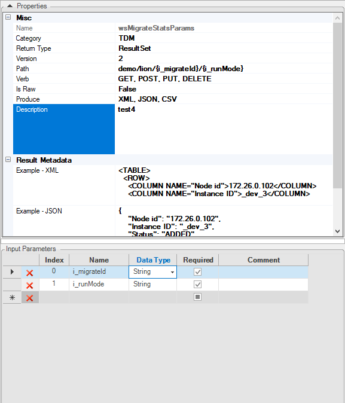

# Custom Web Services Input Parameters

Fabric lets you to pass input parameters to the custom web services, with various ways to define it and with flexibility when passing them. 

## Defining The Input Parameters

Fabric provides easy methods to define the expected input parameters for a web service, either Graphit or Java function. For each of the parameters you can define its name, type and if it mandatory.

To learn how to define input parameters for Graphit read [here](/articles/15_web_services_and_graphit/17_Graphit/06_using_graphit_files_with_parameters.md)

<studio>

To learn how to define input parameters for Java function read [here](/articles/07_table_population/10_creating_a_project_function.md#how-do-i-define-a-functions-parameters-manually)

</studio>

<web>

To learn how to define input parameters for Java function using annotations read [here](/articles/15_web_services_and_graphit/10_annotations.md#param)

</web>

## Transferring The Input Parameters 

Input parameters can be transferred to the project custom Web Services either as:

- Standard web service parameters, according to the verb.
- Part of the URL path

For POST and PUT verb methods, parameters shall be transferred in the request body and yet Fabric knows to use URL based parameters also for these verb methods.

### Transferring Input Parameters as Standard web service parameters

When input parameters are not set as part of the URL path, transfer them according to the web service verb (method). 

For GET verb it looks like this pattern: `/api/[VERSION_NO]/<Web-Service name>?[param1 name]=[param1 value]&[param2 name]=[param2 value]...&`

For example:

`http://localhost:3213/api/v1/wsMigrateStatsParams?i_migrateId=dca63eda-1553-40b7-b2e8-ae098b3c2c04&i_runMode=S`

When calling to web services set with PUT and POST verbs, parameters shall be sent in the request body.

### Transferring Input Parameters As Part of the URL Path

Input parameters can be a part of a request URL path, by adding them to the path wrapped in curly brackets. For example, for a WS named 'demo' with x & y parameters, use 'demo/{x}/{y}', where request call can be: "demo/1/2" (x=1, y=2). 

A combination of the two methods can be used too, e.g. "demo/{x}?y=".

To define it for Graphit:

1. Click on the </img> icon at the top Graphit Editor toolbar.

2. Edit the **Overwrite Path** section. 

    </img> 

<studio>

To define it for a Java function, edit the **Path** property at the right **Properties Panel** in the Java functions Editor.

For example: 

 

In the above screenshot the **i_migrateId** and **i_runMode** input parameters have been set as part of the URL related to the **wsMigrateStatsParams** Web Service which is called as follows:  

`http://localhost:3213/api/wsMigrateStatsParams/dca63eda-1553-40b7-b2e8-ae098b3c2c04/S`
Where:

* 'dca63eda-1553-40b7-b2e8-ae098b3c2c04' is the Migrate ID.
* 'S' is the run mode. 

</studio>

<web>

To define it for a Java function, edit the annotation as explained [here](/articles/15_web_services_and_graphit/10_annotations.md#path).

</web>

