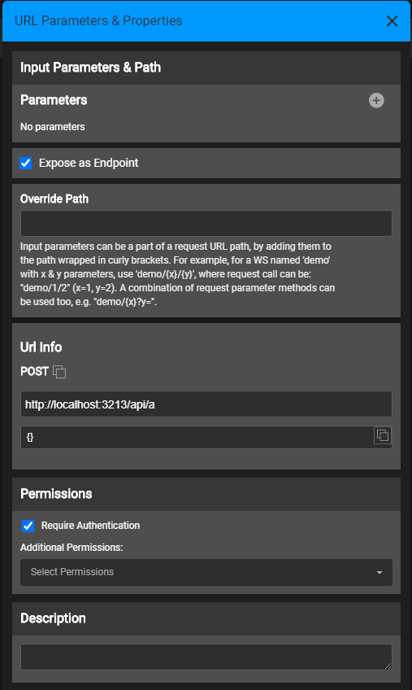

# Custom Web Service Properties

Fabric Web Services properties include metadata that contribute to thedefinitions,  functionalities and characteristics of the Web Service.  

At Graphit is is done at the Properties Panel that is opened when clicking on the </img> icon at the top Graphit Editor toolbar. Some other settings are done via the nodes' types or properties.

These settings are available only when "Expose as Endpoint" is checked.

<studio>

At Java function Web Service Properties panel is located on the top right corner of the **Web Service** window. 

 

</studio>

<web>

At Java function Web Service properties settings is done using annotations as explained [here](/articles/15_web_services_and_graphit/10_annotations.md). 

</web>

Some of the properties are available on both Java and Graphit, as following:

<table>
<tbody>
<tr>
<td valign="top" >
 
<strong>Property</strong>

</td>
<td valign="top" >

<strong>Description</strong>

</td>
</tr>
<tr>
<td valign="top">
<h5>Version</h5>
</td>
<td valign="top">

Representation of the web service versioning. A version number is incorporated into the web service&rsquo;s URL and is used to enable several web service versions, for example to serve various clients. Version is not mandatory and can be omitted. The default population of Version is 1.

<strong>Versioning Logic</strong>&nbsp;

<ul>
<li>If the version is not part of the URL, the API will respond with the latest version.</li>
<li>If the version is part of the URL and the API version exists, the API will respond with the specified version.</li>
<li>If the version is part of the URL and the latest API version is lower, the API will respond with the latest version.</li>
<li>If the version is part of the URL and is lower than the lowest API version, the API will return the correct error response code.</li>
<li>If the version is part of the URL and is in between two API versions, the API will respond with the lower version.</li>
 
At Graphit the versioning setting is done by incorporating it as part of the file name. For example: "a.v1.graphit".  
<studio>
At Java function it is done via the Properties Panel.
</studio>
<web>
At Java function it is done via the @version annotation.
</web>
</ul>
</td>
</tr>
<tr>
<td valign="top">
<h5>Path</h5>
</td>
<td valign="top">

Enable overriding the URL path of a web service.

Note that in case more than a single web service has the same path, the deployment will fail. 
For Graphit <studio>and Java function it is done via the Properties Panel.</studio>, <web>where for Java function it is done using the path property of the @webservice annotation.</web> 
</td>
</tr>
<tr>
<td valign="top">
<h5>Verb</h5>
</td>
<td valign="top">

Methods supported by the web service, as follows:&nbsp;

<ul>
<li><strong>GET</strong> - get data.&nbsp;</li>
<li><strong>POST</strong> - create new data based on the data provided.&nbsp;</li>
<li><strong>PUT</strong> - update data.&nbsp;</li>
<li><strong>DELETE</strong> - delete data.</li>
 </ul> 

At Graphit the verb setting is done by incorporating it as part of the file name. For example: "a.POST.graphit".  Only single verb can be set. Yet, when verb is omitted, the web service is exposed with GET and POST verbs.  
<ul>
<li>The verb name is not case sensitive.</li>
<li>The verb name is not part of the URL path of the web service. It is used to hint the server how to expose and serve  it.</li>
<li>According to the name, different preview URL is shown at the Properties Panel. for example, for POST and PUT verbs, a request body will be shown as example of how parameters shall be sent, while for GET and DELETE verbs, only URL path will be shown and parameters are part of it. </li>
</ul> 

<studio>
At Java function it is done via the Properties Panel, by selecting at least one method from the dropdown list and check it. 
</studio>
<web>
At Java function it is done via the verb property of the @webservice annotation.
</web>

More than a single verb method can be set for a Java function web service.
</td>
</tr>
<tr>
<td valign="top">
<h5>Is Raw</h5>
</td>
<td valign="top">

Indicates whether the output structure should be manipulated automatically by Fabric.

Values are either True or False.

Default = False. When True, Fabric retrieves the data response as is, without parsing or formatting it, thus aligning it with the web service's output format.

At Graphit it is done by setting a node type as "raw". 

<studio>At Java function it is done via the Properties Panel or by using the @isRaw annotation. </studio><web>At Java function it is done via the isRaw property of the @webservice annotation.</web>
</td>
</tr>
<tr>
<td valign="top">
<h5>Produce</h5>
</td>
<td valign="top">

Web Service&rsquo;s output format.

Default format: JSON

Additional formats: XML, CSV.

 

To select a format at Graphit, that is strict it to a specific format, set this format property to the top root node. if no restriction is required, then do not set format on the top root node.

To select a format at Java function <studio> click the dropdown menu and enable it/them</studio><web> set the prodcue property of the @webserice annotation</web>
 
In case formats are set, then when trying to call to the web service with the "format" parameter, which does not macth to the set format/s, an appropritate error response will be returned.
</td>
</tr>
<tr>
<td valign="top">
<h5>Serialize null</h5>
</td>
<td valign="top">

If True, display fields with a null value in the response. Else, ignore fields with null values. The default is True.

At Graphit it is done by setting the "show Null" node property . 

<studio>At Java function it is done via the Properties Panel.</studio><web>At Java function it is done via the @serializeNull annotation.</web>
</td>    
</tr>    
<tr>
 <td valign="top">
<h5>Additional Permissions</h5>
</td>
<td valign="top">
When the web service callers is prohibited to make some Farbic act according to his role permissions, and web service Elevated Permission (relevant for Java function) is set to False, the developer might still wish that the caller will be able to activate certain methods, only for this web service scope. An example of such method is running a BATCH command. In such case, the developer can grant the caller the permission only for the web service session.

To apply these permissions, the developer should specify what methods are allowed. At the Web Service Properties pane:
<ol>
    <li>For Java fucntion: Set the "Elevated Permission" to False. The "Additional Permissions" property becomes enabled.
    <li>Open the "Additional Permissions" and choose the methods that should be permitted, using the checkboxes.
</ol>
Alternatively, the permissions can be set in a code, using the function "additionalPermissions" annotation.

 Permissions shall be granted carefully.
 Added for Fabric release 6.5.8</td>
</tr>
<tr>
 <td valign="top">
<h5>Require Authentication</h5>
</td>
<td valign="top">
Indicates whether a web service requires authentication or not. 
Default is set to True.

When set to False, it will allow calling the web service by skipping the Authentication step. This mode should be used carefully - use it only if a Web Service should be accessible for everyone, without enforcing an API key, a user/password, etc. 
 Added for Fabric release 6.5.4</td>
</tr>
<tr>
<td valign="top">
<h5>Description</h5>
</td>
<td valign="top">
Web Service&rsquo;s description for Open API Spec.</td>
</tr>
</tbody>
</table>    

Following are properties which are available only for java function web services:

<table>
<tbody>
<tr>
<td valign="top" >
 
<strong>Property</strong>

</td>
<td valign="top" >

<strong>Description</strong>

</td>
</tr>
<tr>
<td valign="top">
Return Type
</td>
<td valign="top">

Type of Output value returned from the web service, e.g., String, Long, Map, List, Customized Class or Object. These Output values can be overridden with new values.&nbsp; When sent on the response (as JSON or XML), Fabric knows how to automatically serialize complex structures. 

</td>
</tr>
<tr>
<td valign="top">
<h5>Custom Payload</h5>
</td>
<td valign="top">
Indicates whether input parameters are automatically acquired by Fabric from the input stream as defined in the input parameters panel, or if it is to be implemented by the implementor manually.  Default is False, whereby input parameters are automatically handled by Fabric. Click here to see a code snippet for <a href="/articles/15_web_services_and_graphit/06_web_services_code_examples.md#example-of-a-custom-payload---xml">an XML format payload</a> or for <a href="/articles/15_web_services_and_graphit/06_web_services_code_examples.md#example-of-a-custom-payload---json">a JSON format payload.</a>
This flag must be set to True in the properties panel in order to be activated.
</td>
</tr>
<tr>
<td valign="top">
<h5>Elevated Permission</h5>
</td>
<td valign="top">
Indicates if user permissions should be elevated to the Web Service. 
Default is set to False.

For example, when set to False and the user role has no WRITE permissions, the user will not be able to write into Fabric using the Web Service. However when Elevated Permission is set to True on a Web Service, this restriction is dismissed. Added for Fabric V6.5.3

Starting from Fabric V6.5.8, when a user role has a security profile that prevents him from accessing some LU tables, setting Elevated Permission to True dismisses this restriction. 
 Click here for more information about <a href="/articles/17_fabric_credentials/05_security_profiles.md">Security Profiles.</a>

</td>
</tr>
<tr>
<td valign="top">
<h5>Result Metadata</h5>
</td>
<td valign="top">

Response example to be displayed in Swagger before the web service call.

Set example-JSON, example-XML and example-CSV.

</td>
</tr>
</tbody>
</table>    

