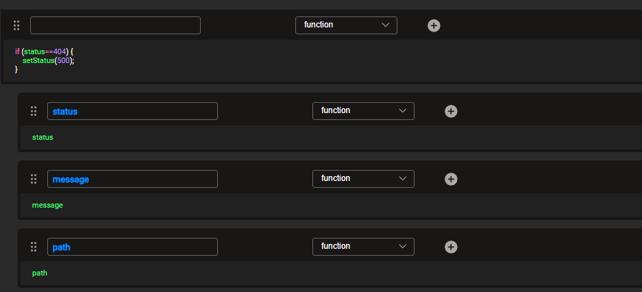

# Web Services Advanced Error Handling

Fabric provides a central place to manage web services errors. This is useful, for example, for cases where a specific standard payload response structure is expected, regardless of the original exception response. Another example is when a caller expects to always get 200 (OK status) as the response status and get the actual status inside the response data.

The implementor has full flexibility to analyze the reason for the underlying failure that caused the trigger, and as such, he can set the Web Service response body, header and status accordingly.

> Note that if you have prepared a 'catch' for the exception, there will be no trigger to execute the file.

The advanced error handling is done by building a dedicated Graphit file named ```error.graphit```. Once it is created on the project implementation (WS LU), its execution is triggered each time an exception is returned as a result of a Fabric Web Service call. 

The payload structure can be in either JSON or XML format, depending on the original Web Service call requested format. In case of a CSV format ```error.graphit```, file will not be triggered.

Being a non-standard Graphit file, which is not invoked programmatically, the Graphit top toolbar does not exist for `error.graphit`.

This feature was added as a part of Fabric release 6.5.3.

### Example 1

The following ```error.graphit``` file checks the original Web Service response status.

If the response is 404 (page not found), it returns these original Web Service details:
- response status
  - exception error message
- path

  and overrides the response with the following:	
- response status: 500.

</img>

### Example 2 

The following ```error.graphit``` file checks the original Web Service response status.

If the response is 404 (page not found), it returns these original Web Service details:
- response status
  - exception error message
- method
- path

  and overrides the response with the following:	
- response status: 200 (OK).
- header_key value: 'Web Service Not Found'


If the response is not 404, it returns these original Web Service details:	
- response status
- exception error message
- request header User-Agent

In the figure below, you can see both of these responses: *404 not found* is shown in the upper part of the figure, and *any other response* (that is, if the response is not 404), is shown in the lower part of the figure.  

</img>


[](/articles/15_web_services_and_graphit/09_custom_ws_properties.md)[](/articles/15_web_services_and_graphit/11_swagger.md)
