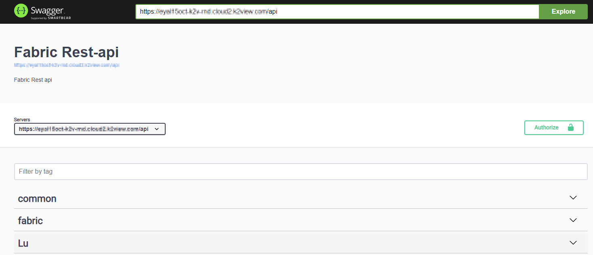
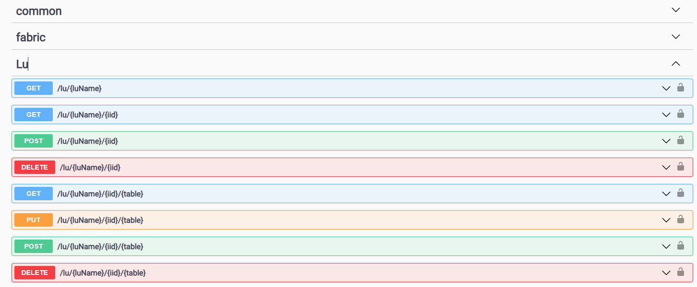
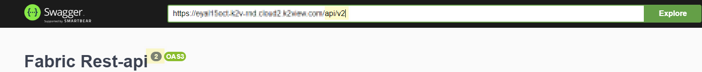

# Web Services Testing Application

Fabric lets developers to effortlessly interact and try out either Fabric built-in or custom web services - via a visualization utility - Swagger UI.

This utility is available as a web application, named 'API' at Fabric [Web Framework]("/articles/30_web_framework/01_web_framework_overview.md" ). Using it, you can quickly find the web services with neatly categorized documentation, and test them with a fine UI, which lets you easily populate parameters, according to the service verb. 

Fabric builds and generates an Open API Specification (OAS version 3) document , which Swagger UI reads and serves, providing these powerful capabilities.

To open the app, go to the Fabric Web Framework and select 'API' from its menu.

<studio>

In addition, you can invoke the web service directly from the Studio, where it automatically opens the web browser with the Swagger testing app and navigates you to the selected web service.

To do so - find the the web service - Graphit or Java function, at the project tree, right-click on its name and choose **Invoke Web Service**.

</studio>

The API testing app page shows the Web Services in categories and in alphabetical order. 

   * Common - all built-in product Web Services that bring reference table metadata and data. 
   * Fabric - pre-built API to run Fabric commands, Authentication and Heart bits/Statuses queries   
   * LU - all built-in LU Web Services that bring LU metadata, data and data modifications, such as Delete instance.
   * Project defined categories for custom Web Services.

Built-in out-of-the-box web services will be always exist and project is according to the project's implementation. 

Read [here](01_web_services_overview.md) about various web services types.

> Notes: 
>
> * Graphit files that are located under resources folder at the project tree are displayed under Graphit category.
> * Categories do not affect the Web service URL path.
> * Web services are shown according to the user's permissions. If he has no permissions to web services under a category, he will not see this category in the page.

Each category can be expanded and collapsed, showing the various web services along with their verb methods, where presented verbs are those that were declared and defined in advance. 

For example, expanding the LU category will show this:

For the project's custom web services, the verb methods are set via the implementation. 

Click a web service to view more details including its parameters, with indication of whether each is mandatory. If a description of the method or comments have been added to the Input parameters, it/they will be displayed, as shown in the following examples (customer_id description):

The **Media type** select list shows options according to the format defined for the web service. 

To test a web service:

1. Click the **Lock**, set a valid **Token** and then click [**Authorize**](/articles/17_fabric_credentials/02_fabric_credentials_commands.md#web-services-authorization). If you are already authenticated, this step is not needed. 

2. Click **Try it Out**, populate the parameters and then click **Execute** to display the response.

    

    You can see that the Request URL is shown too, as well as the curl command, which guides you through how to use it in your application when accessing too the web service.

3. You can change **Media Type** when applicable, and easily see the result in another format, e.g., as XML:

   

## Web Services Versions

You can easily switch to another version and test it: 

At the top URL field, define the version, for example, by adding /v2 and click on Explore. 

As shown below, when changed, you will see an indication as a badge, aside the title. The shown and tested web services will only be those that match that version.

   

*	

