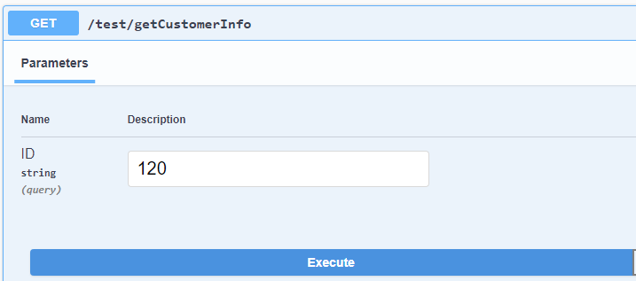

# Fabric Smart Proxy

Fabric Web Services are REST APIs that, among other purposes, allow external access to Logical Unit's data. The Fabric Web Services are exposed through the Fabric Web Service layer. Fabric receives multiple requests concurrently, thus the Web Service response time is highly important. 

Fabric Smart Proxy mechanism allows to redirect the Web Service calls between multiple nodes based on the input. The logic behind establishing what node should be invoked is based on a built-in hash function, which is applied on the value of the Web Service input argument. 

One of the most common reasons for using this mechanism is the need to optimize the LUI retrieval process, in order to reduce the Web Service response time. 
When LUI data is retrieved by the Web Service, Fabric uses the cache mechanism to load an instance into the memory. As the Fabric MDB cache files are stored on a server, it is more difficult to utilize the cache in a multi-node environment. This is due to the fact that each Web Service call might be redirected to a different node and consequently the cache will be stored in different servers. As a result, when the same Web Service is invoked again for the same instance ID, the cache is most likely not going to be reused. The Smart Proxy mechanism can solve this issue by redirecting the call to the same node when the same input is received and thus reduce the Web Service response time.

The Smart Proxy mechanism is off by default. It can be applied by setting the web server filters via the config.ini file as explained further in this article.

## How Do I Set Up Web Server Filters?

The Web Server filters are empty in the config.ini. To set up the filter, uncomment the default setting:

~~~
#WEBSERVER_FILTERS=
~~~

and populate it as follows:

~~~
WEBSERVER_FILTERS=[{"class":"com.k2view.cdbms.ws.ProxyAPI", "params":{"fabric_redirect":"SERVER", "fabric_retry":"1", "fabric_tokens":"token1, token2", "fabric_affinity":"", "read_timeout_sec":"60", "connect_timeout_sec":"60"}}]
~~~

Replace the value of the fabric_tokens parameter from token1, token2 to the name of the input argument used by the Web Services. 

For example, when a Web Service has input parameter called **ID**, the filter should be set to:

~~~
WEBSERVER_FILTERS=[{"class":"com.k2view.cdbms.ws.ProxyAPI", "params":{"fabric_redirect":"SERVER", "fabric_retry":"1", "fabric_tokens":"ID", "fabric_affinity":"", "read_timeout_sec":"60", "connect_timeout_sec":"60"}}]
~~~

When a Web Service has several input arguments, all of them need to be listed as the fabric_tokens value.

