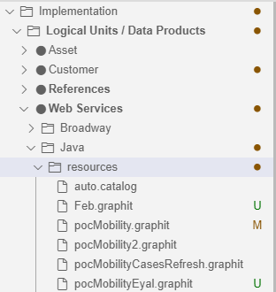

# Create and Edit a Graphit file

As a powerful low-code utility, Graphit enables web service planning and generation in a visualized layout, as well as inline testing and debugging capabilities.

A Graphit file is structured as a hierarchical representation of nodes, where each node defines a tag in the structure of the JSON, XML or CSV document. Yet, some of the nodes can represent non-output tags, such as condition and function tags.

Nodes can have children nodes and each child node can have children nodes, whereby creating nested tags in the generated document. 

When creating a document, the Node Name, Type and Properties can be defined for each node. 

### How Do I Create a New Graphit File?

<studio>

1. Go to **Project Tree**, click on **Web Services** > **Graphit** > right-click & choose **New Graphit File**. 

    

    A Graphit file opens, containing a newly created Graphit node, which should be populated.

2. Start with choosing, via a drop-down list, any of the below commands/functions (node types): 

    

    Initiate the example by choosing a **get** command

    It is useful to place the **get** command - a function that retrieves the LUI (Logical Unit Instance) - in the beginning of the Graphit layout although it can be implemented on any of the nodes. 

3. From the open pop-up window, select an LU from the drop-down list and then click **Add**.

     
    Once this 1st node is created it will looks like this:

    
    
    You can later change the **get** command, when needed, by clicking on the  icon, triggering the *Get Command Builder* pop-up window again.

4. Click on the plus icon in order to add a sibling node to the example layout.

5. Name the newly created node by populating the left-hand-field.
    Note that only nodes with a tag name are displayed in the output document, when a Graphit web service is called.

6. Choose an **sql** command, as the node type, using the drop-down arrow. 

7. Click on the query builder icon  on the 2nd node, to generate a query in a Query Builder window.
    Read [here](https://support.k2view.com/Academy/articles/11_query_builder/01_query_builder_overview.html) for more information about Query Builder.

    Following the creation of the 2nd node and its population, a message pops up, asking whether you want to create table fields, i.e. laying out and exposing the SQL fields in the Graphit; choose **YES**.

    

    

    The below image shows the **nested nodes layout result** 

    

    Note that exposing the SQL fields is optional and even if you choose **NO**, the fields will be displayed in the output document. Yet, exposing them allows you to manipulate them. Sometimes it is preferred by implementors for a better visualized output document, seeing a full layout of the structure.

8. **Save** the Graphit file. A pop-up message will appear, asking you to assign a **Name** and a **Category** for your Graphit file.

    

    Once **Ok**'ed, the newly created Graphit file name appears in the **Project tree**, under its category.

    

    You can see that it has automatically received a **'.graphit' suffix**.

</studio>

<web>

1. Go to **Project Tree**, click on **Implementation** > **Logical Units / Data Products** > **Web Services**.
2. Expand **Web Services** > right-click on **Graphit/Demo** and choose **New Graphit**
 
    
    ASSIGNING A NAME
    
    
3. Click on **Choose Category** to select an existing category name for the Graphit file 

   or click on New Category to enter a new category name, followed by Enter for saving it
    
   The following step is to enter a name for your new Graphit file, followed by Enter for saving it. Note that the name should contain only alpha-numeric characters.
    
   Once the Graphit file is saved, its name appears at the **top of its layout**
    
   as well as in the **Project tree**, under its category.
    
   In both cases, you can see that it has automatically received a **'.graphit' suffix**.

4. Assign a name to the new Graphit file and press Enter to save it. Note that the filename must contain only alpha-numeric characters. Once the file is saved, it is displayed under the project's Web Services folder under resources.

    

</web>

> NOTE: Prior to  Fabric 7, Graphit files were located under Java/resources folder. This option is still available, for backward compatibility.

### Editing Actions Options

- Click </img> at left of a node, to create a new sibling node placed under the original node, on the same level.

- Click </img> at left of a node, to create a new child node under the parent node.
- Click </img> to drag a node to another location in the hierarchy. 
- Click   to expand a collapsed node.
- Click </img> to delete a node on the node level.  
- Click </img> to copy a node so that can be paste into another location at this Graphit or to another Graphit file. 
- Click </img> to copy a node so that can be moved into another location at this Graphit or to another Graphit file.  Moving nodes within a Graphit file can be done also via drag and drop.
- Click to paste a previously copied/cut node as a child node.
- Click to paste a previously copied/cut node as a sibiling node.
- Click to add property to the node
- Click to open Query builder for a *sql* node type
- Click to open Helper for a *get* and *Broadway* node types.

