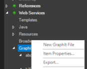
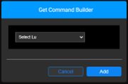
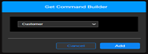
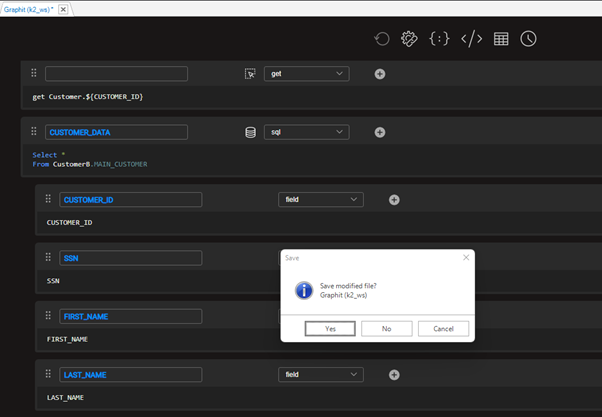
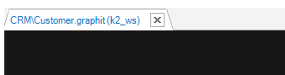

# Create and Edit a Graphit file

***As a powerful low-code utility, Graphit enables web service planning and generation in a visualized layout.***

### How Do I Create a New Graphit File?

<studio>

Go to **Project Tree**, click on **Web Services** > **Graphit** > right-click & choose **New Graphit File**. 

A Graphit file opens, containing a newly created Graphit node, which should be populated.

1. Start with choosing, via a drop-down arrow, any of the below commands/functions (node types): 

    

    Initiate the example by choosing a **get** command

    It is useful to place the **get** command - a function that retrieves the LUI (Logical Unit Instance) - in the beginning of the Graphit layout although it can be implemented on any of the nodes. 

2. From the open pop-up window, select an LU from the drop-down list.

    

    Click **Add**

    

The 1st created node in the Graphit window is complete

You can change the **get** command by clicking on the  icon, triggering the *Get Command Builder* pop-up window again.

3. Click on the plus icon in order to add a sibling node to the example layout.

4. Populate the left-hand-field in the second node with *CUSTOMER_DATA* and choose an **sql** command from the right-hand-field using the drop-down arrow. 

   ​

Clicking on the query builder icon  on the 2nd node, generates a query in a separate window, a Query Builder window.

In order to execute the query, insert an incident number.

For more information about a Query Builder, visit <https://support.k2view.com/Academy/articles/11_query_builder/01_query_builder_overview.html>

Following the creation of the 2nd node and its population, a message pops up, asking whether you want to create table fields; choose **YES**.

 

The below image shows the **nested nodes layout result**, which is followed by a pop-up message that asks you whether you wish to **save** the Graphit file.

Choosing **Yes** is followed by another pop-up message, asking you to assign a **Name** and a **Category** for your Graphit file.

Once **Ok**'ed, the newly created Graphit file name appears at the **top of its layout**  

as well as in the **Project tree**, under its category.

In both cases, you can see that it has automatically received a **'.graphit' suffix**.

</studio>

<web>

1. Go to **Project Tree**, click **Implementation** > **Logical Units/ Data Products**.
2. Expand **Web Services** > **Java** > **resources**
3. Right click **resources** and select **New Graphit**. 

    

4. Assign a name to the new Graphit file and press Enter to save it. Note that the filename must contain only alpha-numeric characters. Once the file is saved, it is displayed under the project's Web Services folder under resources.

    

</web>

### How Do I Edit a Graphit File?
Once a new Graphit file is created, you can edit it to create the required CSV / XML / JSON document structure. 

A Graphit file is structured as a hierarchical representation of nodes, where each node defines a tag or condition in the structure of the CSV, XML or JSON document. 

Nodes can have children nodes and each child node can have children nodes, whereby creating nested tags in the generated document. 

When creating a document, the Node Name, Type and Properties can be defined for  each node. 

<studio>

​    
</studio>

<web>

​    
</web>

### What Are the Hierarchical Structure Options? 

<studio>
​    
- Click </img> **Parent Node** to create a new parent node under the original node on the same level.
- Click </img> **Child Node** to create a new child node under the parent node.
- Click </img> **Delete** to delete a node on the node level.  
- Click </img> **Copy** to delete a node on the node level. 
- Click </img> **Cut** to delete a node on the node level. 
- Click </img> and drag a node to another location in the hierarchy.  

</studio>

<web>
​    
- Click </img> **Parent Node** to create a new parent node under the original node on the same level.
- Click </img> **Child Node** to create a new child node under the parent node.
- Click </img> **Delete** to delete a node on the node level.  
- Click </img> **Copy** to delete a node on the node level. 
- Click </img> **Cut** to delete a node on the node level. 
- Click </img> and drag a node to another location in the hierarchy. 

</web> 

### How Do I Assign a Name To a Node?
To assign a **Tag Name** to a **node**, hover over the field in which the name of the node is found, then type in the new name.   
-  Only nodes with a tag name are displayed in the output document. 
-  Nodes without tag names can be used for internal purposes.

