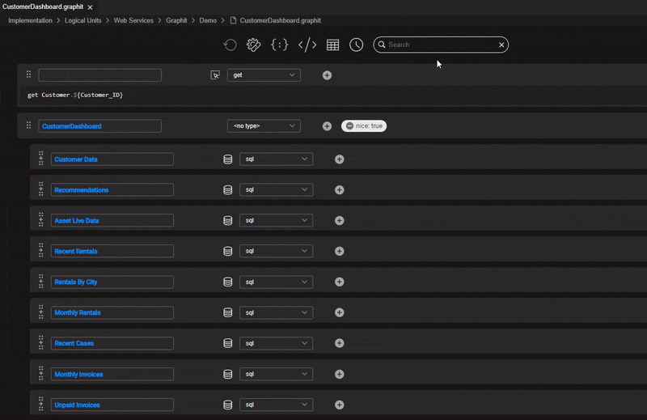

# Graphit Basic Editing

Once you've created a Graphit file, you can start editing it. To learn how to create a Graphit as web service - read [here](/articles/15_web_services_and_graphit/06_custom_ws_create_graphit_ws.md). Similarly, you can create Graphit under any other Logical Unit.

## Graphit Terminology

* **Node** - an entry element, represented visually as a vertical strip, and which stands for an output document element and/or as a logical function.
* **Node Type** - defines how node content is generated and structured. For node types that have a representation in the output document, there may also be a definition relating to the node presentation. Some node types, such as SQL, Broadway and Get, provide additional helpers to ease the node content building.  
* **Node Property** - an additional instruction that can be given to a node. For example, how to format a number, which database to query, or whether the node is active/disabled.

## Basic Editing Concepts

* The Graphit editor is built from a main editing area, a top toolbar, and a right panel that opens when an action in the top toolbar is selected.

* The editor manages Graphit files that are built from nodes that can be added as either a sibling or a child of any other existing node, in the main editing area.
* Nodes can be moved or copied within a GraphIt file using drag-and-drop or copy-paste actions. A node can be copied and pasted between files.
* Upon a node creation, you shall first select its node type and accordingly accomplish its logic and/or output form. The node type can be changed later during editing. To learn more about *node types* - read [here](03_graphit_node_types.md). Note:
  * Not all nodes have an output representation, as they define a logical functionality.
  * Any node that has an output representation shall be named.
* You may use node properties to define some of the logic or the output form of a node. To learn more about *node properties* - read [here](04_graphit_node_properties.md).

## Top Toolbar Actions

*  </img> Refreshing the opened testing results panel. It is enabled only when the result panel is opened.
*  </img> Opening the URL Parameters and Properties panel. This panel shows different items by context.
*  </img> Opening the JSON result panel 
*  </img> Opening the XML result panel 
*  </img> Opening the CSV result panel 
*  </img> Opening the Graphit Profile panel 
*  </img> Search box

## Nodes Editing Actions

Use the following actions for managing nodes such as create, copy, paste, move, delete:

- Click </img> on the left of a node, to create a new sibling node placed under the original node, on the same level. The icon appears while hovering over the node.
- Click </img> on the left of a node, to create a new child node under the parent node. The icon appears while hovering over the node.
- Click </img> to drag a node to another location in the hierarchy. 
- Click   to expand a collapsed node. When expanded, click it again to collapse a node back. Using this capability lets you on the one hand, to get an overview of a Graphit file, avoiding overwhelmingness in case it is complex, and on the other hand to deep dive and view the lower-level nodes.
- Click </img> to delete a node on the node level. The icon appears while hovering over the node.
- Click </img> to copy a node so that it can be pasted into another location in this Graphit or to another Graphit file. The icon appears while hovering over the node.
- Click </img> to copy a node so that it can be moved into another location in this Graphit or to another Graphit file. Moving nodes within a Graphit file can also be done via a drag-and-drop action. The icon appears while hovering over the node.
- Click  to paste a previously copied/cut node as a child node. The icon appears while hovering over the node.
- Click  to paste a previously copied/cut node as a sibling node. The icon appears while hovering over the node.

Use the following actions for node editing:

- Click  to add a property to the node
- Click  to open Query builder for a *sql* node type
- Click  to open Helper for a *get* and *Broadway* node types.

## Search

The Graphit editor offers a quick and efficient way to find a text within the currently opened file, including closed nodes. 

To do so, you can type the keywords into the search box located at the top toolbar. Once entered, the search box expands into a search result widget, displaying all the occurrences of the searched text.

* The expanded search result widget shows the entire content of elements containing the searched text, which is highlighted in orange. 
  * Showing the element allows you to understand the context of the found text, especially when the text appears multiple times within the file.
  * In case the element containing the searched text is long, the search result widget displays ellipses before and/or after the text. 
* Hovering over an entry in the search result widget triggers a tooltip indicating the location of the searched text in the nodes hierarchy. (for example: "CustomerDashboard > CustomerData > CustomerAddress")
* Clicking on an entry takes you directly to its location in the file, expanding closed nodes if necessary, while highlighting the searched text. 
  * Note that the auto-expanding feature does not mark the Graphit file as changed.
  * Clicking and navigating to the found location will close the search result widget. If you click and focus again on the search box, the panel will reopen.
* The search tool displays an appropriate message when no results are found for the searched text.

 	

## Testing Graphit

You can easily execute and test your Graphit file by using the top tollbar actions, as explained [here](05_invoking_graphit_files.md).

