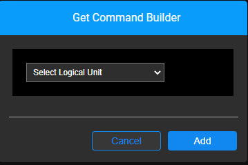
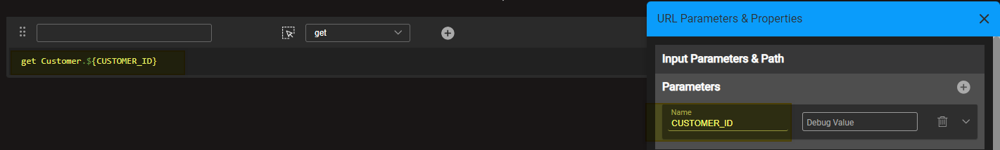
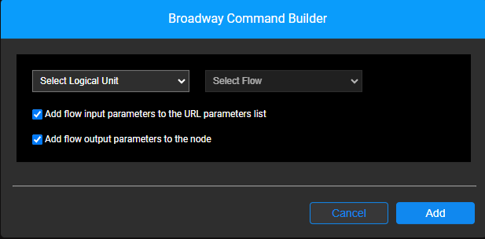

# Graphit Node Types

Node Type options define how content is structured and how a tag is presented in an output document. By default, nodes are assigned *neither* a Type *nor* a Property when they are created.

The following table lists node types. Please refer to the files in the following table's **Examples** column (scroll furthest to the right). The files can be found in the [KB Demo Project](/articles/demo_project/Fabric_Demo_Project/00_Fabric_demo_project_setup_guidelines.md) under Project Tree > Web Services. We suggest that you run each Graphit file in a Debug mode and observe the response. 

<table>
<tbody>
<tr>
<td valign="top" width="150pxl">

<strong>Node Type</strong>

</td>
<td valign="top" width="500pxl">

<strong>Description</strong>

</td>
<td valign="top" width="150pxl">

<strong>Examples</strong>

</td>
</tr>
<tr>
<td valign="top" width="50pxl">Field</td>
<td valign="top" width="900pxl">Basic node type. Defines the node as a tag in XML/JSON format.</td>
<td valign="top" width="50pxl"> 
    <a href="/articles/15_web_services_and_graphit/17_Graphit/08_graphit_examples.md#grfieldgraphit">grField</a>
</td>
</tr>
<tr>
<td valign="top" width="50pxl">Function</td>
<td valign="top" width="900pxl">Runs the code to determine the value of the node. Note that the code must be written in JavaScript.&nbsp;</td>
<td valign="top" width="50pxl"><a href="/articles/15_web_services_and_graphit/17_Graphit/08_graphit_examples.md#grfunctiongraphit">grFunction</a></td>
</tr>
<tr>
<td valign="top" width="50pxl">SQL</td>
<td valign="top" width="900pxl">Defines an SQL statement that retrieves information from Fabric or other database interfaces.
    Enter the SQL statement manually or hover over and then click the SQL icon to open the Query Builder. 
     <b>Note</b>: If the database is not Fabric, the Interface Name must be defined as described in the <a href="/articles/15_web_services_and_graphit/17_Graphit/04_graphit_node_properties.md">Node Properties</a> section.  
<ul>
<li>If the <a href="/articles/11_query_builder/01_query_builder_overview.md">Query Builder</a> is selected, the Query Builder pop-up opens; when it closes, the built query is copied into the Graphit node content.
</li>    
<li>Fields can be automatically expanded into nested nodes. When closing the Query Builder pop-up, you are asked about this expansion. Expanding fields can be useful in case where further manipulation is needed on the result fields, or when the fields should be used on subsequent nodes.
</li>    
</ul>
The SQL type also enables looping results and executing nested codes on each returned row. 
Note that it is recommended to set the SQL statement type to SQL to use a prepared statement and prepared binding. 
To build an SQL statement for each call, set the query type to SQL non-prepared. For example, to build dynamic SQL, select X,Y from $table name.
</td>
<td valign="top" width="50pxl"><a href="/articles/15_web_services_and_graphit/17_Graphit/08_graphit_examples.md#retrieving-data-for-an-lui">grSQL</a></td>
</tr>
<tr>
<td valign="top" width="50pxl">String</td>
<td valign="top" width="900pxl">Simple string text or some combination with variables, such as input parameters or previous field nodes .&nbsp;</td>
<td valign="top" width="50pxl"><a href="/articles/15_web_services_and_graphit/17_Graphit/08_graphit_examples.md#grstringgraphit">grString</a></td>
</tr>
<tr>
<td valign="top" width="50pxl">Get</td>
<td valign="top" width="900pxl">Defines the Fabric get command, according to the LU and LU iid, which will be executed when invoking this Graphit file. 

    Enter the get command statement manually or hover over and then click the Helper icon () to open the Command Builder. See more information later in this article.
</td>
<td valign="top" width="50pxl"></a></td>
</tr>
<tr>
<td valign="top" width="50pxl">Broadway</td>
<td valign="top" width="900pxl">Defines a call to a Broadway flow that will be activated. 
    Enter the command statement manually or hover over and then click the Helper icon () to open the Command Builder. See more information later in this article.
</td>
<td valign="top" width="50pxl"></a></td>
</tr>
<tr>
<td valign="top" width="50pxl">Condition</td>
<td valign="top" width="900pxl">Generates IF-ELSE statements that should include a condition. The nested nodes are/aren't executed according to the condition's result.&nbsp;</td>
<td valign="top" width="50pxl"><a href="/articles/15_web_services_and_graphit/17_Graphit/08_graphit_examples.md#grconditiongraphit">grCondition</a></td>
</tr>
<tr>
<td valign="top" width="50pxl">Group&nbsp;</td>
<td valign="top" width="900pxl">Groups several elements. It is used mainly with Condition nodes.</td>
<td valign="top" width="50pxl"><a href="/articles/15_web_services_and_graphit/17_Graphit/08_graphit_examples.md#grgroupgraphit">grGroup</a></td>
</tr>
<tr>
<td valign="top" width="50pxl">Collect</td>
<td valign="top" width="900pxl">Iterates multiple data sets into one unified array.&nbsp;</td>
<td valign="top" width="50pxl"><a href="/articles/15_web_services_and_graphit/17_Graphit/08_graphit_examples.md#grcollectgraphit">grCollect</a></td>
</tr>
<tr>
<td valign="top" width="50pxl">Raw</td>
<td valign="top" width="900pxl">Presents data as output without manipulation. For example, a header for an XML format.&nbsp;</td>
<td valign="top" width="50pxl"><a href="/articles/15_web_services_and_graphit/17_Graphit/08_graphit_examples.md#grrawgraphit">grRaw</a></td>
</tr>
</tbody>
</table>

## Command Builders

Graphit Editor provides three builders — SQL Query Builder, Get Command Builder and Broadway Command Builder — in order to ease the creation of Graphit file content. The SQL Query Builder opens the Studio's Query Builder.

### *Get* Command Builder

Upon selecting 'get' as the node type or when clicking on the  icon of a node that is already populated with the 'get' node type, the *Get* Command Builder pop-up window opens.

Select a Logical Unit and click 'Add'.

The pop-up will close and the get command will appear with the appropriate syntax. 

The *iid* parameter is smartly acquired from the Logical Unit root table iid, and populated; it is also automatically added as the Graphit file input parameter.

### *Broadway* Command Builder

You can call and activate a Broadway flow from Graphit, and include it as part of the logic and output of the Graphit file.

Upon selecting 'broadway' as the node type or when clicking on the  icon of a node that is already populated with the 'broadway' node type, the Broadway Command Builder pop-up window opens.

1. Select the Logical Unit in which the required Broadway flow is located.

2. Select the Broadway flow.

3. Choose whether the Broadway flow input parameters will automatically be added as the Graphit file input parameters. This default option helps save time and reduce the risk of errors. Yet, you can uncheck this checkbox, in cases where flow input parameters are manually pre-set in the Graphit file, as constants or according to previous query results. 

   > Note: For simplicity, this checkbox affects all Broadway flow input parameters. 

4. Choose whether to add and reveal the Broadway flow output as fields in Graphit, or not. This option is similar to the option provided via the SQL Query Builder Helper.

