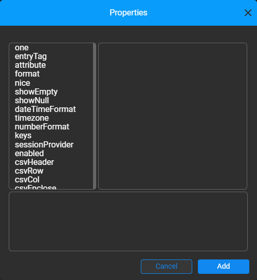
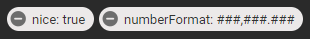

# Graphit Node Properties

Node Properties are additional instructions that can be given to a node. For example, how to format a number, which database to query, or if the node is active or disabled. 

### Add Node Properties

node_properties_added.png

To assign a property to a node:

1. Click the  adjacent to the node, and at the left side of the opened popup - select the required property from the list. On selection:

   - A short description of the property is displayed at the bottom of the popup.  
   - Property optional values will appear at the right side. Some of them are editable at the right side sub-panel.

   </img>

2. Select a value among the options.

3. Click 'Add'. The popup would close and the property with its value will appear alongside the node, as a label.

   </img>

> Notes:
>
> * You can add several properties to each node.
> * Properties are not editable.
> * You can remove a node property by clicking elsewhere on its label.  


### Node Properties Options
The following table describes the node properties. Please refer to the files in the following table's Example column. The files can be found in the [KB Demo Project](/articles/demo_project/Fabric_Demo_Project/00_Fabric_demo_project_setup_guidelines.md) under Project Tree > Web Services. 
<table>
<tbody>
<tr>
<td valign="top" >
<p><strong>Node Property</strong></p>
</td>
<td valign="top" >
<p><strong>Description</strong></p>
</td>
<td valign="top" >
<p><strong>Examples</strong></p>
</td>
</tr>
<tr>
<td valign="top" >Session Provider</td>
<td valign="top" >Defines which interface should be used for a query. This property should be defined each time a node is defined as either SQL or Non-prepared SQL and the queried database is not Fabric.<br />Note that this property affects the node and its child nodes.</td>
<td valign="top" ><a href="/articles/15_web_services_and_graphit/17_Graphit/10_graphit_examples.md#grshowformatgraphit">grShowFormat</a></td> 
</tr>
<tr>
<td valign="top" >Enabled</td>
<td valign="top" >If enabled is set to False, the node and its children are disregarded.</td>
<td valign="top" ><a href="/articles/15_web_services_and_graphit/17_Graphit/10_graphit_examples.md#grshowenabledgraphit">grShowEnabled</a></td>
</tr>
<tr>
<td valign="top" >Nice</td>
<td valign="top" >Defines the layout of the output format. True defines that each tag is printed in a new line and is indented.&nbsp;<br />Note that this property affects the node and its child nodes.</td> 
<td valign="top" ><a href="/articles/15_web_services_and_graphit/17_Graphit/10_graphit_examples.md#grshowenabledgraphit">grShowEnabled</a></td>  
</tr>
<tr>
<td valign="top" >One</td>
<td valign="top" >Defines whether the node is handled as an array or a single value. True defines that the result is always a single entry, also when the query it is based on - returns multiple rows.</td>
<td valign="top" ><a href="/articles/15_web_services_and_graphit/17_Graphit/10_graphit_examples.md#gronegraphit">grOne</a></td>
</tr>
<tr>
<td valign="top" >Entry Tag</td>
<td valign="top" >Defines the tag surrounding XML array entries. When not used or set as None, the [entry] value is used.</td>
<td valign="top" ><a href="/articles/15_web_services_and_graphit/17_Graphit/10_graphit_examples.md#grentrygraphit">grEntry</a></td>
</tr>
<tr>
<td valign="top" >Attribute</td>
<td valign="top" >Defines in XML whether a value is set as an attribute or as a child node (default).&nbsp;</td>
<td valign="top" ><a href="/articles/15_web_services_and_graphit/17_Graphit/10_graphit_examples.md#grattributegraphit...">grAttribute</a></td>
</tr>
<tr>
<td valign="top" >Format</td>
<td valign="top" >When defined, the node is evaluated and added when the output format matches the format's JSON, XML or CSV value. Note that this property only affects the node where it is defined.&nbsp;</td>
<td valign="top" ><a href="/articles/15_web_services_and_graphit/17_Graphit/10_graphit_examples.md#grformatgraphit">grFormat</a></td>
</tr>
<tr>
<td valign="top" >Show Empty</td>
<td valign="top" >Defines whether empty nodes are displayed in the output. Default = True.<br />Note that this property affects the node and its child nodes.
<td valign="top" ><a href="/articles/15_web_services_and_graphit/17_Graphit/10_graphit_examples.md#grshowemptygraphit">grShowEmpty</a></td>
</td>
</tr>
<tr>
<td valign="top" >Show Null</td>
<td valign="top" >Defines whether null entries are displayed in the output. Default = True.<br />Note that this property affects the node and its child nodes.&nbsp;</td>
<td valign="top" ><a href="/articles/15_web_services_and_graphit/17_Graphit/10_graphit_examples.md#grshownullgraphit">grShowNull</a></td>
</tr>
<tr>
<td valign="top" >Number Format</td>
<td valign="top" >Controls how numbers are formatted in the output. Use either a built-in format or the following syntax to create your own:
```
0  Digit
#  Digit, zero shows as absent
.  Decimal separator or monetary decimal separator
-  Minus sign
,  Grouping separator
E  Separates mantissa and exponent in scientific notation.
;  Separates positive and negative subpatterns
%  Multiply by 100 and show as percentage
```
Note that this property affects the node and its child nodes.&nbsp;</td>
<td valign="top" ><a href="/articles/15_web_services_and_graphit/17_Graphit/10_graphit_examples.md#grnumberformatgraphit">grFormatNumber</a></td>
</tr>
<tr>
<td valign="top" >Keys</td>
<td valign="top" >Advanced mechanism that replaces nested queries by joining the data on the root query and grouping it with a key. This is done when query keys are used to select a subset of rows to group each invocation of the node. When keys are specified in children nodes, each node groups its parent's node according to the key.</td>
<td valign="top" ><a href="/articles/15_web_services_and_graphit/17_Graphit/10_graphit_examples.md#grkeysgraphit">grKeys</a></td>
</tr>
<tr>
<td valign="top" >csvHeader, csvRow, csvCol, csvEnclose</td>
<td valign="top" >The following node properties control CSV format:
<ul>
<li>csvHeader, disables a header row</li>
<li>csvRow, defines the delimiter between rows in CSV format. The default value is set to the CR sign (\n).</li>
<li>csvCol, defines the delimiter between columns in CSV format. The default value is set to the comma character.</li>
<li>csvEnclose, defines the character used to enclose a value in CSV format. This is used only if the value holds a special character (csvEnclose, csvRow, csvCol).</li>
</ul>
</td>
<td valign="top" ><a href="/articles/15_web_services_and_graphit/17_Graphit/10_graphit_examples.md#grcsvgraphit">grCSV</a></td>
</tr>
</tbody>
</table>


[](/articles/15_web_services_and_graphit/17_Graphit/03_graphit_node_types.md)[](/articles/15_web_services_and_graphit/17_Graphit/05_graphit_debugging.md)

