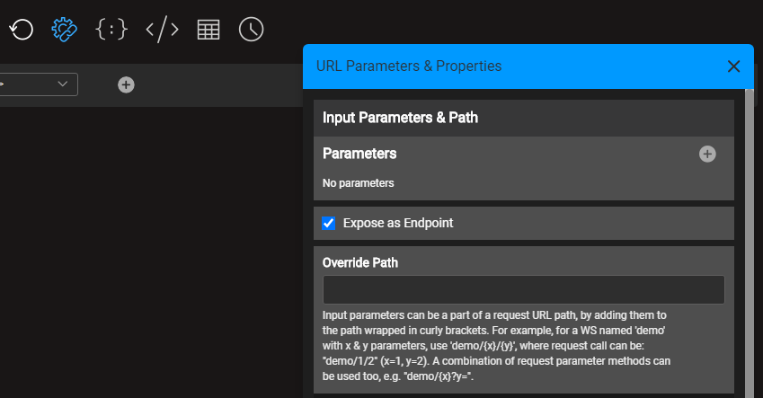
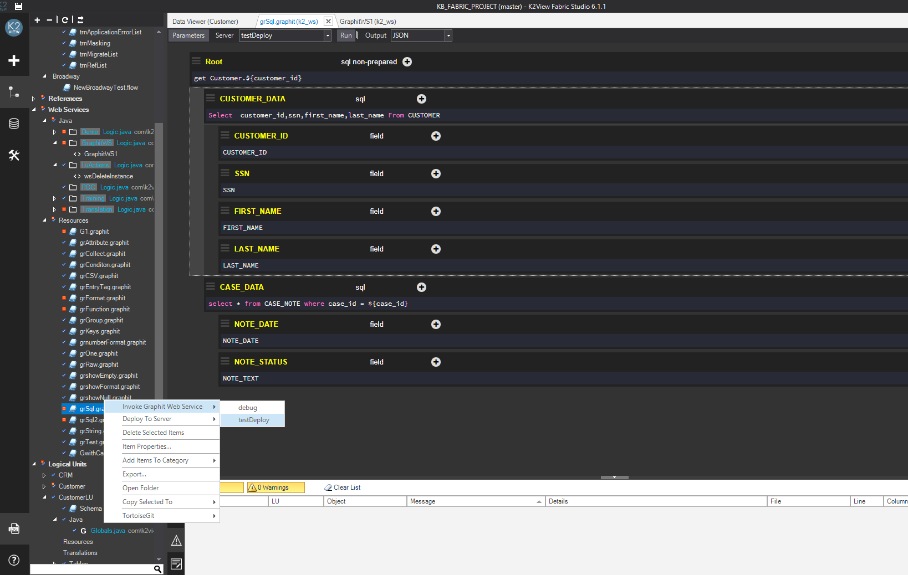

# Invoking Graphit Files
Graphit files can be invoked either externally as Web Services or internally from other Fabric implementation components. 

In either one of the options you can transfer Graphit input parameters, while invoking it. To learn how to define parameters in Graphit - read [here](06_using_graphit_files_with_parameters.md).

## Testing and Debugging Graphit file inside the Graphit Editor

You can easily execute and test your Graphit file by using the top toolbar actions.

Before testing, you shall populate the input parameters via the **Input Parameters & Properties** panel, as explained [here](06_using_graphit_files_with_parameters.md). 

Upon executing, for example clicking on the </img> icon, a JSON **Result** panel would open, where you can see the outcome of the Graphit execution. Similarly and easily, you can examine the outcome of the file in other formats - XML or CSV, by clicking their action icons in the top toolbar.

You can leave this panel open and continue editing the file. Then, you can click on the refresh </img> icon at the top toolbar to re-execute and refresh the outcome. This is very useful for debugging purposes.

You can also examine the Graphit's performance at the **Profiler** panel, which opens when selecting the </img> icon in the top toolbar.

## Invoke Graphit Externally

Graphit files that are located in the Web Services LU, can be exposed to external calls, as a web service endpoint.

Those files, when located under 'Resources' folder in the project tree, are always exposed as web services, whereas those located under 'Graphit' folder are controlled by you as to whether be exposed or not (the default is that they are exposed).

To change this settings:

1. Click on the </img> icon in the Graphit Editor's top toolbar.

2. Check/uncheck the **Expose as Endpoint** checkbox. 

   </img> 

To learn more about how to externally invoke Graphit, transfer its input parameters and set other definitions - read [here](/articles/15_web_services_and_graphit/05_custom_ws.md#invoking-custom-apis)

You can use the Web services Testing App to easily invoke Graphit web service endpoints, as explained [here](/articles/15_web_services_and_graphit/11_swagger.md). <studio>You can open the testing app directly from the Studio, automatically pointing the Graphit file. To do so, at the project tree right-click the Graphit file and choose **Invoke Graphit Web Service**

</studio>

> Graphit files, that are located in LUs other than the Web, are not exposed as web service and can be invoked only by Fabric implementation components.

## Invoke Graphit From Fabric Implementation Components

A Graphit file can be invoked internally, from other Fabric Implementation Components. Each component provides methods to transfer the Graphit input parameters.

### Invoking From a Java Function

When calling Graphit from a Java function, use the following Implementation UserCode function syntax:

`graphit(<file name>, <Input parameters>)`

The input parameters shall be populated by either a parameter name or by a map object. The Graphit function result is Object.

To learn more about how to transfer input parameters when calling Graphit from a function - read [here](06_using_graphit_files_with_parameters.md#invoking-from-a-java-function).

>  Note: You can send "format" as one of the parameters, when you wish to get the result document in a specific format, other than the default format, which is JSON.

### Invoking From Broadway

To call Graphit from a Broadway flow use the Graphit Actor, where you can select the Graphit file as well as set and connect the input parameters.

To learn more about how to transfer input parameters when calling Graphit from a Broadway actor - read [here](06_using_graphit_files_with_parameters.md#invoking-from-broadway).

