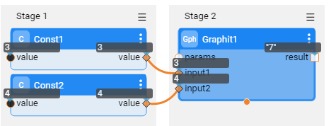
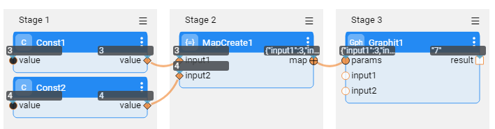

# Defining and Using Graphit Parameters

Graphit allows you to define input parameters whereby the generated documents are executed using various settings like LUIs, LU table columns and other specific parameters that require processing.

Parameters can be set when:
- Testing a Graphit file in the Graphit Editor
- Invoking Graphit as web service via HTTP request
- Calling Graphit from another implementation component such as Java Function or Broadway 


## Defining Graphit Parameters

1. Click on the </img> icon at the top Graphit Editor toolbar.
2. The **URL Parameters & Properties** right side panel opens and its top section is called **Input Parameter & Path**. In the beginning, no parameters are defined.
3. To add a new parameter, click on the plus (+) sign at the top of the Parameters sub section.
   </img>

4. A New Parameter pane opens, where you can define for a new parameter: name, type, description and whether it is mandatory.
   </img>

5. You can then add more parameters as needed. You can expand and collapse each of parameter pane, where in a collapsed mode only the name appears, as well as the debug value for testing. 
   </img>

> Note: The debug value is not saved with the Graphit file and it is used only in the Graphit Editor, for testing the web service.


## Using Parameters 

To use the input parameters in the Graphit file logic, you shall refer to them by using the **${}** bracket.

For example, to use it in the GET command - which requires the iid - when inputting parameter, use 'Customer_ID' and LU is 'Customer': 

`get Customer.${Customer_ID}`.

In this example you can also have the LU name to be a parameter, like this: `get ${LU}.${Customer_ID}` .

Parameters that can be used are not only input parameters but also those that set or retrieved at the Graphit logic:

* A Parameter that was set as a constant variable value, in a function node type. For example: when defining at a function node this  ` var LU = 'Customer' ` the `LU` variable can used on later nodes. For example, for GET command like  `get ${LU}.${Customer_ID}` . In that case LU was not defined as input parameter. 
* A Parameter that was retrieved from a SQL query or Broadway flow calls. The output fields of such commands result, can be used as parameters to later logic at the Graphit, for example in a WHERE statement at a next SQL command.


When using the parameters in function nodes you shall use it as variables. For example, supposed  `input1` and  `input2` are defined as input parameters, then in a function node you can do `input1 + input2` to get their sum.


## Set Input Parameters When Testing in Graphit
To test & debug a Graphit file:

1. Click on the </img> icon at the top Graphit Editor toolbar.
2. At The **URL Parameters & Properties**  > **Input Parameter & Path** section, populate the "Debug Value" fields.
3. Test the GraphIt by using either of the JSON, XML or CSV icons at the top toolbar.


## Transfer Input Parameters When Calling Graphit as Web Service


To learn how to send input parameters when the Graphit is exposed as web service, read [here](/articles/15_web_services_and_graphit/08_custom_ws_input_parameters.md).


## Transfer Input Parameters When Invoking From Fabric Implementation Components
A Graphit file can be invoked internally, from another Fabric Implementation Components. 

### Invoking From a Java Function

When calling Graphit from a java function, the input parameters shall be populated by a parameter name or by a map object.

**Example 1**: sending parameters as a map:


```java
Map<String, Object> graphitParams = new HashMap<>();
graphitParams.put("input1",1000);
graphitParams.put("input2",2463);
return graphit("gr1.graphit", graphitParams);
```


This code calls the following Graphit file which uses **${input1}** and **${input2}** as parameters.


**Example 2**: sending parameters as parameter list, as parameter name followed by the parameter value, similar to the below  example: 

`return graphit("gr2.graphit", "input1", 1000, "input2", 2463);`


>  Note: you can send "format" as one of the parameters when wishes to get the result document in a specific format, ither than the default which is JSON.


### Invoking From Broadway

When calling Graphit from a Broadway, using the Graphit Actor, you can either use the "params" input object or the auto added input parameters. The input parameters are added automatically to the actor according to the Graphit definitions, that is - Broadway looks at the Graphit structure and generate them. 

When running it, the actor looks first at the input parameters (first level) and if not found, looks at the "params" input argument.

In the below example Broadway Graphit Actor calls to a GraphIt file which get2 two input parameters, named "input1" and "input2" and summarizes them. The two input parameters usage are demonstrated below:







[](/articles/15_web_services_and_graphit/17_Graphit/05_graphit_debugging.md)[](/articles/15_web_services_and_graphit/17_Graphit/07_invoking_graphit_files.md)


