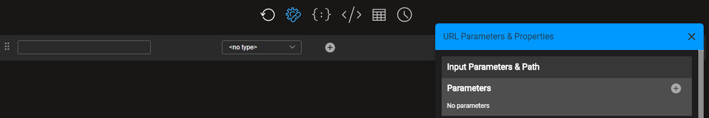
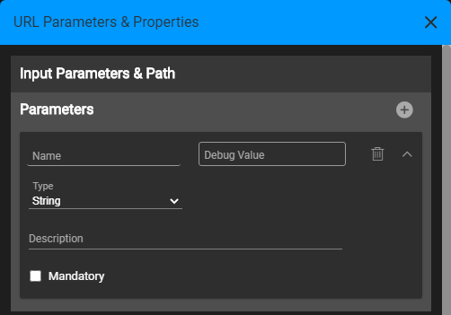
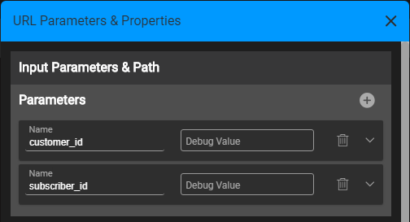

# Defining and Using Graphit Parameters

Graphit allows you to define input parameters whereby the generated documents are executed using various settings like LUIs, LU table columns and other specific parameters that require processing.

Parameters can be set when:
- Testing a Graphit file in the Graphit Editor
- Invoking Graphit as web service via HTTP request
- Calling Graphit from another implementation component such as Java Function or Broadway 


## Defining Graphit Parameters

1. Click on the </img> icon at the top Graphit Editor toolbar.
2. The **URL Parameters & Properties** right side panel opens and its top section is called **Input Parameter & Path**. In the beginning, no parameters are defined.
3. To add a new parameter, click on the plus (+) sign at the top of the Parameters sub section.
   </img>

4. A New Parameter pane opens, where you can define for a new parameter: name, type, description and whether it is mandatory.
   </img>

5. You can then add more parameters as needed. You can expand and collapse each of parameter pane, where in a collapsed mode only the name appears, as well as the debug value for testing. 
   </img>

> Note: The debug value is not saved with the Graphit file and it is used only in the Graphit Editor, for testing the web service.


## Using Parameters 

To use the input parameters in the Graphit file logic, you shall refer to them by using the **${}** bracket.

For example, to use it in the GET command - which requires the iid - when inputting parameter, use 'Customer_ID' and LU is 'Customer': 

`get Customer.${Customer_ID}`.

In this example you can also have the LU name to be a parameter, like this: `get ${LU}.${Customer_ID}` .

Parameters that can be used are not only input parameters but also those that are set in Graphit logic or retrieved from SQL queries:

* A Parameter that was set as a constant variable value, in a function node type. E.g., when defining ` var LU = 'Customer' ` at a function node, the `LU` variable can be used on later nodes, like  `get ${LU}.${Customer_ID}`. 
* A Parameter that was retrieved from either an SQL query or Broadway flow calls. The output fields of such command's result, can be used as parameters for later logic in the Graphit, for example in a WHERE statement in a next SQL command.


When using the parameters in function nodes, you shall use them as variables. For example, assuming that `input1` and `input2` are defined as input parameters, then in a function node you can do `input1 + input2` to get their sum.


## Set Input Parameters When Testing in Graphit
To test & debug a Graphit file:

1. Click on the </img> icon in the top Graphit Editor toolbar.
2. In the **URL Parameters & Properties**  > **Input Parameter & Path** section, populate the 'Debug Value' field.
3. Test the Graphit by using either the JSON, XML or CSV icons in the top toolbar.


## Transfer Input Parameters When Calling Graphit as a Web Service


To learn how to send input parameters when the Graphit is exposed as a web service - read [here](/articles/15_web_services_and_graphit/08_custom_ws_input_parameters.md).


## Transfer Input Parameters When Invoking From Fabric Implementation Components
A Graphit file can be invoked internally, from other Fabric Implementation Components. Each component provides methods to transfer the Graphit input parameters.

### Invoking From a Java Function

When calling Graphit from a Java function, the input parameters shall be populated by either a parameter name or by a map object.

**Example 1**: sending parameters as a map:


```java
Map<String, Object> graphitParams = new HashMap<>();
graphitParams.put("input1",1000);
graphitParams.put("input2",2463);
return graphit("gr1.graphit", graphitParams);
```


This code calls the following Graphit file, which uses **${input1}** and **${input2}** as parameters.


**Example 2**: sending parameters as parameter list, as parameter name followed by the parameter value, similar to the below  example: 

`return graphit("gr2.graphit", "input1", 1000, "input2", 2463);`


>  Note: You can send "format" as one of the parameters, when you wish to get the result document in a specific format, other than the default format, which is JSON.


### Invoking From Broadway

When calling Graphit from Broadway, using the Graphit Actor, you can use one of the following two methods to transfer parameters to the Graphit: the 'params' input object or the auto-added input arguments. The input arguments are automatically added to the actor according to the Graphit definitions, that is - Broadway looks at the Graphit structure and generates them. 

When running it, the actor first looks at the auto-added input arguments and if not found, it looks at the 'params' input argument.

In the below example, Broadway Graphit Actor calls to a Graphit file, which gets 2 input parameters, named 'input1' and 'input2' and sums them. The 2 parameters transfer methods are demonstrated below (the first image shows the auto-adding method and the second image the 'params' input object method):


[](/articles/15_web_services_and_graphit/05_invoking_graphit_files.md)[](/articles/15_web_services_and_graphit/07_invoke_javacode_from_graphit.md)


