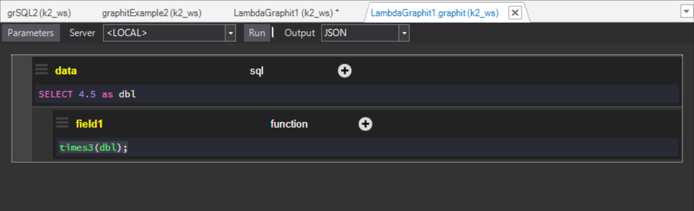
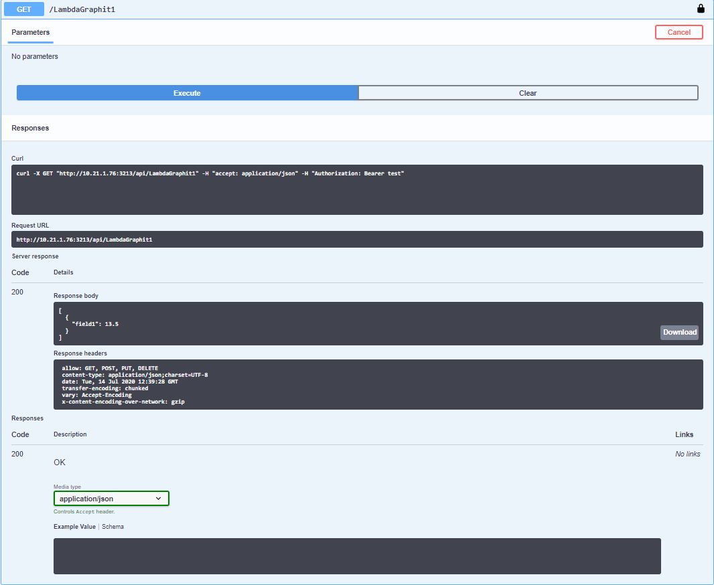

# Invoking Java Code From Graphit

Java functions can be bound to Graphit using a Web Service. To do so, create a Lambda expression based on the 'Scripter.F' functional interface in a key/value map entry, where the key contains the name of the function that is invoked in Graphit and the value contains its logic.

### Example

Web Service file: LambdaGraphit1.ws (can be found in the [KB Demo Project](/articles/demo_project/Fabric_Demo_Project/00_Fabric_demo_project_setup_guidelines.md) under Project Tree > Web Services > Java) 

```java
Map<String, Object> scope = new HashMap<>();
// a map object named scope in which each entry will contain the function's name and its logic
scope.put("times3", (Scripter.F) p->(double)p[0] *3);
// call graphit with the scope
return graphit("LambdaGraphit1.graphit", scope);
```

Graphit file LambdaGraphit1.graphit: (can be found in the [KB Demo Project](/articles/demo_project/Fabric_Demo_Project/00_Fabric_demo_project_setup_guidelines.md) under Project Tree > Web Services > resources )
Note that the above defined function times are called from the node **field 1** (defined as a function) on a variable called **dbl**, declared in the parent node 



Output using the Swagger GUI:



Limitations:
This type of function cannot be debugged in the Graphit Editor as the functional parameters cannot be created in the Studio. 
However, the code can be tested by either deploying it to Fabric or by debugging the Web Service code using the the IntelliJ editor. 

 

[](/articles/15_web_services_and_graphit/17_Graphit/06_using_graphit_files_with_parameters.md)[](/articles/15_web_services_and_graphit/17_Graphit/08_graphit_examples.md)

