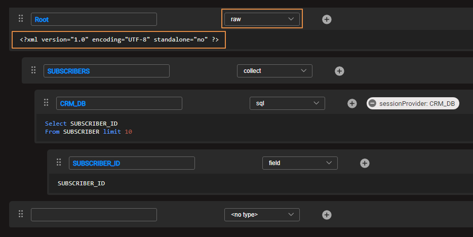
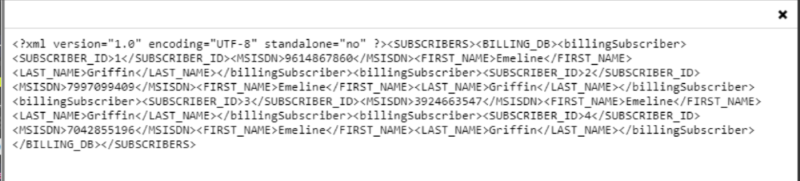
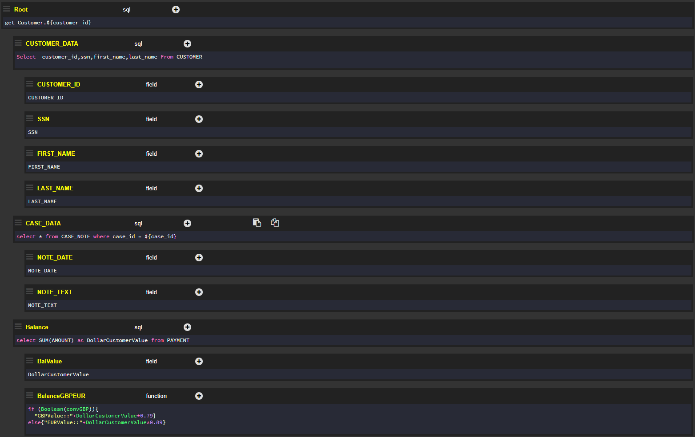
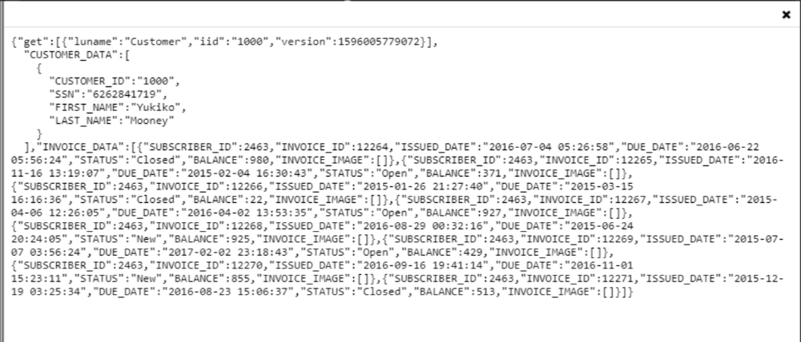
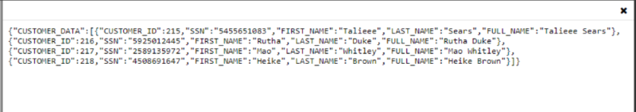
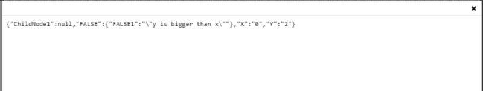
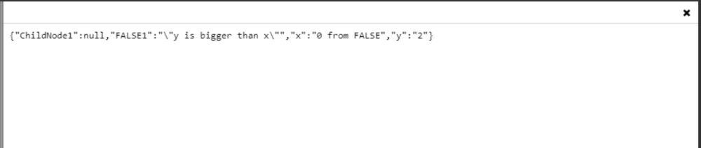
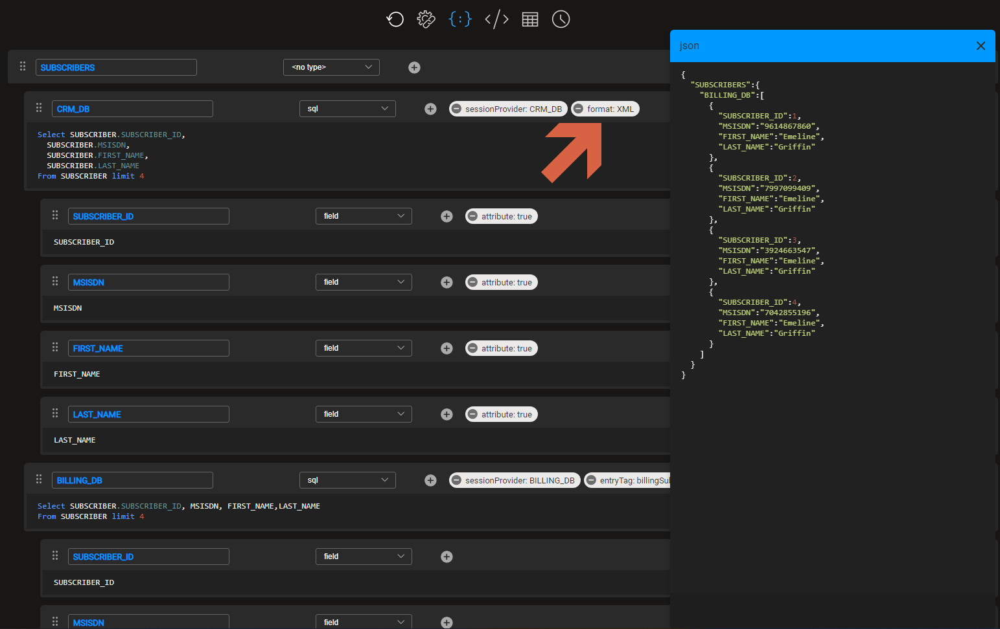

# Graphit Examples
This article contains several Graphit files examples. Graphit file names, when are mentioned, refers to the files that can be found in the [KB Demo Project](/articles/demo_project/Fabric_Demo_Project/00_Fabric_demo_project_setup_guidelines.md) under Project Tree > Web Services

### A simple Example of a Customer Info Web Service that brings data for an LUI

The following Graphit file gets an input LUI, which extracts customer data from the CUSTOMER LU, calculates its balance and sets its status accordingly. 

Output data is returned in a JSON structure and adds information on whether the customer is either a:
-  VIP member, with a total balance of over USD 10,000.
-  Gold member, with a total balance of over USD 1,000. 

</img>

After deploying and invoking the Graphit file directly as a Web Service:

</img>


### A simple Example of a CSV Output
This example displays how to retrieve data from multiple tables in the BILLING_DB database and use Graphit to prepare a CSV-formatted response:

#### grCSV.graphit

</img>

Run the Graphit file in a Debug mode with 2 and 3 as consecutive values for the SubscriberID:

</img>

Notes:

- The csvRow has been set to the SUBSCRIBER_ID node. Therefore, a new line has been created for each new subscriber_id entry.

- The csvHeader has been set to False in the SUBSCRIBER_INFO node. Therefore, the header has been removed from the CSV output.


###  Graphit Node Types Examples
#### grRaw.graphit
This example illustrates an XML output in raw format. Observe the header value displayed in the response.  

</img>


Output:

```xml
<?xml version="1.0" encoding="UTF-8" standalone="no" ?><SUBSCRIBERS><CRM_DB><SUBSCRIBER_ID>97</SUBSCRIBER_ID></CRM_DB><CRM_DB><SUBSCRIBER_ID>98</SUBSCRIBER_ID></CRM_DB><CRM_DB><SUBSCRIBER_ID>99</SUBSCRIBER_ID></CRM_DB><CRM_DB><SUBSCRIBER_ID>100</SUBSCRIBER_ID></CRM_DB><CRM_DB><SUBSCRIBER_ID>101</SUBSCRIBER_ID></CRM_DB><CRM_DB><SUBSCRIBER_ID>102</SUBSCRIBER_ID></CRM_DB><CRM_DB><SUBSCRIBER_ID>103</SUBSCRIBER_ID></CRM_DB><CRM_DB><SUBSCRIBER_ID>104</SUBSCRIBER_ID></CRM_DB><CRM_DB><SUBSCRIBER_ID>105</SUBSCRIBER_ID></CRM_DB><CRM_DB><SUBSCRIBER_ID>106</SUBSCRIBER_ID></CRM_DB></SUBSCRIBERS>
```

When removing the 'raw' from the node's type, the output will be as following:

```xml
<Root><SUBSCRIBERS><CRM_DB><SUBSCRIBER_ID>97</SUBSCRIBER_ID></CRM_DB><CRM_DB><SUBSCRIBER_ID>98</SUBSCRIBER_ID></CRM_DB><CRM_DB><SUBSCRIBER_ID>99</SUBSCRIBER_ID></CRM_DB><CRM_DB><SUBSCRIBER_ID>100</SUBSCRIBER_ID></CRM_DB><CRM_DB><SUBSCRIBER_ID>101</SUBSCRIBER_ID></CRM_DB><CRM_DB><SUBSCRIBER_ID>102</SUBSCRIBER_ID></CRM_DB><CRM_DB><SUBSCRIBER_ID>103</SUBSCRIBER_ID></CRM_DB><CRM_DB><SUBSCRIBER_ID>104</SUBSCRIBER_ID></CRM_DB><CRM_DB><SUBSCRIBER_ID>105</SUBSCRIBER_ID></CRM_DB><CRM_DB><SUBSCRIBER_ID>106</SUBSCRIBER_ID></CRM_DB></SUBSCRIBERS></Root>
```


#### grFunction.graphit

This example illustrates a simple JavaScript routine that returns the highest number of the **x** random number and the **y** random number.<br></br>
</img>

Output:

</img>

#### grSQL.graphit
This example illustrates a parent node that is defined as SQL non-prepared, whereas its children nodes are defined as SQL.<br></br>
</img>
Output:
</img>

#### grString.graphit
This example illustrates how 2 values, retrieved from a previously-defined SQL query, are concatenated.<br></br>
</img>
Output:
</img>

#### grCondition.graphit
The condition defined in this file triggers either the TRUE or FALSE node, depending on the randomly generated values of **x** and **y**.<br></br>
</img>

Output:

</img>

#### grGroup.graphit

The **x** string has been added to both TRUE and FALSE groups, while the **y** value is not declared in the groups. The display ${x} also lists the group of origin.<br></br>

</img>

Output:

</img>

#### grCollect.graphit
This example shows how both Subscriber and Billing datasets are collected into one single array.<br></br>
</img>

Output:

</img>


###  Graphit Node Properties Examples

#### grShowFormat.graphit
The **sessionProvider** flag is set to CRM_DB in order to enable direct references to CRM_DB tables and fields.<br></br>
</img>

Output:


#### grShowEnabled.graphit

The response returns empty as the entire CRM_DB node and its children nodes are affected by the **enabled** flag.

Additionally, the **nice** flag is set to TRUE on the root node level. As a result, each tag of the response is indented according to the position of the tag in the document's hierarchy.


<br></br>
</img>

Output:

</img>


#### grOne.graphit

The **one** flag is set to TRUE and is applied to the Billing_DB2 node. The response brings only the first value for {"BILLING_DB2":{"SUBSCRIBER_ID":2}} instead of the 10 values expected for this tag, had the **one** flag not been activated.<br></br>
</img>

Output:

</img>

#### grEntry.graphit
The **entry** flag has been set to the Subscribers node and therefore the XML response displays tags around each subscriber_id value.<br></br>
</img>

Output:

</img>


#### grAttribute.graphit
The **attribute** flag has been activated on all children nodes of the CRM_DB node.<br></br>
</img>
Output:
</img>

#### grFormat.graphit
The **format** flag has been set to XML in the CRM_DB node. If the format is specified, the node will only be evaluated and added if the output format matches the format value.

The example below requests JSON in the output format. The CRM_DB node, with all its sub nodes, is not displayed in the response since its format is in XML.




#### grShowEmpty.graphit
The **showempty** flag has been set to False and is applied to the CRM_DB node. Empty nodes are not shown in the response.<br></br>
</img>

Output:

</img>

#### grShowNull.graphit
The **showNull** flag has been set to False and is applied to the CRM_DB node. The response does not display the LAST_NAM field in the CRM_DB node as it has Null values that are ignored and are not shown in the section of the response referring to the CRM_DB. The flag has is not applied to the BILLING_DB node, and therefore Null values are displayed.<br></br>
</img>

Output:

</img>

#### grNumberFormat.graphit
The **numberFormat** flag has been set to 000.00 and is applied to the NumberFormat node. All responses display **numberFormat** with 3 digits before the floating point and another 2 after it.<br></br>
</img>

Output:

</img>

#### grKeys.graphit
The response has been reorganized using the subscriber_id as a key.<br></br>
</img>

Output:

</img>

[](/articles/15_web_services_and_graphit/17_Graphit/07_invoke_javacode_from_graphit.md)
