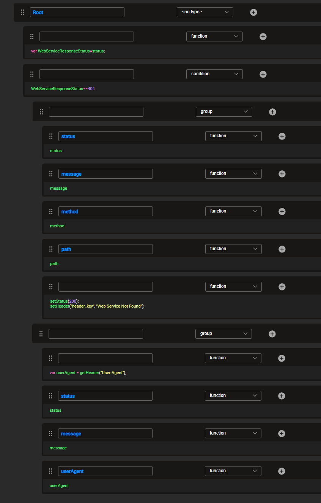

# Graphit - Error Handling

Once an ```error.graphit``` file is created on the project implementation, its execution is triggered each time an exception is returned as a result of a
Fabric Web-Service call. (Important to note that if you have prepared a "catch" for the exception, there will be no trigger to execute the file). 

The creation of a ```error.graphit``` file allows the implementors to set a standard payload reponse structure no matter what triggered the exception.

For example, one trigger could be a ```page not found``` message caused by an external client calling a Web-Service that was not deployed, a different example of a trigger can be the provisioning of an invalid APIKEY in the request, etc..

The implementator has full flexibility to analyze the reason for the underlying failure that caused the trigger, and as such, set the Web-Service response body, header and status accordingly.

This feature was added as a part of release 6.5.3.

### Example of error.graphit file

The following ```error.graphit``` file checks the original Web-Service response status.

If the response is 404 (page not found) it returns these original Web-Service details:
- response status
- exception error message	
- method
- path

and overrides the response with the following:		
- response status: 200 (OK).
- header_key value: 'Web Service Not Found'


If the response is not a 404, it returns these original Web-Service details:	
- response status
- exception error message
- request header User-Agent

In the figure below, you can see both of these responses: *404 not found* is shown in the upper half of the figure, and *any other response* (that is, if the response is not a 404), is shown in the lower half of the figure.  

</img>


[](/articles/15_web_services_and_graphit/17_Graphit/09_invoke_graphit_from_outside_studio.md)
