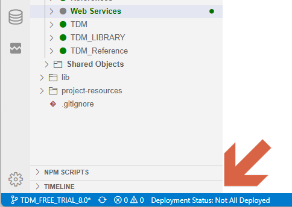

# Deploy from Fabric Studio

New or already existing Fabric project implementations must be deployed to the server in a way that recent code changes are compiled and ready to be used.

A deployment can be performed either from the Fabric Studio, as explained in this article, or by using an [Offline Deploy](/articles/16_deploy_fabric/03_offline_deploy.md).

<studio>

Studio allows you to perform deployment into either the local development server or a remote server.

Before starting the deployment process on a project, check that the target Fabric server is configured. To do so, go to the [User Preferences > Server Configuration](/articles/04_fabric_studio/04_user_preferences.md#what-is-the-purpose-of-the-server-configuration-tab) window and configure the required Fabric server, or use the  **'debug'** server entry, that is already configured to localhost, that is, to the Fabric server that the Studio works by default with.

Note that in order to **force the sync** of the LU Instances after deployment, you should check the [Force Upgrade Post Deploy](/articles/14_sync_LU_instance/02_sync_modes.md#fabric-studio-server-configuration---force-upgrade-post-deploy-checkbox) checkbox in the **Server Configuration** window.

> It is highly recommended not to deploy directly from Studio into a sensitive server such as staging and production. Deployment into such environments shall be done using CI/CD pipeline that first verifies the potential deployment package. Moreover, it may be required to combine the work of several developers.

</studio>

## Auto Deploy

The Fabric Studio **Auto Deploy** capability performs an automatic deployment of the code changes, to the local Fabric server, while debugging various components, such as the Data Viewer, LU Schema, Broadway, Broadway  Population, Parser and GraphIt. 

This reduces frictions during the debugging process and frees the user from performing a manual deployment upon each code change.

Fabric performs a local deployment according to the following logic: 

- If the Schema was changed, a full deploy is performed.
- If Java was changed, only Java resources and Broadway are deployed.
- If Broadway was changed, only Broadway is deployed.

<studio>

## How Do I Deploy a Fabric Object from the Fabric Studio?  

The following steps must be performed in the Fabric Studio for each deployed object, [Logical Unit](/articles/03_logical_units/01_LU_overview.md), [Web Service](/articles/15_web_services_and_graphit/01_web_services_overview.md), [Broadway flow](/articles/19_Broadway/01_broadway_overview.md), [Graphit](/articles/15_web_services_and_graphit/17_Graphit/01_graphit_overview.md) or Reference table.

1. Right-click the **object** to be deployed and then select **Deploy to Server** to display the list of servers defined in the **User Preferences** window. Note that the **Force Upgrade Post Deploy** notification displays next to the server if the server is checked as Force Upgrade Post Deploy in the [Server Configuration](/articles/04_fabric_studio/04_user_preferences.md#what-is-the-purpose-of-the-server-configuration-tab) tab.
2. Do either:

  - Click [**Server Name**], or
  - Click **Add/Edit** to open the **User Preferences** window if the required server configuration is missing. 

## Deploying Fabric Objects to the Local Fabric Debug Server

To debug an LU, it must first be deployed to the local Fabric debug server. A deployed LU has a green circle next to its name.

To deploy the Fabric implementation to the Fabric debug server, do either:

- Right-click the selected Fabric object > **Deploy To debug**, or
- Click **Deploy** in the upper [Fabric Debug panel](/articles/04_fabric_studio/01_UI_components_and_menus.md#fabric-studio-debug-panel).

</studio>

<web>

## Deploying a Fabric Project  

You can activate a deployment and see the Deployment Status in several places within the Fabric Studio.

### Deployment Status

A deployed LU has a green circle next to its name in the Project Tree. Otherwise, for example while making changes in its content, the circle turns gray.

Additionally, you can look at the 'Deployment Status' at the bottom status bar and see whether all LUs are deployed. When hovering over it with the mouse, a tooltip appears, implying which LUs are not deployed.

The below illustration shows the Project Tree, where all LUs - except 'Web Services' - appear with a green circle, indicating that they are deployed. A similar indication exists in the bottom status bar.

### Activate Deploy

Deployment can be done for either all updated LUs, those that are not yet deployed, or a specific LU.

To deploy all updated LUs, perform either one of the following actions:

* In the top menu bar, click Fabric and then 'Deploy All Updated Logical Units'.
* In the bottom status bar, hover with the mouse over 'Deployment Status', to display a tooltip that implies which LUs are not deployed. Clicking on 'Deployment Status' will trigger the deployment on these LUs.
* Open the command pallet (you can use the CTRL+SHIST+P shortcut), look for 'Deploy All Updated Logical Units' and click on it.

> Note: The 'Deploy All' action activates a Soft Deploy, unless this is the first time an LU is being deployed. This definition can be changed in the Preferences page, which is accessible via the bottom-left gear icon.

To deploy a specific LU, right-click on its name in the Project Tree. In the context menu, you can choose either Soft Deploy or Deploy. For more information about deploy options read [here](/articles/16_deploy_fabric/01_deploy_Fabric_project.md).

</web>

