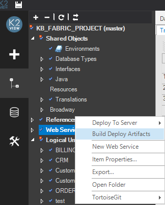

<studio>

# Offline Deploy

New or updated Fabric project implementations must be deployed to the server side. A deployment can be performed either from the [Fabric Studio](/articles/16_deploy_fabric/02_deploy_from_Fabric_Studio.md) or from the Fabric Server (also known as an Offline Deploy).

An **Offline Deploy** is implemented by running the **Deploy** command on the Fabric Server using artifacts that can be created either by the Fabric Studio or by the script on the server side.

### When Should I Use Offline Deploy?
When a Fabric project is developed by a group of programmers it is important that the environment is always up-to-date. This can be challenging. Fabric provides a solution that enables combining the code changes that have been implemented and committed by several programmers and deploying them to a specific environment. To do so, the Development team should prepare an automated Jenkins process that takes the project's latest sources from the Git or SVN repository and copies them to the server. The process then runs the script that creates the artifacts based on this code and then deploys them on a server. This process can run on the Fabric Server without any dependency on the Fabric Studio. 

[Click for more information about Best Practices for working with GIT and SVN](/articles/04_fabric_studio/07_best_practices_for_working_with_GIT_and_SVN.md).

### How Do I Perform an Offline Deployment?

There are two ways to perform an Offline Deployment:
- Build and deploy in two steps. First build the artifacts either from the Fabric Studio or from the server using the  [buildArtifacts.sh](03_offline_deploy.md#deployment-scripts-syntax-and-options) deployment script. Then do the deployment by running the **Deploy** command on the server.

- Build and deploy in one step. Build and deploy from the server using the  [buildAndDeployArtifacts.sh](03_offline_deploy.md#deployment-scripts-syntax-and-options) deployment script. It is also possible to deploy without the build, whereby the script only runs a **Deploy** command without creating and deleting artifacts.

#### Build and Deploy in Two Steps

1. To build the artifacts **from the Fabric Studio**:

   a. Right click the **object** (for example, **Web Services**) and click **Build Deploy Artifacts**. A notification is displayed after the artifacts are successfully built.

   

   b. Right click the same **object** and select **Open Folder**. The Windows Explorer opens in the following location: [Your PC Folder]\K2View Fabric Studio\Projects\\[Project Name]\Implementation\LogicalUnits\\[LU Name].

   c. Copy the **ludb.JAR** and **ludbXMLs.ZIP** files to the server.

2. To build the artifacts **from the Fabric Server**, run the  [buildArtifacts.sh](/articles/16_deploy_fabric/03_offline_deploy.md#deployment-scripts-syntax-and-options) deployment script.

3. To do the deployment, run the **Deploy** command using the following syntax:

~~~
DEPLOY <LUT> WITH JAR <'jar_path'> ZIP_FILE <'zip path'> [WS_METHODS <'string'>] NOSYNC <Boolean>.
~~~

Note that if the LUT parameter is populated by a **k2_ws** (Web Service LU Type), you can populate the WS_METHODS using the list of Web Services to be deployed. If this parameter is not populated or is empty, all the WS are deployed into the Fabric Server.

**Example**:

~~~
DEPLOY k2_ws WITH JAR '/home/k2view/AutoTests/Data/StudioProject/QA/Implementation/LogicalUnits/k2_ws/ludb.jar' ZIP_FILE '/home/k2view/AutoTests/Data/StudioProject/QA/Implementation/LogicalUnits/k2_ws/ludbXMLs.zip' WS_METHODS 'dbQueryOnAnyDB' NOSYNC true;
~~~

#### Build and Deploy in One Step
To build the artifacts and the deployment together in one step from the server, run the  [buildAndDeployArtifacts.sh](/articles/16_deploy_fabric/03_offline_deploy.md#deployment-scripts-syntax-and-options) deployment script.

#### Deployment Scripts Syntax and Options
The following table describes the syntax and the mandatory/optional parameters for calling the deployment scripts. The scripts are located under **$K2_HOME/fabric/scripts** in the Fabric Server.

   <table style="width: 900px;">
<tbody>
   <tr>
<td style="width: 270px;">
   
<h4>
       <strong>buildArtifacts.sh</strong> for Linux or

   
<strong>buildArtifacts.bat</strong> for windows

   </td>
   <td style="width: 630px;">
   
<strong>Description</strong>: Build the artifact files.

   
<strong>Usage</strong>: ./buildArtifacts.sh&nbsp;[-h --help] -pd [PATH_TO_PROJECT] -l [LUTNAME] -d [OUTPUT DIRECTION]

   
<strong>Options</strong>:

   <ul>
   <li>-h/--help displays the usage of the script.</li>
   <li>-pd [PROJ_NAME] - mandatory parameter. Sets the path to the project.</li>
   <li>-l [LUTNAME] - optional parameter. If not set, the artifacts are created for the entire project.</li>
   <li>-d [OUTPUT DIRECTION] - optional parameter. If not set, the artifacts are created in the given/each LU folder.</li>
   </ul>
   </td>
   </tr>
   <tr>
   <td style="width: 189px;"><h4>
   
<strong>buildAndDeployArtifacts.sh</strong> for Linux or <strong>buildAndDeployArtifacts.bat</strong> for Windows

   </td>
   <td style="width: 401px;">
   
<strong>Description</strong>: Build and deploy the artifact files.

   
<strong>Usage</strong>: ./buildAndDeployArtifacts.sh -pd [PATH_TO_PROJECT] -s [NOSYNC] -l [LUT_NAME] -u [USER] -p [PASSWORD] -d [DEPLOYONLY]

   
<strong>Options</strong>:

   <ul>
   <li>-h/--help - displays the usage of the script.</li>
   <li>-pd [PROJ_NAME] - mandatory parameter. Sets the path to the project.</li>
   <li>-s [NOSYNC] - optional parameter. Default is <strong>True</strong>.</li>
   <li>-l [LUTNAME] - optional parameter. If not set, the deploy runs for the entire project.</li>
   <li>-u [USER] - optional parameter. Default is <strong>admin</strong>.</li>
   <li>-p [PASSWORD] - optional parameter. Default is <strong>admin</strong>.</li>
   <li>-d [DEPLOYONLY] - optional parameter. If <strong>True</strong>, the script only runs a <strong>deploy</strong> command without creating and deleting the artifacts.</li>
   </ul>
   </td>
   </tr>
   </tbody>
   </table>
   

#### Deploy Command Syntax and Options
The following table describes the syntax and the mandatory/optional parameters when invoking the **deploy** command on the Fabric Server.

<table width="900px">
<tbody>
<tr>
<td width="200px">

<strong>DEPLOY</strong>

</td>
<td width="700px">

<strong>Usage</strong>: DEPLOY &lt;LUT&gt; WITH JAR &lt;'jar_path'&gt; ZIP_FILE &lt;'zip path'&gt; [WS_METHODS &lt;'string'&gt;] NOSYNC &lt;Boolean&gt;.

<strong>Options</strong>:

<ul>
<li>LUT - Logical Unit Type name.</li>
<li>JAR - mandatory parameter. Path to JAR file, relative to USER_DIR.</li>
<li>ZIP_FILE - optional parameter. Path to ZIP file, relative to USER_DIR.</li>
<li>NOSYNC - gets Boolean value:
<ul>
<li>NOSYNC TRUE: Only schema changes trigger sync after deploy.</li>
<li>NOSYNC FALSE: Any deploy (even without any changes) triggers sync on the first time the instance is accessed.</li>
</ul>
Note that NOSYNC FALSE is the same as checking <a href="/articles/14_sync_LU_instance/02_sync_modes.md#fabric-studio-server-configuration---force-upgrade-post-deploy-checkbox">Force Upgrade Post Deploy</a> in the Server Configuration window in the Fabric Studio.</li>
<li>SOFT_DEPLOY - optional parameter. Default is <strong>False</strong>.
<ul>
<li>In case the value of this parameter is set to TRUE, the deploy is performed without automatic processes: user jobs, parsers and interface listener.</li>
</ul>
</li>
<li>WS_METHODS - For LU Type = Web Services (k2_ws), specify which methods are selected, separated by &ldquo;,&rdquo;. Empty for all.</li>
</ul>
</td>
</tr>
</tbody>
</table>

</studio>
