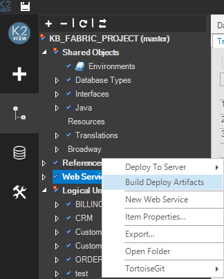

# Offline Deploy

New or updated Fabric project implementations must be deployed to the server. 

Deployment into non-development servers must be carefully performed, and the correct updates must be verified. Verification can be done using code reviews (a human process) and tools that perform 3rd-party dependency vulnerability checks and code analysis for quality and security.

Such deployment, not performed from [Fabric Studio](/articles/16_deploy_fabric/02_deploy_from_Fabric_Studio.md), is called an *Offline Deploy*.  Fabric provides two primary ways to perform this:

- In the Fabric server itself, using a Deploy script.
- Remotely, using API calls.

These methods should be used only after the prebuilt project artifacts targetted for deployment have passed verifications. CI/CD tools used for the verification pipeline can also perform Offline Deploy actions.

## Offline Deployment using Build and Deploy scripts

There are two ways to perform an Offline Deployment:
- Build and deploy in two steps: First, build the artifacts in the Fabric Studio or a server using the [buildArtifacts](03_offline_deploy.md#build-artifacts) script. Then, perform the deployment by <studio> running either the Fabric **Deploy** command on the target Fabric server or the *buildAndDeployArtifacts* script (using the DEPLOYONLY flag) or by </studio> using API calls.

  > CI/CD tools should be used to build artifacts on a server using a docker image containing Fabric. This way, Fabric is not required to run to build the artifacts.

- Build and deploy in one step. <studio>Build and deploy in the target Fabric server using the  [buildAndDeployArtifacts](03_offline_deploy.md#build-and-deploy-artifacts) script.</studio><web>Use the K2cloud UI.</web>

### Build and Deploy in Two Steps

<studio>

To build the artifacts **in the Fabric Studio**:

1. Right-click the **object** (for example, **Web Services**) and click **Build Deploy Artifacts**. A notification displays following a successful build of the artifacts.

2. Right-click the same **object** and select **Open Folder**. The Windows Explorer opens in the following location: [Your PC Folder]\K2View Fabric Studio\Projects\\[Project Name]\Implementation\LogicalUnits\\[LU Name].

3. Look for the **ludb.JAR** and **ludbXMLs.ZIP** files.

</studio>

To build the artifacts **on a server**, run the *[buildArtifacts.sh](/articles/16_deploy_fabric/03_offline_deploy.md#build-artifacts)* script.

<studio>

Copy the **ludb.JAR** and **ludbXMLs.ZIP** files of the relevant LUs into the target Fabric server, and run the Fabric **Deploy** command using the following syntax:

~~~
DEPLOY <LUT> WITH JAR <'jar_path'> ZIP_FILE <'zip path'> [WS_METHODS <'string'>] NOSYNC <Boolean>.
~~~

Note that if the LUT parameter is populated by **k2_ws** (the Web Services LU Type), you can populate the WS_METHODS using the list of web services to be deployed. If this parameter is not populated or is skipped, the whole Web Services LU Type, with all web services it contains, will be deployed in the Fabric server.

**Example**:

~~~
DEPLOY k2_ws WITH JAR '/home/k2view/AutoTests/Data/StudioProject/QA/Implementation/LogicalUnits/k2_ws/ludb.jar' ZIP_FILE '/home/k2view/AutoTests/Data/StudioProject/QA/Implementation/LogicalUnits/k2_ws/ludbXMLs.zip' WS_METHODS 'dbQueryOnAnyDB' NOSYNC true;
~~~

### Build and Deploy in One Step
To build the artifacts and the deployment together, in one step, from the server, run the [buildAndDeployArtifacts](03_offline_deploy.md#build-and-deploy-artifacts) script.

</studio>

### Build and Deploy Scripts Syntax and Options
The following table describes the syntax and the mandatory/optional parameters for calling the deployment scripts. The scripts are located under **$FABRIC_HOME/fabric/scripts** in the Fabric server.

#### Build Artifacts

<table>
<tbody>
   <tr>
<td>
   

   <strong>buildArtifacts.sh</strong> for Linux or

   
<strong>buildArtifacts.bat</strong> for Windows

   </td>
   <td>
   
<strong>Description</strong>: Build the artifact files.

   
<strong>Usage</strong>: ./buildArtifacts.sh&nbsp;[-h --help] -pd [PATH_TO_PROJECT] -l [LUTNAME] -d [OUTPUT DIRECTION]

   
<strong>Options</strong>:

   <ul>
   <li>-h/--help displays the usage of the script.</li>
   <li>-pd [PROJ_NAME] - mandatory parameter. Sets the path to the project.</li>
   <li>-l [LUTNAME] - optional parameter. If not set, the artifacts are created for the entire project.</li>
   <li>-d [OUTPUT DIRECTION] - optional parameter. If not set, the artifacts are created in the given/each LU folder.</li>
   </ul>
   </td>
   </tr>
</tbody>
</table>
<studio>

#### Build and Deploy Artifacts

<table>
<tbody>
   <tr>
   <td>
   
<strong>buildAndDeployArtifacts.sh</strong> for Linux or <strong>buildAndDeployArtifacts.bat</strong> for Windows

   </td>
   <td>
   
<strong>Description</strong>: Build and deploy the artifact files.

   
<strong>Usage</strong>: ./buildAndDeployArtifacts.sh -pd [PATH_TO_PROJECT] -s [NOSYNC] -l [LUT_NAME] -u [USER] -p [PASSWORD] -d [DEPLOYONLY]

   
<strong>Options</strong>:

   <ul>
   <li>-h/--help - displays the usage of the script.</li>
   <li>-pd [PROJ_NAME] - mandatory parameter. Sets the path to the project.</li>
   <li>-s [NOSYNC] - optional parameter. Default is <strong>True</strong>.</li>
   <li>-l [LUTNAME] - optional parameter. If not set, deploy runs for the entire project.</li>
   <li>-u [USER] - optional parameter. Default is <strong>admin</strong>.</li>
   <li>-p [PASSWORD] - optional parameter. Default is <strong>admin</strong>.</li>
   <li>-d [DEPLOYONLY] - optional parameter. If <strong>True</strong>, the script runs only a <strong>deploy</strong> command without creating and deleting the artifacts.</li>
   </ul>
   </td>
   </tr>
   </tbody>
   </table>

### Deploy Command Syntax and Options
The following table describes the syntax and the mandatory/optional parameters when invoking the **deploy** command on the Fabric server. Note that for deployment, you can also run the *buildAndDeployArtifacts* script using the DEPLOYONLY flag.

<table width="900px">
<tbody>
<tr>
<td width="200px">

<strong>DEPLOY</strong>

</td>
<td width="700px">

<strong>Usage</strong>: DEPLOY &lt;LUT&gt; WITH JAR &lt;'jar_path'&gt; ZIP_FILE &lt;'zip path'&gt; [WS_METHODS &lt;'string'&gt;] NOSYNC &lt;Boolean&gt;.

<strong>Options</strong>:

<ul>
<li>LUT - Logical Unit Type name.</li>
<li>JAR - mandatory parameter. Path to JAR file, relative to USER_DIR.</li>
<li>ZIP_FILE - optional parameter. Path to ZIP file, relative to USER_DIR.</li>
<li>NOSYNC - gets Boolean value:
<ul>
<li>NOSYNC TRUE: Only schema changes trigger a sync after deployment.</li>
<li>NOSYNC FALSE: Any deployment (even without any changes) triggers a sync on the first time the instance is accessed.</li>
</ul>
Note that NOSYNC FALSE is equivalent to checking the <a href="/articles/14_sync_LU_instance/02_sync_modes.md#fabric-studio-server-configuration---force-upgrade-post-deploy-checkbox">Force Upgrade Post Deploy</a> checkbox in the Server Configuration window in the Fabric Studio.</li>
<li>SOFT_DEPLOY - optional. The default is <strong>False</strong>.
<ul>
<li>In case the value of this parameter is set to TRUE, the deployment is performed without these automatic processes: user jobs, parsers, interface listener, and deploy.flow.</li>
</ul>
</li>
<li>WS_METHODS - optional. When LU Type = Web Services (k2_ws), specify which methods are selected, separated by &ldquo;,&rdquo;. Empty for all.</li>
</ul>
</td>
</tr>
</tbody>
</table>
</studio>

## Offline Deployment using API calls

### Request URL Format

 POST   `https://<FABRIC-IP>:<FABRIC-PORT>/deploy?luName=<LUT-NAME>[&noSync=true|false][&softDeploy=true|false][&methodList=<LIST-OF-METHODS>]&[token=<APIKEY>][user=<USER-NAME>&password=<PASSWORD>]`

#### Parameters

<table>
	<thead>
		<tr>
            <th >
<strong>Parameter</strong>
</th>
            <th >
<strong>Description</strong>
</th>
            <th>
<strong>Mandatory</strong>
</th>
            <th>
<strong>Default</strong>
</th>
		</tr>
	</thead>
	<tbody>
		<tr>
			<td>
luName
</td>
		    <td>
The name of the LUT that shall be deployed. Each deploy command manages only a single LUT.
</td>
			<td>
Y
</td>
			<td>

</td>            
		</tr>
        <tr>
			<td>
noSync
</td>
		    <td>
Indicates if deploy shall run in a no-sync mode, applying only schema changes, but without triggering a sync.
</td>
			<td>
N
</td>
			<td>
false
</td>            
		</tr>
		<tr>
            <td>
softDeploy
</td>
            <td>
Indicates if deploy shall run in a soft deploy mode - without triggering automatic processes.
</td>
            <td>
N
</td>
   			<td>
false
</td>
	    </tr>
   		<tr>
            <td>
methodList
</td>
            <td>
Specifies which methods to be deployed, when luName=k2_ws (Web Services). Method names shall be separated by &ldquo;,&rdquo;. When empty or not sent - whole methods are deployed.
</td>
            <td>
N
</td>
   			<td>

</td>
	    </tr>
    </tbody>
</table>

#### Authentication & Authorization

* Authentication is done by either user and password (*user* & *password* parameters) or an API Key (*token* parameter), that shall be sent as parameters. 
* The request caller shall be authorized with the right permissions to perform the deployment on the required LUT / web services. See [here](/articles/17_fabric_credentials/01_fabric_credentials_overview.md#list-of-permissions) for more information.

 

### Request Body

Body parameters, along with the deployment files, are to be sent with ContentType header = multipart/form-data.

<table>
	<thead>
		<tr>
            <td >
<strong>Parameter</strong>
</td>
            <td >
<strong>Description</strong>
</td>
            <td>
<strong>Mandatory</strong>
</td>
		</tr>
	</thead>
	<tbody>
		<tr>
			<td>
jar
</td>
		    <td>
Path to the JAR file
</td>
			<td>
Y
</td>
		</tr>
		<tr>
            <td>
projectXmlData
</td>
            <td>
Path to the ludbXMLs ZIP file. When not specified, only Java files will be deployed.
</td>
            <td>
N
</td>    
	    </tr>
    </tbody>
</table>

