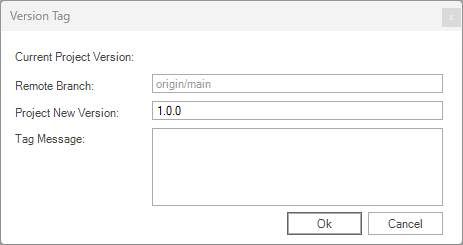
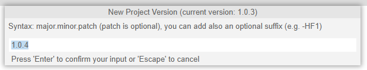
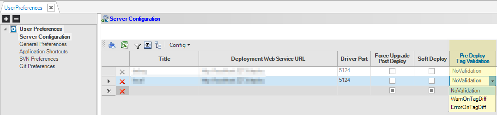
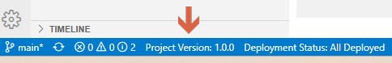

# Project Versioning

The implementation of a Fabric project is an ongoing process that evolves in response to changing business needs. It is essential to manage the project implementation code in a source control system, such as GIT. Additionally, Fabric provides a valuable feature of project version tagging, enabling visibility of the deployed version tag on the server. This capability grants you a greater control over your project's versions and allows you to easily identify the currently deployed version on a Fabric server.


The project versioning solution is built from 3 steps along the project lifecycle, helping you to control, verify and have visibility of the project's version:

1. Tag a version, an action available in the Studio.

2. Deploy Fabric objects, that were tagged with a version, into the server.

3. Check the project objects version/s in Fabric console/terminal to understand what has been deployed.

   

## Tag a Version

Studio helps you to tag a version appropriately by:

1. Proposing you the next version, according to the current version and based on semantic versioning format.
2. Alerting you when there are any local changes that haven't yet been pushed to GIT.
3. Alerting you when your changes are not aligned with other changes on your working GIT's branch.
4. Updating the project version both in the project definitions and in GIT, as an annotated tag.  

### Tag Version Workflow

The following is the recommended workflow:

<studio>

1. Pull the project from GIT.

2. Develop and implement your code on the project.

3. Once the working phase is done, set a version for your work:

   - From the project tree root, right-click and choose "Version Tag".

   - The Version Tag pop-up window appears, displaying the information of the remote GIT branch, the proposed tag version and an optional tag message. The proposed version is based on the previous version but can be changed, as described below.

      

   - Leave the value of the new project version, as proposed, or change it if needed.
   
   - Click OK to proceed.
   

</studio>

<web>

1. Create a space based on a project from GIT.

2. Develop and implement your  code on the project.

3. Once a working phase is done, set a version for your work:

   - From the top Fabric menu item choose "Version Tag".

   - A popup appears with information of the remote GIT branch, the proposed tag version and an optional tag message. The proposed version is based on the previous but can be changed, as described below.

      
   
   - Leave the project new version value as proposed or change it, when needed.
   
   - Press 'Enter' to proceed.

</web>

4. Studio makes validations about the action: 

   - It checks that you do not have any local changes (no matter if committed locally or not) which are not pushed to GIT. If there are changes - Studio warns you about that. 
   
     If you decide creating a version despite the warn, a version will be created, containing only the pushed to GIT files. 
   
   - It Checks weather your changes are aligned with other changes on this GIT's branch and warns you if not. 
   
     Note that this case is valid: sometimes two or more developers are working on same branch in parallel, on different capabilities, aimed to different phases. Thus, a version tag might contain specific development made on that on that branch. 


5. In case you click to continue, after examining warns, if appear, the version tag is created at both project meta data file (k2proj.xml) and also as an annotated tag in GIT, where tag message, if populated, is set at GIT. Both changes are committed and pushed into GIT.

   

> **Note**: Studio is not responsible about the permissions a developer has to create a tag, neither from which branch it is allowed. Project's owner shall defines it at GIT itself as well as define the procedures, for example from which branch (e.g., any or specific "main"), version tag shall be produced.


### Project Version Format

it is recommended to follow the semantic versioning structure, where version number shall be built as MAJOR.MINOR.PATCH,  as defined [here](https://semver.org/). Nevertheless, for simplicity, Studio enforces the format of X.Y, that is starting with 2 digits and then let you decide how else it will looks like.

On next time that Tag Version action is initiated, Studio analyzes the current version and "clean" it from non-digits characters, preserving the convention that used so far. For example, the next suggested version after "10.2.3-DEV-SNAPSHOT" will be "10.2.4" and the next proposed version for "1.0-HF2" it will be "1.1".


## Deploying Tagged Objects 

<studio>

Fabric Studio allows deploying project objects into remote servers. As part of project versioning capability, Studio offers you to decide, per remote server, weather activating the version tag validation, as a pre-deploy step, ensuring by doing it that you will have the most exact visibility on what is deployed at the target remote Fabric server. 

At the Studio User Preferences screen, you can choose, per remote server, at the **Pre Deploy Tag Validation** field, either to skip on it, to warn when validation failed or block the deployment when validation failed.



On deploying to remote server, either the whole project or only specific objects, Studio performs the following according to the chosen preferences:

* When **NoValidation** is chosen (default), then Studio skips on all tag checks. This is the less recommended option because local changes, if were done, will not be reflected, via the version command, at the remote server. It is available for customers that do not use project versioning capability, and thus as well as for backward compatability it is set as default.

* When **WarnOnTagDiff** is chosen, then Studio checks that the candidates to be deployed are aligned with the version tag. It compares the files that are going to be deployed against the files at GIT, by the current project version tag. If they are not equal - Studio warns you. You can choose to continue anyway.

  In such case, where you decide to continue with the deployment, despite the warns, a star will be added to the project's version at the built artifacts (e.g. "1.0.2*****"). This will be used later on the remote server to indicate, at the `version` command results, to hint the user about. By doing this, Studio empowering the version visibility at the remote target server, about what is deployed.

* When **ErrorOnTagDiff** is chosen, then Studio behaves similar to the **WarnOnTagDiff** option but in this case it blocks the action and deployment cannot be done.


When running **Build Deploy Artifacts** action, Studio behaves similarly, but without alerting the user, because no deployment is done but building artifacts. Yet, when not skipping on the validation checks, the built artifacts are sign with the star indication, when not aligned with tag. This means that later on, when these artifacts will be taken and deployed at another server, using the [offline deploy](/articles/16_deploy_fabric/03_offline_deploy.md), same indication will appear on the `version` command results, hinting users about.


> Note: User Preferences is saved at developer's local machine Studio and thus it is his responsibility to set properly the pre deploy validation, according to the project's procedures. 


</studio>

<web>

To use a specific version tag in a space, you shall set in either in project level - at branch/tag field or on a specific project space profile level. 

</web>


## Fabric commands

Fabric enable visibility on the version of the currently deployed objects at server. By knowing the project version, you can examine at GIT the exact content of that object and accordingly understand better his functionality and behavior, especially if something works not as expected.

* The ```version``` command shows, in addition to the product version, the project version for each LU, in a separated entry. Because each LU can be deployed separately, their versions might be different.  For Example:

  ```
  |Resource        |Result                                  |
  +----------------+----------------------------------------+
  |Version         |7.2.0                                   |
  |Full Version    |7.2.0_37                                |
  |Version's commit|46a96b7246e96cecd84dfc3522302b99c7c1b65c|
  |MDB Version     |3.39.2                                  |
  |Customer        |1.0.0                                   |
  |Orders          |1.0.0                                   |
  |Billing         |1.0.3                                   |
  ```

* Project version will not be shown as long as project versioning actions were not activated. In addition it will not be shown for those LUs which are not deployed. This can happen also during the phase of starting using this capability, where some LUs are being deployed after using it will appear with version and other will not. 

* ```list ws```  and ```list lut``` are also reflecting the project versioning, shown in the "Project Version" column in the commands result. 

  `list ws` command result example: 

  ```
  |Name |Category|Version|Deployed               |Project Version|
  +-----+--------+-------+-----------------------+---------------+
  |test1|test    |1.0    |2023-06-01 12:23:30.608|1.0.0          |
  |test2|test    |1.0    |2023-07-03 18:27:49.738|1.0.3          |
  ```

  

  `list lut` command result example: 

  ```
  |LU_NAME |Project Version|
  +--------+---------------+
  |Billing |1.0.3          |
  |Customer|1.0.0          |
  |Orders  |1.0.0          |
  ```

* When the deployment was done although it was not aligned with the tagged version, the ```version``` command yields a star near the project version (e.g. "1.0.2*****"), indicating that the deployed object is not quals to the version, but contain changes.  


<web>

In Studio, You can see the current deployed version also at the bottom status bar



</web>

## Notes

* Using the project version capability is optional and as long as not used, project metadata will not contain it. Thus, version command will not show LUs entries. 

* When project's source code is not controlled at GIT, the related project versioning elements and actions will not be shown or act.

  If still needed, project version can be added manually to the k2proj.xml (at `<ProjectVersion>` element), so that it will be reflected later at the version command result on the deployed server. As Studio validations cannot be run in such case, there is no guarantee that the version which is shown in the version command's result really represent the version, that was added and saved manually. 

  Manual update shall not be done when working with GIT and with the project version mechanism.


<studio>[](/articles/16_deploy_fabric/03_offline_deploy.md)</studio><web>[](/articles/16_deploy_fabric/02_deploy_from_Fabric_Studio.md)</web>[](/articles/16_deploy_fabric/05_project_versioning_examples.md)


