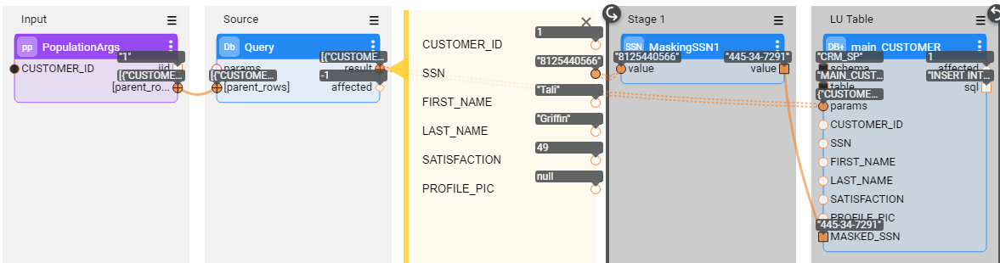
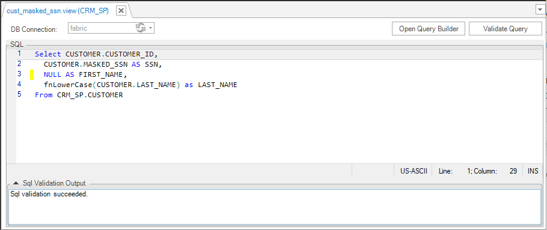
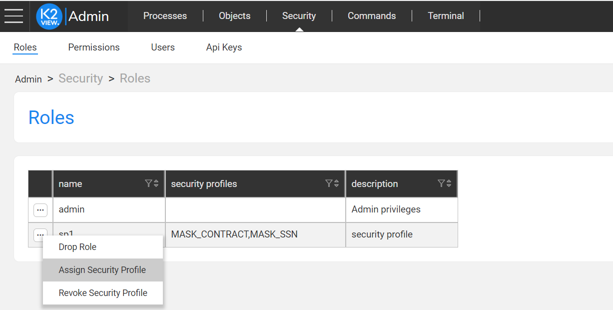

# Declarative Field Level Authorization

### Overview

Starting from Fabric V6.5.8, Fabric introduces the **Declarative Field Level Authorization** mechanism. The purpose of this mechanism is to enable access restriction to sensitive data, using a Role Based Access approach. Fabric can expose either original or manipulated data to the Fabric user based on his predefined role. This mechanism is applicable to all channels that query the Fabric data: Web Services, GraphIt, Broadway actors.

For example, the Customer Details WS retrieves an SSN, which is considered as sensitive data. Most user roles are not allowed to view a customer SSN, whereas some other user roles (such as admin) are. The Declarative Field Level Authorization mechanism enables to define a [security profile](05_security_profiles.md) that can redirect the WS to retrieve the masked SSN instead of the original one. The following section describes how to field setup the **Declarative Field Level Authorization** mechanism.

Known limitation: Field Level Authorization is not applied on GraphIt that is invoked directly as a Web Service. In order to enforce the authorization mechanism, you need to create a Web Service that will invoke a GraphIt file.  

### E2E Field Level Authorization Definition

1. Apply data manipulation on a table that contains sensitive data. For example, you can add a new field called MASKED_SSN to the CUSTOMER LU table and populate it with a masked value of the original SSN field using the CUSTOMER population flow as illustrated below:

   

2. Create an LU view that retrieves the manipulated value instead of the original value. For example, using the following query, create an LU view that exposes the value of the MASKED_SSN field instead of the original SSN value. Data manipulation can also be done using an [LUDB function](/articles/07_table_population/11_3_creating_an_LUDB_function.md).

   * Note that the LU view must have the same number of columns as the original LU table, otherwise the Web Service or GraphIt calling it will fail to replace the table by a view. However, should you wish to hide all values of a certain column, you could always use the `NULL AS <column name>` syntax.

   

   [Click to get more information about LU views creation](/articles/06_LU_tables/06_LU_views.md).

3. Create a security profile, then select an LU table and assign it with a corresponding LU view.

   * Each LU table can only be defined once under each security profile.
   * Each LU table can be assigned to more than one security profile. 
   * Each LU view can be attached to more than one LU table.

   

   [Click to get more information about the security profiles](05_security_profiles.md). 

4. Save the security profile and deploy the LU.

5. Assign the created security profile to a user role by one of the following ways:

   * Using a Fabric command to [assign a security profile to a role](/articles/17_fabric_credentials/02_fabric_credentials_commands.md#assign-security_profile-security_profile-to-role-role).

   * Opening the [Web Admin](/articles/30_web_framework/03_web_admin_application.md) > Security > Roles, as shown below:

     

     ​

     Multiple security profiles can be assigned to the same role. 

Note: If the same LU table is defined under several security profiles assigned to the same role, Fabric will select the first security profile that appears in Studio.

