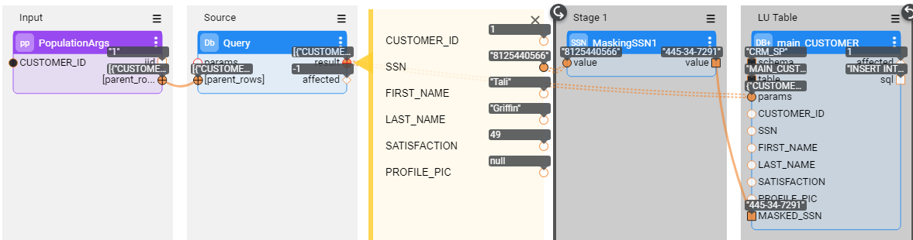
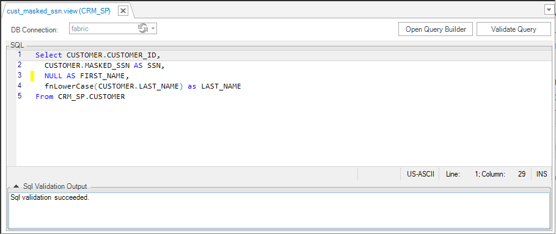
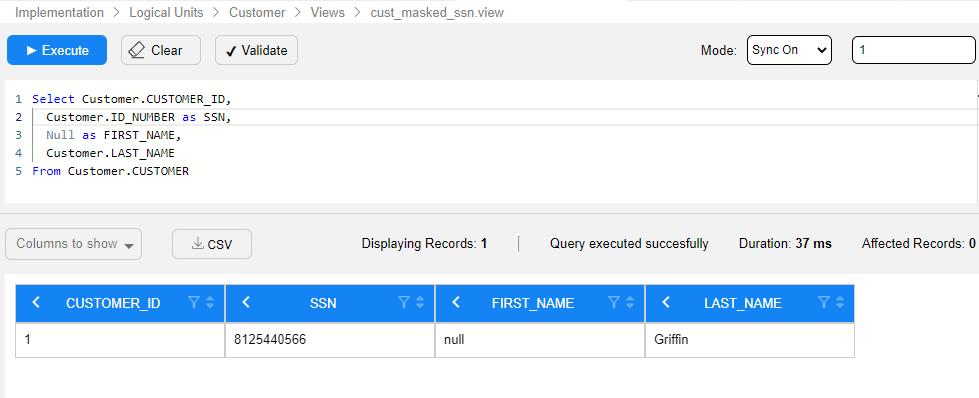
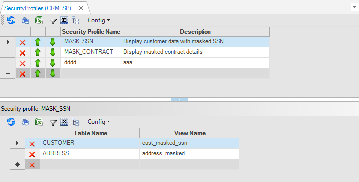
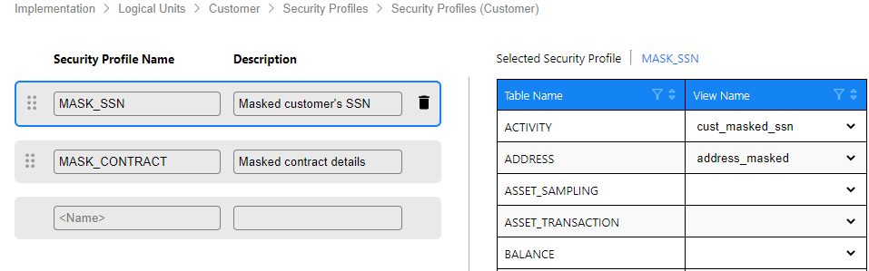
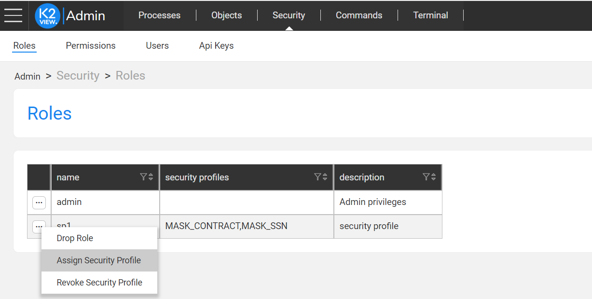

# Declarative Field Level Authorization

### Overview

The purpose of the **Declarative Field-Level Authorization** mechanism is to restrict access to sensitive data, using Role-Based Access Control (RBAC). Fabric can expose either the original or manipulated data to Fabric users based on their predefined roles. This mechanism applies to all channels that query Fabric data: Web Services, GraphIt and Broadway actors.

For example, the Customer Details web service retrieves an SSN, which is considered sensitive data. Most user roles are not permitted to view a customer's SSN, whereas some roles (such as administrators) are. The Declarative Field-Level Authorization mechanism allows to define a [security profile](05_security_profiles.md) that can redirect the web service to retrieve a masked SSN instead of the original one. The following section describes how to set up the **Declarative Field-Level Authorization** mechanism.

Starting from Fabric V8.3, a new feature validates during the sync process whether a user is authorized to view LU instance data based on their role, security profile and defined root table view, and throws an unauthorized exception if access is denied. The Search command has been enhanced to return only the IID when the user is unauthorized. The Web Service/GraphIt functionality has been enhanced to consider security profile definitions.

For example, to restrict certain users from accessing VIP customers, it is possible to add a new field to the root table called vip_ind and mark the VIP customers with 'Y'. All other customers will remain with vip_ind set to null. Afterwards, it is required to define a view called customers_vip that runs select * from root_table where vip_ind is null. Users with a role linked to a security profile that contains this view will not have access to the VIP customers, as the sync activity will throw unauthorized exception.

### End-to-End Definition of Field-Level Authorization

1. Apply data manipulation on a table that contains sensitive data. For example, you can add a new field called MASKED_SSN to the CUSTOMER LU table and populate it with a masked value of the original SSN field using the CUSTOMER population flow as illustrated below:

   

2. Create an LU view that retrieves the manipulated value instead of the original value. For example, using the following query, create an LU view that exposes the value of the MASKED_SSN field instead of the original SSN value. Data manipulation can also be done using an [LUDB function](/articles/07_table_population/11_3_creating_an_LUDB_function.md).

   * Note: The LU view must have the same number of columns as the original LU table, otherwise the Web Service or GraphIt that calls it will fail to replace the table with the view. However, should you wish to hide all values of a certain column, you could always use the `NULL AS <column name>` syntax.

<studio>

   

</studio>

<web>

   

</web>

   [Click to get more information about LU views creation](/articles/06_LU_tables/06_LU_views.md).

3. Create a security profile, then select an LU table and assign it with a corresponding LU view.

   * Each LU table can only be defined once under each security profile.

   * Each LU table can be assigned to more than one security profile. 

   * Each LU view can be attached to more than one LU table.

<studio>

</studio>

<web>

</web>

[Click to get more information about the security profiles](05_security_profiles.md). 

4. Save the security profile and deploy the LU.

5. Assign the created security profile to a user role by one of the following ways:

* Using a Fabric command to [assign a security profile to a role](/articles/17_fabric_credentials/02_fabric_credentials_commands.md#assign-security_profile-security_profile-to-role-role).

* Opening the [Web Admin](/articles/30_web_framework/03_web_admin_application.md) > Security > Roles, as shown below:

  

  

  Multiple security profiles can be assigned to the same role. 

Note: If the same LU table is defined under several security profiles assigned to the same role, Fabric will select the first security profile that appears in Studio.

