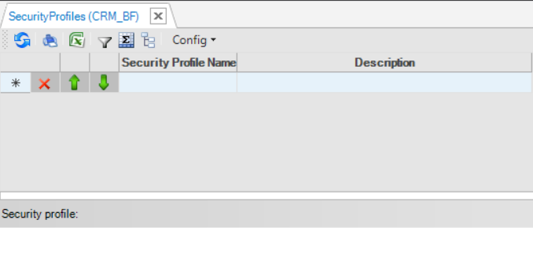
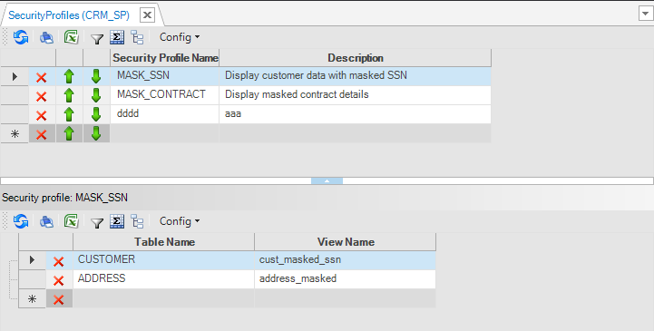

# Security Profiles

### Overview

Starting from Fabric V6.5.8, Fabric introduces **Security Profiles** that are part of Fabric's [Declarative Field Level Authorization](04_fields_level_authorization.md) mechanism. The purpose of security profiles is to restrict Fabric from exposing sensitive data to unauthorized users, based on their predefined roles. In order to implement such restriction, a **security profile** must:

1. Include a definition of at least one pair -  an LU table and a corresponding LU view.
2. Be attached to a Fabric user role.

### How to Create a Security Profile?

1. Go to **Project Tree** > **Logical Units** > [**LU Name**] and click on **Security Profiles** to display the **Security Profiles** window.

   
2. Populate the Security Profile Name and Description in their designated fields. 
   * Multiple security profiles can be created under the same LU. 
   * If some security profiles were already created under a different LU, their names will appear in the drop-down list.
   * A security profile with the same name can be created under different LUs.
3. Then, for each security profile select an LU table and assign it with a corresponding LU view.
   * Note that each LU table can only be defined once under each security profile.
4. Save the security profile.

   
5. Deploy the Logical Unit.

