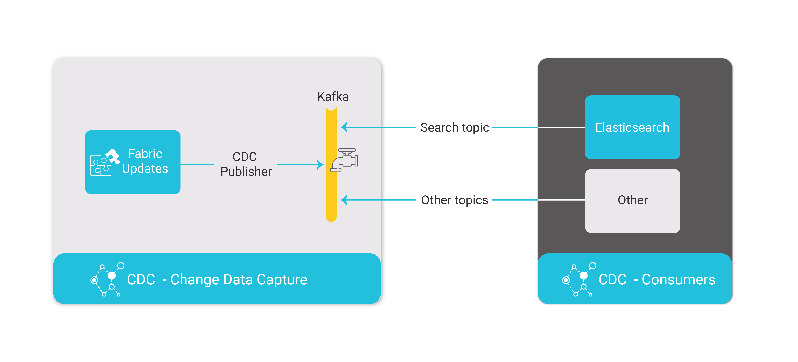

# Change Data Capture Overview

The Fabric Change Data Capture (CDC) solution notifies external systems about data changes published via Kafka. It also offers cross-instance search capabilities through its built-in integration with Elasticsearch.

Fabric CDC can send different data segments to different CDC consumers, and different LU table columns can be defined as CDC fields on different CDC consumers. Each CDC consumer has its own Kafka topic and gets its own CDC messages so that **each CDC consumer gets only the data changes that are relevant for it**. 

For example:
-  Consumer A gets data changes about the Customer's usage.
-  Consumer B gets data changes about the Customer's financial transactions.
-  Consumer C gets data changes about the Customer's personal details. 

The following HL flow describes the CDC flow and the population of CDC data in consumers:

- Each CDC message is sent to Kafka. Each CDC consumer has its own Kafka topic. 

- The Fabric CDC_TRANSACTION_CONSUMER job consumes the **search** topic from Kafka and updates Elasticsearch. Other consumers must create their own consumer processes to consume Kafka CDC messages. 

Note that publication of CDC changes must be [predefined](05_cdc_consumers_implementation.md) in the Fabric Studio. When defining an LU in the Fabric Studio, selected LU table columns can be set to publish CDC messages each time they are updated. 

To publish CDC columns to CDC consumers, LUs with CDC indexes must be deployed to Fabric:

- When the LU is deployed to Fabric for the first time, a [CDC Schema](03_cdc_messages.md#cdc-schema) message is published to Kafka, creating the CDC indexes in the CDC consumers.
- When the LU is redeployed to Fabric, a [CDC Schema Update](03_cdc_messages.md#cdc-schema-update) message is published to Kafka about the schema's updates in the affected CDC LU tables.

