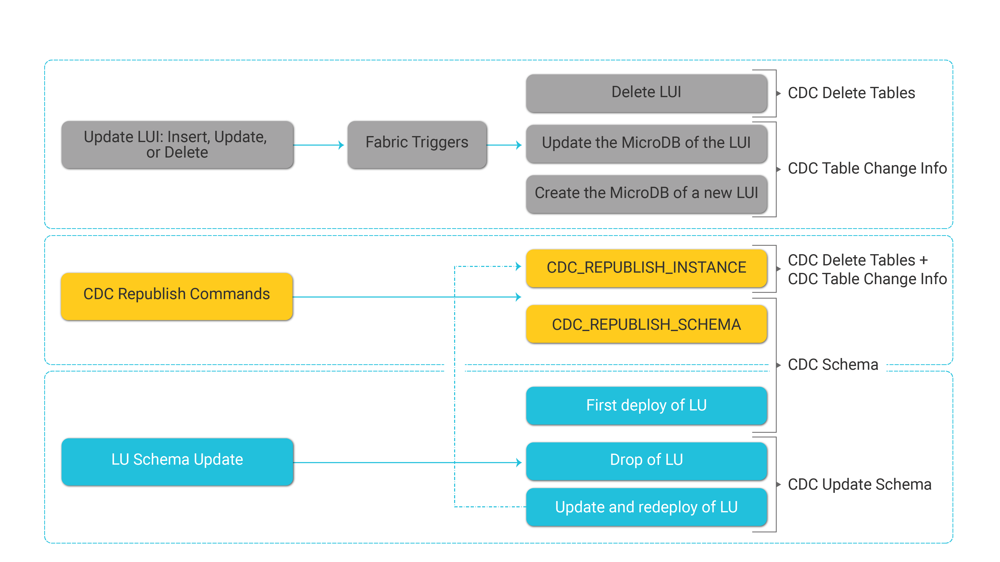

# CDC Publication Flow

Fabric [CDC messages](02_cdc_messages.md) can be classified into two main categories:

- Schema update - initiated by updates on the LU level or by a CDC_REPUBLISH_SCHEMA command.

- Data update - initiated by updates on a given LUI or by a CDC_REPUBLISH_INSTANCE.

  

The following diagram describes a list of events that trigger CDC messages:

## Schema Update

### CDC_REPUBLISH_SCHEMA

-  Republish a full schema definition of the LU by demand.

-  An LU schema can be republished to all CDC consumers or to a selected list of CDC consumers.

**Examples:**

- Republish the **Customer** schema to all CDC consumers:
  - cdc_republish_schema Customer; 
- Republish the **Customer** schema to **Search** and **Tableau** CDC consumers:
  - cdc_republish_schema Customer types='Search','Tableau';

### Update and Redeploy LU

When updating CDC metadata, i.e. adding, updating, or deleting CDC columns in LU tables, the LU must be redeployed to Fabric. The deployment initiates republishment of the  changes both in the LU schema and background LUI data whereby:
- Sending a [CDC Schema](/articles/18_fabric_cdc/02_cdc_messages.md#cdc-schema) message.
- Initiating a [batch process](/articles/20_jobs_and_batch_services/16_batch_CDC_commands.md) to run the CDC_REPUBLISH_INSTANCE command on all LUIs of the deployed LU if the CDC fields have been added to existing LU table columns.

Note that if a new LU table with CDC columns is added to the LU schema, deployment of the updated LU republishes the metadata of the new LU table. However, the data of the new LU table cannot be republished to CDC consumers since it has not been synced with Fabric. In this scenario it is recommended to remigrate all LUIs to enable the population of the new LU table in Fabric and to enable Fabric to republish the data of the new LU table to CDC consumers. For example, to remigrate all customers:

  - Batch Customer from fabric fabric_command='sync_instance Customer.?';

  [Click for more information about Batch commands](/articles/20_jobs_and_batch_services/12_batch_sync_commands.md).

  

## Data Update

### CDC_REPUBLISH_INSTANCE

Republish the CDC data of a selected LUI. 

**Usage:** 

 cdc_republish_instance <LUT_NAME>.<INSTANCE_ID> [TABLES='<table1,tables2...>'] [TYPES='<type1,type2...>'] [TRUNCATE=true/false];

 **Parameters:**

TABLES – the list of LU tables to be included in the CDC message.

TYPES – a list of CDC consumer types. 

TRUNCATE – if True, send a CDC Delete Tables message about  the LUI before republishing its CDC data. The default value is True. 

**Examples:**

- Republish all CDC data of Customer 1 to all CDC consumers:
  - cdc_republish_instance Customer.1;
- Republish the CDC data of the CUSTOMER and ADDRESS LU tables to all CDC consumers for Customer 1:
  - cdc_republish_instance Customer.1 tables='CUSTOMER, ADDRESS’;
- Republish all CDC data of Customer 1 to the specified CDC consumers:
  - cdc_republish_instance Customer.1 types='Search,Tableau';
- Republish all CDC data of Customer 1 to the specified CDC consumers. Do not send a CDC Delete Tables message about Customer 1 before republishing their CDC data:
  - cdc_republish_instance Customer.1 types='Search,Tableau' truncate=false;
- Republish the CDC data of the CUSTOMER and ADDRESS LU tables for Customer 1 to the specified CDC consumers:
  - cdc_republish_instance Customer.1 tables='CUSTOMER, ADDRESS’ types='Search,Tableau';

