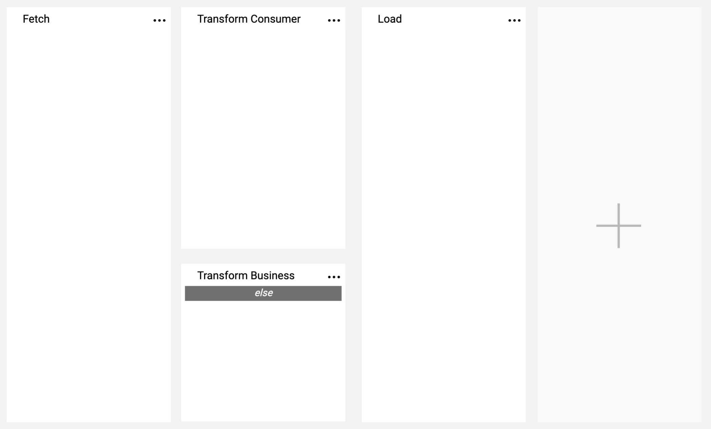

# Broadway Overview

Broadway is the Fabric module used to design data movement, its transformation and the orchestration of business flows. Featuring a powerful user interface for creating and debugging business and data flows, Broadway also provides a high-performance execution engine that can be activated by Fabric.

Broadway is used throughout Fabric, wherever data movement and orchestration are needed. For example:
* [Logical Unit](/articles/03_logical_units/01_LU_overview.md) data population from external databases or REST APIs.
* Moving data from Fabric to external systems based on [CDC](/articles/18_fabric_cdc/01_change_data_capture_overview.md) or [batch processes](/articles/20_jobs_and_batch_services/11_batch_process_overview.md).
* Subscribing to a message bus and consuming messages.
* Orchestration of scheduled activities through Fabric's job system.
* Data transformation for [Web Services](/articles/15_web_services_and_graphit/01_web_services_overview.md).

Broadway is a flexible engine and is seamlessly integrated into the Fabric command system. Its power can be leveraged anywhere in Fabric's architecture layers for limitless use cases.

## Orchestration and Business Process

A Broadway flow is built from [Stages](19_broadway_flow_stages.md) which are executed from left to right. A flow can be split into different execution paths based on conditions. More than one Stage can be executed in each fork in the path.

In the example above, the **Fetch** Stage is executed first. The system then executes either the **Transform Consumer** or (else) the **Transform Business** Stage and finally the **Load** Stage.

## Logic and Data Transformation

Each Stage can contain one or more [Actors](03_broadway_actor.md) which are reusable pieces of logic with input and output arguments that can be assembled together to create complex logic. Actors are executed by Stages.

In the example above, the **Fetch** Stage queries data and transfers it as input to the Actors in the next Stages. Based on the data, either the **Transform Consumer** Stage or the **Transform Business** Stage is executed. In turn, these Stages execute the Actors that build data for the **DbLoad** Actor in the last Stage.

An entire Broadway flow can be exported and encapsulated into an Actor and then be reused across flows. This is a powerful tool for reusing logic and working with highly-complex flows.

[Click for more information about Broadway flows.](02a_broadway_flow_overview.md)

## Data Inspection

When Broadway transfers data between Actors, the data is displayed in the Broadway Studio. Complex data types (objects, arrays) are automatically detected and analyzed, and both metadata and data are visually rendered for easy debugging and extraction.

The example above displays how the system automatically identifies the data structure of the **FetchCustomer** Actor. This enables selecting specific fields from the data and passing them to the appropriate Actors.

[Click for more information about Data Inspection.](27_broadway_data_inspection.md)

## Learning Broadway

Broadway gets its name from its powerful execution of flows in Stages with the Actors that encapsulate logic. Coupled with its data and metadata inspection engines, Stages and Actors act as Broadway’s main pillars.

Broadway has additional capabilities that together provide a great way to model data movement and orchestration. These and other capabilities are explored in other articles in the Knowledge Base.

Another great way to learn how to use Broadway is from the built-in Tutorial which can be accessed when creating any Broadway flow. Go to **Actions** > **Examples** and checkout the documented sample flows.

The **a-broadway-tutorial.flow** takes you through the major Broadway features and capabilities and can act as a good starting point. Other example flows focus on a single feature or capability, demonstrating and explaining them in depth.

[Click for more information about Broadway Tutorial and flow examples.](17_tutorial_and_flow_examples.md)

