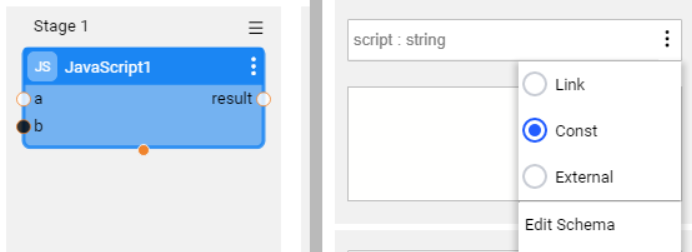
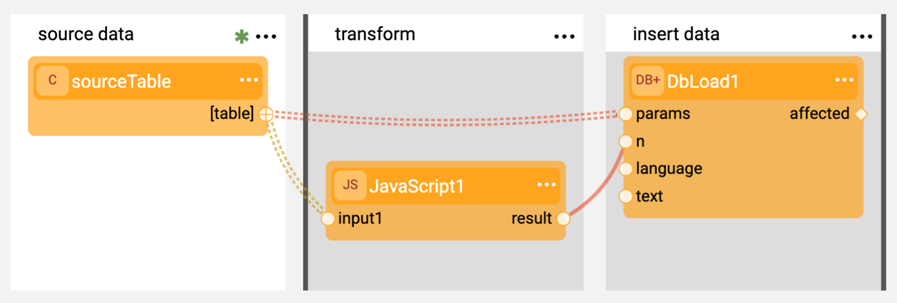
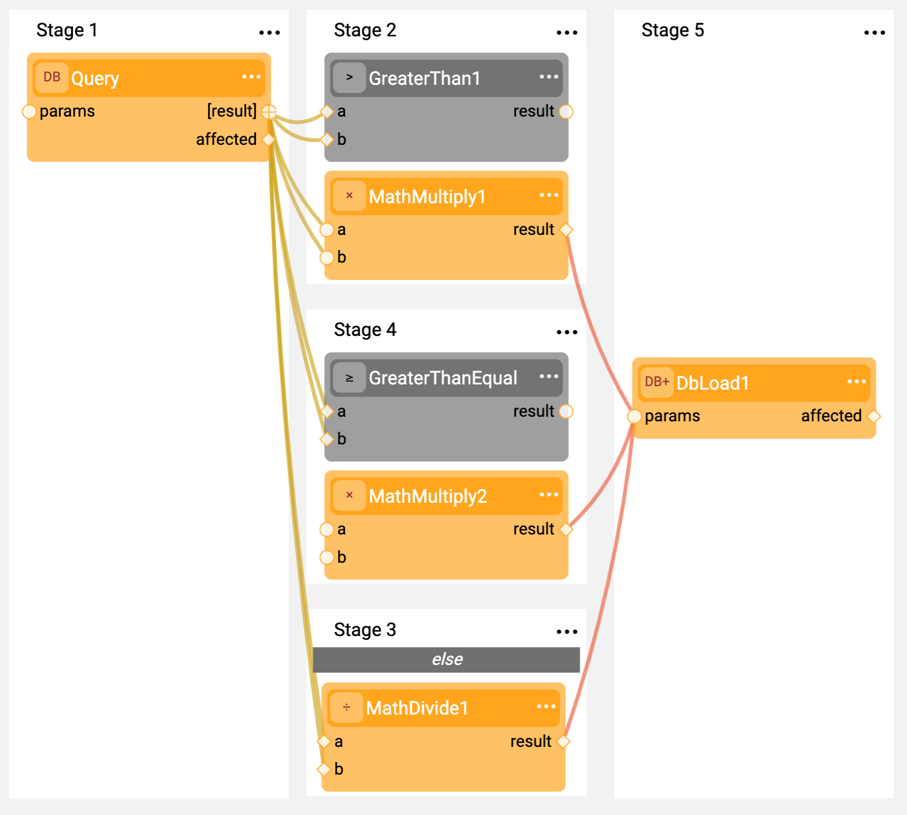

# Broadway High Level Components

In the Overview we saw the main Broadway concepts that make it a unique solution:
[Stages](19_broadway_flow_stages.md) as way to model work flow, [Actors](03_broadway_actor.md) to model data flow and [data inspection](27_broadway_data_inspection.md) to
discover and manipulate complex data types.

## Actor Input/Output Arguments

### Inputs 

Actors can get their input from three different sources:

**Link:** from a previous Actor's output (by means of connecting lines between actors).

**Const:** by inputting a constant value supplied by the user.

**External:** by giving an input argument to the flow.

### Outputs 

Output data can also be exposed (using the external parameter) as a result of the flow's execution. 

In the image, the JavaScript Actor obtains the **script** input as a constant input, **a** is supplied by connecting to a previous Actor, and **b** is supplied as an external input to the flow and the result is exposed as external flow result.

[Click for more information about Actor's Inputs and Outputs](03_broadway_actor_window.md#actors-inputs-and-outputs).

## Type System

Broadway Actors pass data between them as Java objects. Virtually any data type can be passed between Actors but in practice most Actors pass a subset of types that are supported by Broadway.  Supported Broadway types can be described by the Broadway Schema engine, can be displayed clearly by the Data Inspector and can be converted automatically to other supported types.
Broadway supports Arrays, Maps and Primitives such as String, Long, Real, Date, Boolean and Byte Array (binary data).
In addition Broadway has a robust type conversion system that automatically converts between types where possible, relieving the user of the burden of type conversion.

[Click for more information about Broadway data types](05_data_types.md#data-types-in-broadway).

## Data Schema

The Broadway UI uses JSON Schemas to describe the data and enable designing data flows that correspond to the known data structure.
Broadway can learn the schema from the data format that is injected. 
Just run the flow, and the metadata is automatically derived from the input data. If you do have available JSON Schemas, they can be easily imported and edited in the Broadway interface.

[Click for more information about the Broadway Data Editor and how you can edit the schema using it](27_broadway_data_inspection.md).

## Iterations

A common usage of a flow is to perform an iterative operation on a specific data set. For instance, it can be used to transform data from a database result-set or read through a JSON array retrieved by a REST API.
Broadway deals with such cases by using iterations which are shown with the **Iterate** line. 

This signals Broadway to perform the operation for every entry in the data set.

[Click for more information about iterations in Broadway](21_iterations.md).

## Stage Conditions

Stages can be executed upon a certain set of conditions. They can also be split when necessary. 
To do so, an actor can be designated to decide if a specific stage (or a split section of the stage) in the flow, will be performed. The Actor can be a simple logical operator or an entire flow (i.e., inner flows). 
Based on the result obtained, Broadway will decide how the flow should be continue its execution.

In the case of multiple forks (such as multiple splits in the stage), the *else* fork will be executed if none of the other splits were executed.

[Click for more information about Stage Conditions](19_broadway_flow_stages.md#what-is-a-stage-condition).

## Actor Inheritance

Actors obey an inheritance hierarchy. This enables activities such as:
- Pinning a constant value and re-using it across multiple flows. 
- Re-using some Actor logic such as JavaScript or SQL.
- Overriding the Actor Java implementation and tailoring it to a specific use case.  

[Click for more information about Actor Inheritance](06_export_actor.md).

## Transactions

Broadway has a built-in transaction management mechanism. Stages can be marked for transaction. Any transactional resource needed by the Actors, such as a database or a queue, automatically becomes part of the stage's transaction. Once the Transactional Stage is completed, the transaction is committed. In case of failure, any submitted transaction will be rolled back.
Transactions also take into account Broadway inner flows. If a Transactional Stage executes an inner flow, this inner flow is automatically considered as part of the transaction.

[Click for more information about Transactions](23_transactions.md).

## Error Handling

Every Stage can be assigned with an error handling mechanism. The *ErrorHandler* Actor is used to hold the logic needed to deal with the error, as well as the decision whether the flow should continue or stop. The ErrorHandler Actor can be a simple logical statement or an entire inner flow.

[Click for more information about Error Handling](24_error_handling.md).

