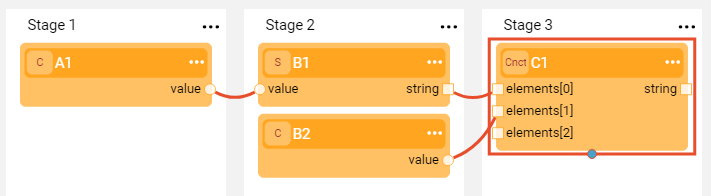
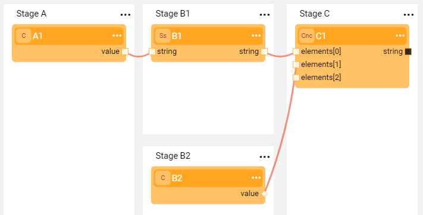
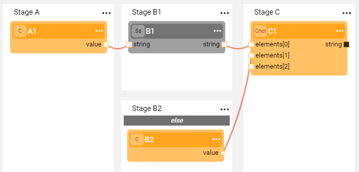
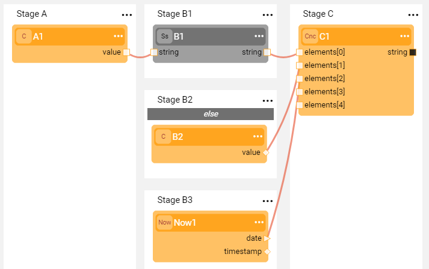

# Broadway Flow Overview

A **Broadway Flow** is a core Broadway object that represents a business process. 

Binding other objects into the same flow, a Broadway flow acts as a graph or a tree and is built from several [Stages](19_broadway_flow_stages.md) where each Stage includes one or more [Actor](03_broadway_actor.md). 
-  Stages are executed consecutively from left to right.
-  Actors in each Stage of the flow are executed top-down. 

### Simple Flow
The following displays a simple flow that has three Stages and four Actors. The execution order of the Actors in the flow is: **A1 -> B1 -> B2 -> C1**.

### Flow with 2 Stages on the Same Level
Each Stage can be split into two stages (and so on) whereby there are several stages on the same dependency level in the flow. Their execution order is top-down. In the following example, the execution order remains: **A1 -> B1 -> B2 -> C1**.

### Flow with Condition
If a condition like IF-ELSE is required, the flow can be split, whereby a Stage condition is defined on one section and the other section is set to ELSE. 
The execution order of the Actors in this flow is: **A1 -> B1 (if condition is true), otherwise B2 -> C1**. 

Note that a Stage Condition Actor is green and a regular Actor is blue.

If there are additional Stages on the same dependency level as an IF-ELSE condition, their Actors are also executed in the following execution order: **A1 -> B1  (if condition is true), otherwise B2 -> Now1 -> C1**.

[Click for more information about Stage Conditions](19_broadway_flow_stages.md#what-is-a-stage-condition).

