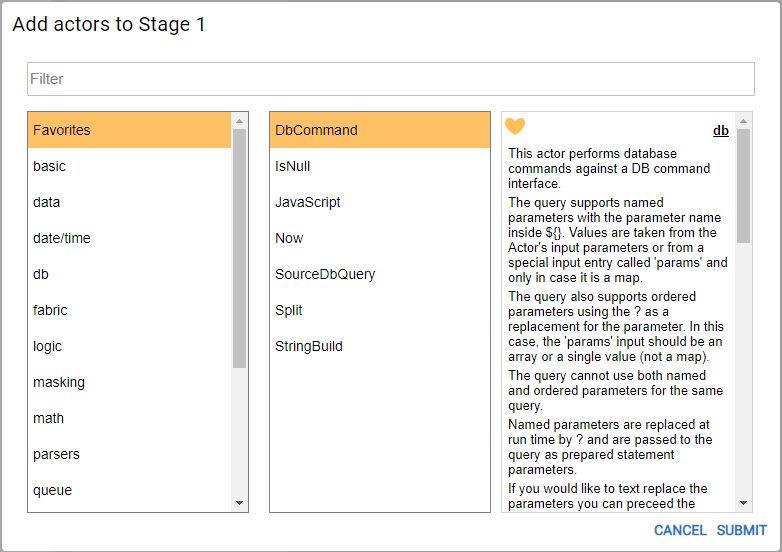
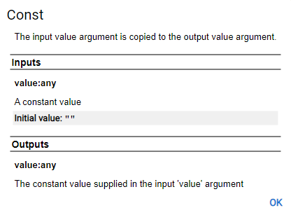
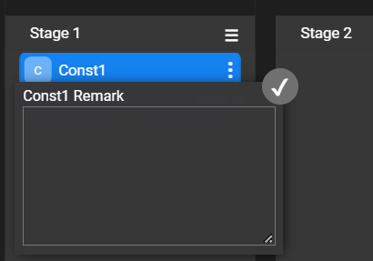

# Broadway Actor

### Actor Overview

A Broadway  **Actor** represents an action that is executed on a [Stage](19_broadway_flow_stages.md) of the [Broadway flow](02a_broadway_flow_overview.md) to get input parameters and return output parameters. For example, reading a file, creating a table, parsing an object or concatenating a string.

Broadway offers a number of [built-in Actors](04_built_in_actor_types.md) which address a wide range of predefined activities that can be added to Broadway flows.

When a flow requires business logic that is not supported by a built-in Actor, a **JavaScript** Actor can be used which executes the JavaScript code provided in the **script** [Input parameter](/articles/19_Broadway/03_broadway_actor_window.md#data-input-parameters). Alternatively, you can use the **LuFunction** Actor to invoke Java functions or build your own Java Actor.

This article describes the following options for working with Actors:
- [Adding Actors to the Stages](03_broadway_actor.md#how-do-i-add-actor-to-stage) of a Broadway flow.
- [Saving a flow as an Actor](03_broadway_actor.md#how-do-i-save-flow-as-actor) that can be used as an inner flow of other Broadway flows.
- [Exporting Actors](03_broadway_actor.md#how-do-i-export-an-actor) to create inherited Actors with extended business logic. 

To learn about more complex scenarios, such as creating or editing an Actor, refer to the [Actor Editor](28_actor_editor.md) article. 

### How Do I Add Actor to Stage?

To add an Actor to a Stage in a Broadway flow:
1.  Click anywhere in the **Stage** area to open the **Add Actors to [Stage Name]** window which displays a list of categories on the left and the built-in Actors of each categories on the right.
2.  Click **SUBMIT** to finish the action and to add the Actor to the Stage.

### How Do I Save a Flow as an Actor?
A flow can be packaged and then reused as an inner flow in another flow. For example, an inner flow that handles errors. This is an excellent solution for reusing business logic and for avoiding complex flows with many steps.

To save a flow as an Actor, click **Actions** > **Save as Actor** in the [Main menu](18_broadway_flow_window.md#main-menu) of the Broadway flow window.

### How Do I Export an Actor?

An Actor can be exported to create another Actor that inherits the current Actor’s logic. By doing so, specific business logic can be reused in different places in the flow. Once exported, the new Actor is added to the list of built-in Actors.

To export an Actor, click **Export Actor** in the [Actor's context menu](18_broadway_flow_window.md#actor-context-menu).

### Dynamic Logic Actors

Dynamic Logic Actors include dynamic logic as one of their input parameters. The most frequently used Actors include:

- **JavaScript** Actor, which executes the JavaScript code provided in the **script** parameter and returns the value of the last expression.
- **DbCommand** Actor, which executes the SQL command provided in the **sql** parameter.

### Actor Description and Remarks

The description of the Actor is part of the Actor's file. A remark is a user's comment added during the flow implementation.

When exporting an Actor, the Actor's remarks are copied to the description of the new Actor type.

Click  in the right corner of the Actor to open the [Actor's context menu](18_broadway_flow_window.md#actor-context-menu) and select **Description** to view the description of the Actor type. The Description window is displayed in a read-only mode as in the following example:

To add your own remark to an Actor, select **Remark** in the [Actor's context menu](18_broadway_flow_window.md#actor-context-menu). 

Once there is a remark you can pull it up by clicking the green asterisk . To delete a remark, remove its text and close the remark. 

