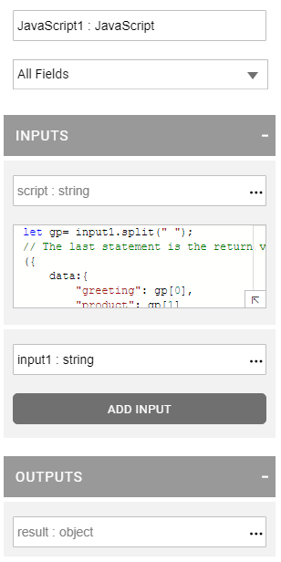
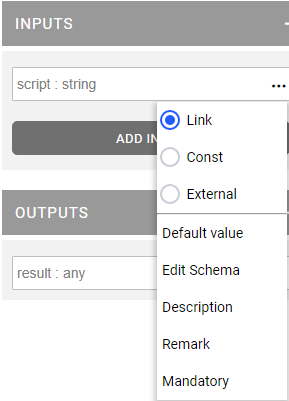
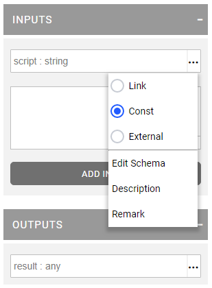
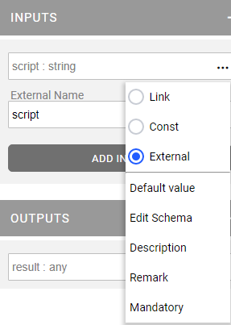
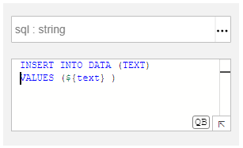
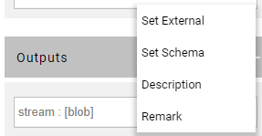

# Broadway Actor's Properties Window

## Properties Overview

The **Actor's Properties** window is displayed when adding a new Actor to a flow or when clicking an Actor object in the Flow window. The Actor window holds the following sections:

<table>
<tbody>
<tr>
<td rowspan="4" valign="top" width="400pxl"></td>
<td valign="top" width="600pxl">

<strong>Object Name</strong>

Displays the Actor name in the following format:

<ul>
<li>[Object Name] : [Actor Type]</li>
</ul>

By default, when adding an Actor, Broadway concatenates a sequential number to the Actor Type name. For example: when adding <strong>DateAdd</strong> Actors to the flow, the object names of these Actors are DateAdd1, DateAdd2 etc.

It is recommended to give the Actors meaningful names according to their function in the flow.

</td>
</tr>
<tr>
<td valign="top" width="300pxl">

<strong>Parameters Filter</strong>

Filters the input and output fields in the Actor window using the following options:

<ul>
<li>All Fields (default), displays a list of all the Actor's fields and the fields of their ancestor.</li>
<li>Actor name, displays a list of input and output parameters of the current Actor object.</li>
<li>Ancestor Actor name, displays the list of input and output parameters of the Actor's ancestor.</li>
</ul>

For example:

<ul>
<li><strong>FixedColumnParser</strong> Actor inherits from <strong>LinesParser</strong> Actor.</li>
<li>Select <strong>All Fields</strong> to display a full list of input and output parameters of the <strong>FixedColumnParser</strong> Actor.</li>
<li>Select an Actor Type (FixedColumnParser or LinesParser) to filter the input and output parameters accordingly.</li>
</ul>
</td>
</tr>
<tr>
<td width="300pxl">

<strong>INPUTS</strong>

Displays the input parameters in the following format:

<ul>
<li>[Parameter Name] : [Parameter Type]</li>
</ul>
  
Click  to update an input parameter. 

  
Click <strong>Add Input</strong> to add more parameters. The button is applicable for selected Actor types only.

</td>
</tr>
<tr>
<td width="300pxl">

<strong>OUTPUTS</strong>

Displays the output parameters in the following format:

<ul>
<li>[Parameter Name] : [Parameter Type]</li>
</ul>
  
Click  to update an output parameter. 

  
 Click <strong>Add Output</strong> to add more parameters. The button applicable for selected Actor types only.

</td>
</tr>
</tbody>
</table>

## Actor's Inputs and Outputs

### Input Parameter Properties

The Actor's input parameters are displayed in the Actor's Properties window in the following format:
- [Parameter Name] : [Parameter Type]

For example:
- interface : string

[Click for more information about Broadway data types](05_data_types.md#data-types-in-broadway).

The population of the input parameter depends on the **Population Type**. The following types are supported:
- **Link**, gets the input value as an input parameter from another Actor. When **Link** is selected, it connects the parameter to another Actor's output parameter.
- **Const**, sets the value of the parameter. When **Const** is selected, a text area opens under the parameter to enable populating the parameter's value.
- **External**, gets the input value as a parameter from the external process which executes the Broadway flow. When External is selected, the **External Name** field opens under the parameter.

<table>
<tbody>
<tr>
<td valign="top" ></td>
<td valign="top" ></td>
<td valign="top" ></td>
</tr>
</tbody>
</table>

The actions on the input parameters are:
- Default value, set a default value for an input parameter (for **Link** and **External** population types). Broadway enables populating a value that matches the parameters type. For example: when the parameter is Integer, Broadway only enables inserting numbers into this parameter.

- Edit Schema, click to open the popup window where you can update the parameter's type.

- Description, click to check the parameter's description. The description cannot be updated.

- Remark,  click to add a remark. A remark can be modified.

- Mandatory, click to set the input parameter mandatory (starting Fabric 6.5.3). This indication can be  used by external systems that are calling the **LIST BF** command in a context of a specific flow.

  **Syntax**: 
    ~~~~
	LIST BF LU_NAME=<'LU Name'> FLOW=<'BF FLOW'>;
    ~~~~
  
  **Example**:
    ~~~~
        fabric>list bf lu_name='Customer' flow='broadwayOverview';

        |param|name  |type|schema|mandatory|isDefault|
        +-----+------+----+------+---------+---------+
        |input|params|any |{}    |false    |false    |
    ~~~~

  ​

Note that when populating an input value for an **SQL** parameter, click **QB** to open the [Query Builder window](/articles/11_query_builder/02_query_builder_window.md) to validate the SQL query as displayed in the following **DbCommand** built-in Actor example:

### Add Input Button

Some Actors such as JavaScript and DbCommand, enable adding input parameters using an **Add Input** button. A new input parameter has the following default settings:

- Parameter Type = Any.
- Population Type = Link.

If the population type is updated to a **Const**, select the parameter type from the dropdown list.

To delete or add more parameters, in the context menu click  > Delete or Insert.

Note that the input parameters of the ancestor Actor cannot be deleted.

### Output Parameters Properties

The Actor's output parameters are displayed in the Actor's Properties window in the following format:

- [Parameter Name] : [Parameter Type]

The actions in the output parameters are:
- Set External, click to expose the output parameter to the external process that executes the Broadway flow. When selected, the **External Name** field opens under the parameter.
- Edit Schema, click to open the popup window where you can update the parameter's type.
- Description, click to check the parameter's description. The description cannot be updated.
- Remark, click to add a remark. The remark can be modified.

### Add Output Button

Some Actors, such as InnerFlow, enable adding output parameters using an **Add Output** button. A new output parameter is added with the default Parameter Type = Any.

To delete or add more parameters, in the context menu click  > Delete or Insert.

Note that the output parameters of the ancestor Actor cannot be deleted.

