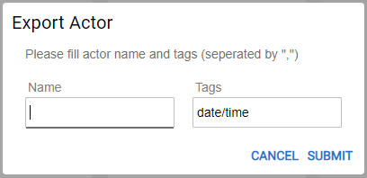
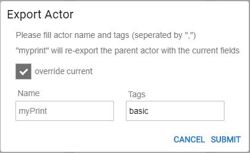
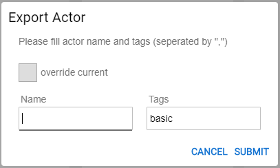

# Actor Inheritance Mechanism

### Overview

A Broadway Actor can be extended to create a new Actor type using the **Export Actor** functionality. 

When an Actor is exported, a new Actor inherits its logic and arguments and also extends it with additional functionality whereby specific business logic can be reused in different Broadway flows. For example, to format all dates using the same pattern, set a specific pattern in the **DateFormat** Actor and then export the Actor to reuse it in various Broadway flows. 

When exporting the Actor, each input and output argument can be set as hidden or final. 

* Setting an argument as **hidden**, the ancestor's argument is hidden in the inherited Actor. For example, when an argument is irrelevant for the inherited Actor's functionality.
* Setting an argument as **final**, the inherited Actor cannot change the ancestor's argument value. 

This setting is optional. If hidden or final arguments are not set, the argument remains as is in the inherited Actor.

This article describes how to extend an Actor or to modify an extended Actor using the **Export Actor** functionality. To learn about more advanced options for Actors inheritance, refer to the [Actor Editor](28_actor_editor.md) article. 

### How Do I Export an Actor?

1. Add an **Actor** to the flow and update its arguments and/or logic. For example, add a **DateFormat**  Actor and set its **format** input argument to **'E  dd-MM-yy HH:mm a'** and the time zone to **Israel**. Using these settings, the **string** output argument is displayed as **'Thu  06-08-20 15:30 PM'**.

2. Click  > **Export Actor** in the [Actor's context menu](18_broadway_flow_window.md#actor-context-menu) to open the Export Actor pop-up.

   

3. Populate the new Actor's **Name** as **myDateFormat**. 

4. Optional: override the **Tag** to create a new Actor in a new (different) category.

5. Optional: set the hidden or final value for each input or output argument.

6. Click **SUBMIT**. 

The new **myDateFormat** Actor is created and inherits from the **DateFormat** Actor type. The **myDateFormat** Actor can be reused by any Broadway flow in Fabric.

Once the inherited Actor is created, it is added to the list of Actors and can be [added to a Stage](03_broadway_actor.md#how-do-i-add-actor-to-stage) in the current or another flow. In addition, the **. actor** file of the inherited Actor is added to the project tree. 

The [Actor's input and output arguments](03_broadway_actor_window.md#properties-overview) in the Properties window can be filtered using the Parameter's filter to display only the inherited Actor's arguments, or only the ancestor's arguments or all.

### How Do I Modify an Inherited Actor?

An inherited Actor can be modified for two reasons:

- To update the behavior of the exported Actor due to changed requirements. 
- To extend the behavior of the exported Actor to create an additional level of inheritance.

The difference between the two reasons is whether the inherited Actor is overridden or not.  If the Actor needs to be updated, it is overridden. 

To override an extended Actor, do the following: 

1. Click  > **Export Actor** in the [Actor's context menu](18_broadway_flow_window.md#actor-context-menu) to open the Export Actor pop-up.

2. Check **override current**. The name is prepopulated with the Actor's name and is read-only.

   

3. Optional: override the **Tag** to create an Actor in a new (different) category.

4. Optional: set the hidden or final value for each input or output argument.

5. Click **SUBMIT** to save the changes.

To extend the behavior of the exported Actor, do the following:

1. Click  > **Export Actor** in the [Actor's context menu](18_broadway_flow_window.md#actor-context-menu) to open the Export Actor pop-up.

   

2. Populate the new Actor's **name**. 

3. Optional: override the **Tag** to create an Actor in a new (different) category.

4. Optional: set the hidden or final value for each input or output argument.

5. Click **SUBMIT** to save the changes.

