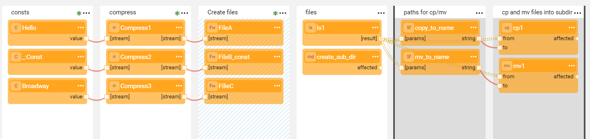

# Stream Actors

Broadway provides a groups of [built-in Actors](04_built_in_actor_types.md) to handle with streams, such as reading from a file or writing into a file, compressing or uncompressing the data. These Actors belong to a **streams** category.

In addition, Broadway provides the Actors to perform the file system commands, such as **md** to create a directory or **cp** to copy a file. These Actors belong to a **system** category.

The **file.flow** example shows how these Actors handle the flow and it includes the steps such as compressing the data, creating a directory and the files, moving the files between the directories, etc.

Click **Actions** > **Examples** in the [Main menu](18_broadway_flow_window.md#main-menu) to open the **file.flow** example. 

