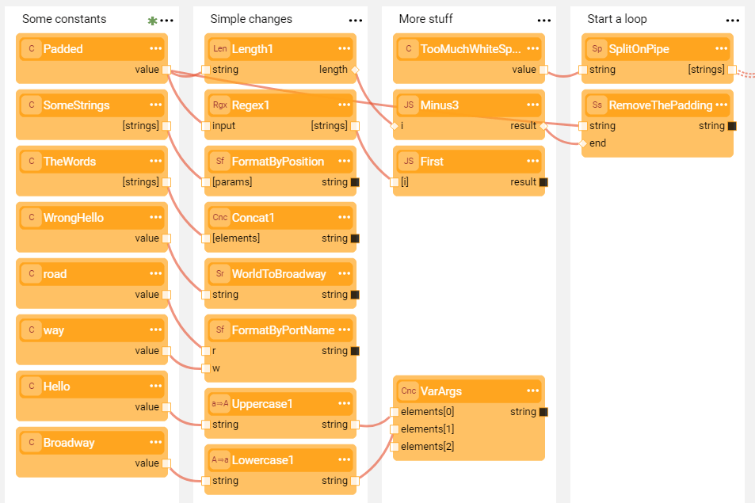
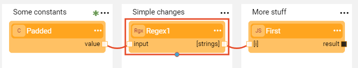

# Show Only Connected

Complex Broadway flows can have many connections between the [Actors](03_broadway_actor.md), making the flow unclear. To simplify the tracking of the complex flow and to increase its usability and maintainability, use the option to display only the connected Actors.

To do so, click  > **Show only connected** in the [Actor's context menu](18_broadway_flow_window.md#actors-context-menu) to display only Actors linked to the selected Actor.
Click **Show only connected** again to remove this filter and display all Actors in the flow.

**Example:**

A complex string handling flow:

To view only the  Actors connected to the **Regex1** Actor, click  > **Show only connected** in the [Actor's context menu](18_broadway_flow_window.md#actors-context-menu). 

The following Actors are displayed:

<studio>

</studio>

<web>

</web>

