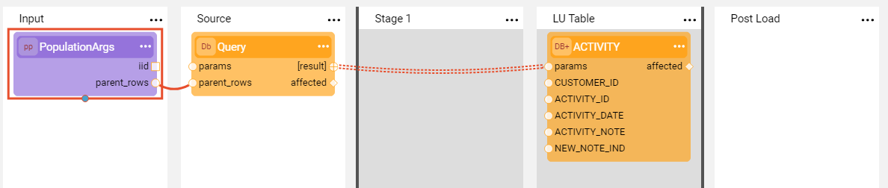
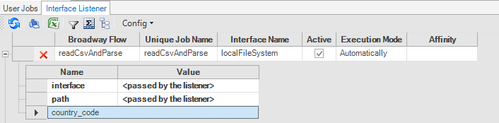
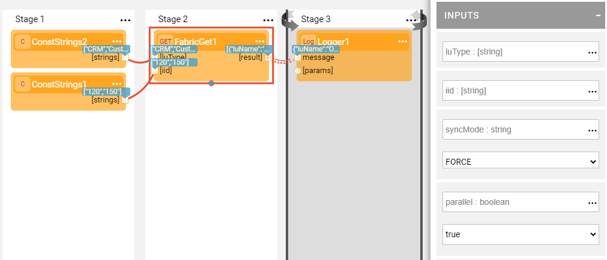
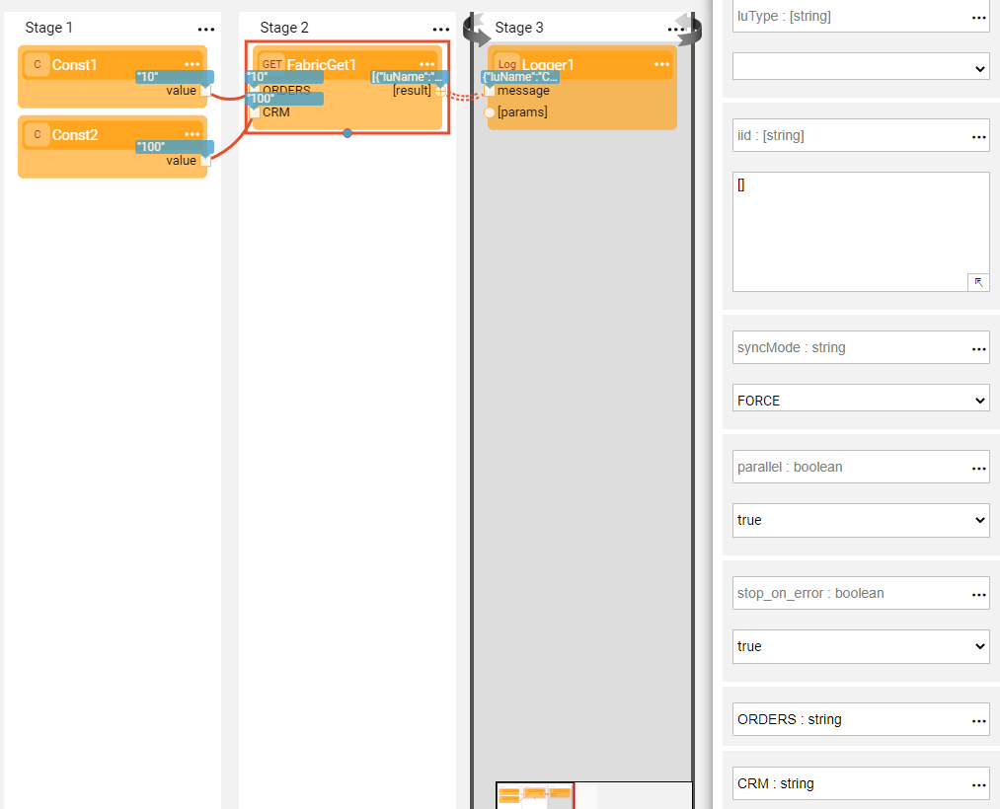
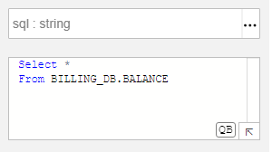
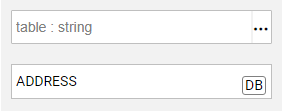

# Broadway Integration with Fabric Studio

The Fabric Studio includes several integration points that are used by Broadway Actors to simplify the creation of Broadway flows.

### Broadway as a Population

A Broadway flow can be used as a [Table population](/articles/07_table_population/01_table_population_overview.md) to replace  complex Java code in the population logic by [Stages](19_broadway_flow_stages.md) and [Actors](03_broadway_actor.md) in the flow. 

To create the population based on the Broadway flow, right click the table name in the **Project Tree** and select **New Table Population Based Broadway Flow**. The population template is created and can be modified as needed.

[Click for more information about creating a table population based on a Broadway flow](/articles/07_table_population/14_table_population_based_Broadway.md).

### Interface Listener For Broadway Flows

From version 6.5.3, a new actor [*InterfaceListener*](/articles/24_non_DB_interfaces/02_SFTP_interface.md#using-the-interfacelistener-actor) has been added to Broadway. This actor allows a broadway flow to be triggered upon detection of an event on the Interface. 

The flow described below, is still supported and can be defined via Fabric Studio.

The Interface Listener functionality, an enhancement of the Fabric Jobs functionality, can be used to read and parse files using a Broadway flow. An Interface Listener is triggered each time a new file arrives to the directory defined in the interface, which can be either an SFTP or a local file system. Each file is only picked up once by the Listener and the file name must not be repeated otherwise it will be disregarded.  

The Listener invokes the attached Broadway flow that needs the **FileRead** Actor to read the files. The **interface** and the **path** input arguments of the **FileRead** Actor must be defined as an [External link type](/articles/19_Broadway/03_broadway_actor_window.md#actors-inputs-and-outputs). Their values are passed from the defined interface by the Listener.

[Click for more information about creating an SFTP interface for an Interface Listener](/articles/24_non_DB_interfaces/02_SFTP_interface.md#example-of-using-an-sftp-interface).

### Fabric Commands Actors

The **Fabric** category of [built-in Actors](04_built_in_actor_types.md) executes Fabric commands. For example:

* **FabricGet** Actor, executes the GET command on the current Fabric session.
* **FabricSet** Actor, sets a value on the Fabric session.
* **FabricSetRead** Actor, reads a key from the Fabric session.

Starting from V6.5.1, the **FabricGet** Actor supports fetching multiple instances from different LUs and enables setting **parallel** and **stop_on_error** arguments. To sync multiple LUIs, do either:

* Connect a list of LU types to the **luType** input argument and a list of Instance IDs to the **iid** input argument.

  

* Or, add a new input to the Actor, change the input name to the **luType** name and set the value as **iid**. In this case, the **luType** input argument of the Actor should be set to the empty value.

  

### Use of LU Functions and Graphit in Broadway

**LuFunction** and **Graphit** Actors use Fabric integration with Broadway to enable the reuse of Fabric logic in Broadway flows. 

To do so, set the [Logical Unit](/articles/03_logical_units/01_LU_overview.md) in the **luType** input argument and then select a [Project function](/articles/07_table_population/08_project_functions.md) or a [Graphit](/articles/15_web_services_and_graphit/17_Graphit/01_graphit_overview.md) resource. 

Note that the **luType** input argument includes the list of all Logical Units in the Project including the [Web Services](/articles/15_web_services_and_graphit/01_web_services_overview.md) and the References. It is recommended to use the same LU used for the creation of the Broadway flow.

#### LuFunction Actor

The **LuFunction** Actor is used when a Fabric [Project function](/articles/07_table_population/08_project_functions.md) must be invoked from a Broadway flow and is also a way to write business logic in Java rather than in JavaScript in Broadway. 

After the **luType** input argument is set, the list of values in the **functionName** dropdown list are filtered by the LU name and display the functions of the selected LU and Shared Object. The Actor's input and output arguments are updated with the inputs and output of the selected function.

#### Graphit Actor

The **Graphit** Actor executes Graphit logic for data serialization. Parameters for the Graphit execution are picked up from input arguments or from the **params** input argument.

After the **luType** input argument is set, the list of values in the **graphit** dropdown list is filtered by the LU name. The Actor's input and output arguments are updated with the inputs and output of the selected Graphit resource.

### Table Selection and Query Builder

The input arguments of [DB Commands Actors](actors/05_db_actors.md) include integration to Fabric Windows which simplifies the creation and validation of queries. 

To populate the SQL statement of a **DbCommand** Actor, do the following:

1. Set the **interface** input argument and then click **QB** in the **sql** input argument field. The [Query Builder window](/articles/11_query_builder/02_query_builder_window.md) opens and is filtered by the selected DB connection.
2. Click the required table and fields or write the query manually. 
3. Click **Execute Query** to validate it and then click **OK**. The SQL statement is populated in the **sql** input argument of the **DbCommand** Actor.

To set the table and the fields of a **DbLoad** Actor, do the following:

1. Set the **interface** input argument and click **DB** in the **table** input argument field. The Table Selection popup window opens and is filtered by the selected DB connection.
2. Click the required **table** and then **OK** to populate the table name and the columns in the **table** and the **fields** input arguments of the **DbLoad** Actor.

<table>
<tbody>
<tr>
<td valign="center" ></td>
<td valign="center" ></td>
</td>
</tr>
</tbody>
</table>

### Interfaces List

Several Broadway [Actors](03_broadway_actor.md) include an **interface** as an input argument. When setting the Actor's interface from the dropdown list, the list of values is retrieved from the Project Interfaces list. Only Active interfaces are displayed. The values are filtered by the Interface Type where only interfaces relevant to the Actor type are shown.

### Broadway Flows: Automatic Execution upon LU Deploy

A Broadway flow can run automatically as a result of a deploy activity. Once the **deploy.flow** Broadway flow is defined under a selected LU, each time a deploy is initiated for the LU, it will trigger the execution of the deploy.flow.

* If the deploy.flow is defined on the shared level only, it will be inherited to all the LUs.
* If a soft deploy is defined to the deployed environment, a deploy will not trigger the deploy.flow execution.
* When a new Logical Unit is created, a deploy.flow will be generated automatically with the following constants:
  * lu_name - contains the name of deployed LU.
  * nosync – 
    * NOSYNC TRUE: Only schema changes trigger sync after deploy.
    * NOSYNC FALSE: Any deploy (even without any changes) triggers sync on the first time instance is accessed.
  * Is_first_deploy - A Boolean representing if this is the first deploy.
  * is_studio - Will be true if this is the studio debug environment fabric instance.

