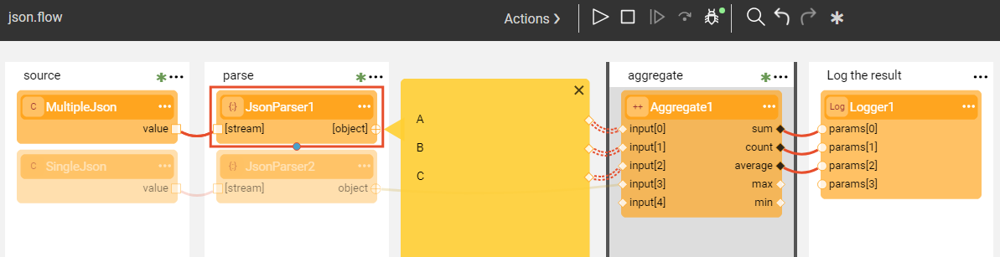

# Parser Actors

Broadway provides a groups of [built-in Actors](04_built_in_actor_types.md) to parse the input provided in various formats: JSON, xml, csv and more. These Actors belong to a **parsers** category. 

### JsonParser Actor

The purpose of this Actor is to analyze an input stream represented by an iterable collection of blobs or strings and to return a collection of JSON objects found in the stream. If the **single** input attribute is set to true, the Actor will expect only a single object in the input stream. Otherwise, if it's set to false, the parser can handle an input with multiple objects.

The **json.flow** example shows how **JsonParser** can handle two types of inputs - a single object JSON and a multiple object one.

Click **Actions** > **Examples** in the [Main menu](18_broadway_flow_window.md#main-menu) to open the **json.flow** example. 

