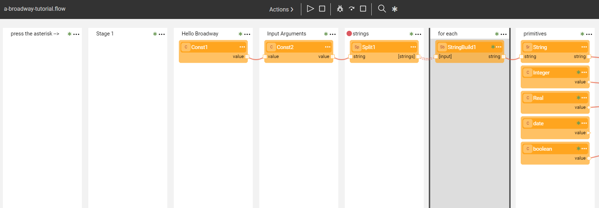
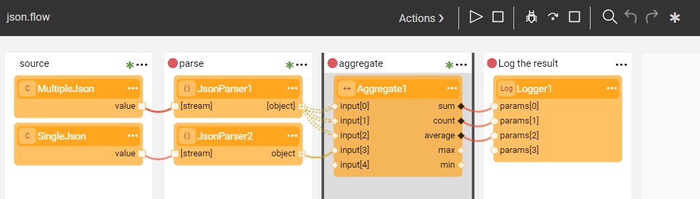

# Broadway Tutorial and Flow Examples
The **a-broadway-tutorial.flow** introduces you to Broadway, its features, main principles and capabilities to provide you with the information you need to understand this module. In addition to the Tutorial's flow you can find other Broadway flow examples explaining specific subjects such as DB commands, conditions, parsers, dates and strings and how they are handled.

The following [Broadway flow](02a_broadway_flow_overview.md) guides you through each consecutive step of an example business process and explains how it is implemented.

To open the Tutorial and example flows, in the [Broadway Flow](18_broadway_flow_window.md#main-menu) window, go to **Main Menu** > **Actions** > **Examples** and select the flow.

Explanations in the Tutorial are written in **Remarks** and can be displayed by either:
- Clicking  in the [Main menu](18_broadway_flow_window.md#main-menu) of the flow to display all remarks.
- Clicking  in the right corner of a [Stage](19_broadway_flow_stages.md) or [Actor](04_built_in_actor_types.md) to see its remarks.

More remarks can be added by selecting **Remark** from either the [Stage context menu](18_broadway_flow_window.md#stage-context-menu) or the [Actor's context menu](18_broadway_flow_window.md#actor-context-menu).

The Tutorial explains that a flow can be run by clicking **Run Flow** in the **Main menu** to run the entire flow and display the results and can be debugged by adding break points and using **Debug Step** to move between the Stages.

[Click for more information about the Run and Debug flow](25_broadway_flow_window_run_and_debug_flow.md).

The Tutorial explains the usage of a number of common [built-in Actor Types](04_built_in_actor_types.md), for example:

- **Const**, a basic Actor which copies an input argument to the output value argument.
- **StringBuild**, **Replace**, **Concat** and other Actors which handle the strings in a Broadway flow. Check out **strings.flow** about working with strings in a Broadway flow.
- Broadway supports several types of parser Actors, for example **JsonParser** or **XmlParser**. Parsers take a string or blob and parse them into a structure. Check out [**json.flow**](17_tutorial_and_flow_examples.md#example---jsonflow), **csv.flow** and **lines.flow** parsing examples.

The tutorial provides an explanation about main Broadway features and refers to additional example flows for more details:

- [Dynamic Logic Actors](03_broadway_actor.md#dynamic-logic-actors) include dynamic logic as one of their inputs. The input can be added to Actors and be referred to the Actor's logic. For example, **JavaScript** Actor executes the JavaScript provided in the **script** parameter and returns the value of the last expression.  **javascript.flow** provides an additional explanation of how this Actor works.

- [Conditions](19_broadway_flow_stages.md#what-is-a-stage-condition) are implemented using the **Stage Condition** option in the [Stage context menu](18_broadway_flow_window.md#stage-context-menu). You can [split the Stage](19_broadway_flow_stages.md#how-do-i-split-or-merge-the-stages) and assign a condition to one or more Stages created as a result of the split. An **else** Stage runs if all other Stage conditions return false. Check out **conditions.flow** for more conditions examples.

- [Flow loops](21_iterations.md) are implemented via an **Iterate** connection type. To change the **line type**, select the line and change its **Link Type** value to **Iterate** in the [Link Properties window](07_broadway_flow_linking_actors.md#link-object-properties). To close the scope of the iteration, select **Iterate Close** from the [Stage context menu](18_broadway_flow_window.md#stage-context-menu). Check out **iterate-for-each.flow** for more loop's examples.

- An Actor's input or output argument can be set as [External](03_broadway_actor_window.md#actors-inputs-and-outputs). When marking an output parameter as External, it becomes an output for the entire flow. In addition, a flow can be invoked using the **InnerFlow** Actor. You can also package an entire flow as an Actor. To do so, go to **Actions > Save As Actor** in the [Main menu](18_broadway_flow_window.md#main-menu). Check out **javascript-advanced.flow**, **inner-flow-power.flow** and **inner-flow.flow** for more about input/output arguments and examples of the inner flow.  

### Example - json.flow

The **json.flow** example shows how to parse a collection of byte arrays (stream). In the example the source is a constant. Based on the requirements, the source can be set to a **FileReader**, **Http** or any Actor that produces a stream / string.

A **JsonParser** Actor can either parse a single JSON object or multiple JSON objects arriving on the same stream. Note that an array is a single JSON object. In this example you can see both, the first handles a stream and initiates an Iteration loop and the second handles a single entry.

