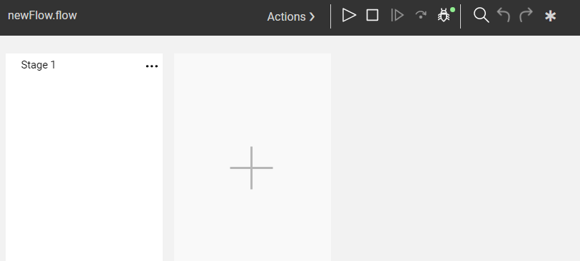
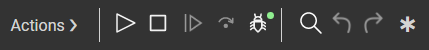
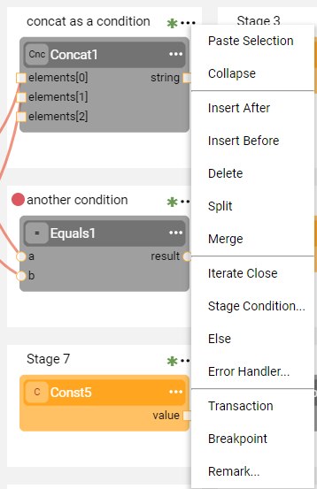
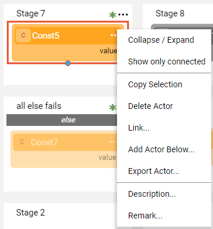
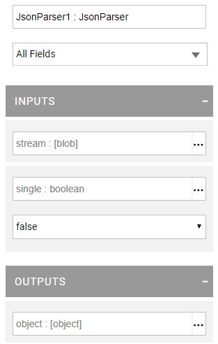
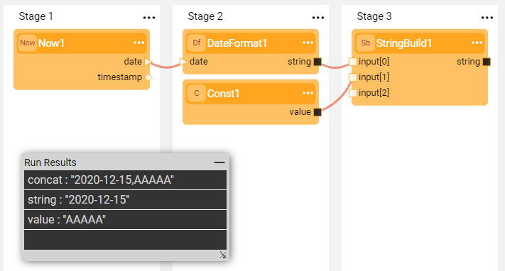
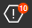
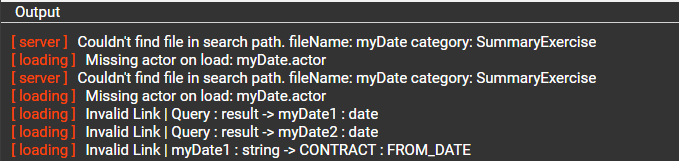

# Broadway Flow Window

The **Broadway flow** window is the main Broadway interface that enables the definition and the execution of business processes including [Stages](19_broadway_flow_stages.md), [Actors](03_broadway_actor.md) and [links between the Actors](07_broadway_flow_linking_actors.md). 

To create a new Broadway flow:
1. Go to **Project Tree** > **Shared Objects**, right click **Broadway** > **New Flow** to open the Flow Name window.
2. Populate the **flow name** and click **OK** to open an empty Flow area.

The **Broadway flow** window includes the following elements described in this article:

- The flow area, which displays Stages and their Actors. 
  - To [add a Stage](19_broadway_flow_stages.md#how-do-i-add-or-delete-a-stage), either click the big **+**, or go to the [Stage context menu](18_broadway_flow_window.md#stage-context-menu) > **Insert After** or **Insert Before**. 
  - To [add Actors to a Stage](03_broadway_actor.md#how-do-i-add-actor-to-stage), click in the empty Stage area.
- [Main menu](18_broadway_flow_window.md#main-menu), which enables running the flow and executing additional actions like **Save as Actor**.
- [Stage context menu](18_broadway_flow_window.md#stage-context-menu), which provides Stage activities like **Merge** or **Delete**.
- [Actor context menu](18_broadway_flow_window.md#actor-context-menu), which provides Actor activities like **Add**, **Link** or **Export Actor**. 
- [Actor Properties window](18_broadway_flow_window.md#actor-properties-window), which enables setting and editing the properties of a selected object.
- [Run Results window](18_broadway_flow_window.md#run-results-window), which displays the results of the flow execution. 
- [Flow Validation Footer](18_broadway_flow_window.md#flow-validation-footer), which displays the error messages in the flow, if exist.

### Main Menu

The Main menu is a toolbar located at the top of the window. It has the following options:

<table style="width: 900px;">
<tbody>
<tr>
<td width="170pxl">Actions</td>
<td width="630pxl">
<ul>
<li><a href="17_tutorial_and_flow_examples.md">Examples</a>, open the tutorial or an example flow.</li>
<li><a href="22_broadway_flow_inner_flows.md">Save as Actor</a>, save the current flow as an Actor and use its logic as an inner flow in another Broadway flow.</li>
<li><a href="25_broadway_flow_window_run_and_debug_flow.md">Debug/Run Arguments</a>, if the flow's population type is External, click to open the popup window to define the input arguments for its execution.</li>
<li><a href="31_broadway_profiler.md">Profiler</a>, enable the Broadway Profiler when running a flow.</li>
<li>Flip scroll-wheel, to move the mouse over the flow's scrollbar horizontally instead of vertically.</li>
</ul>
</td>
</tr>
<tr>
<td width="200">Run Flow / Stop Run</td>
<td style="width: 465px;">

Run the entire flow or stop the run.

</td>
</tr>
<tr>
<td width="200">Resume Debug</td>
<td style="width: 465px;">

Resume the flow until the next breakpoint.

</td>
</tr>
<tr>
<td width="200">Debug Step</td>
<td style="width: 465px;">

Execute the next step of the flow.

</td>
</tr>
<tr>
<td width="200"><a title="Debug" href="25_broadway_flow_window_run_and_debug_flow.md#running-and-debugging-a-broadway-flow">Debug ON / OFF / Live</a></td>
<td style="width: 465px;">

Enable the Debug mechanism. When the mode is Debug ON or Live Debug, the flow can be debugged even if it is triggered from another Fabric object, for example a job.

</td>
</tr>
<tr>
<td width="200">Search Actor</td>
<td style="width: 465px;">

Search the Actor by name, parameter name, schema, external name or const value.

</td>
</tr>
<tr>
<td width="200">Undo/Redo</td>
<td style="width: 465px;">

Click to undo or redo the last activity.

</td>
</tr>
<tr>
<td><a href="18_broadway_flow_window.md#flow-validation-footer">Validation</a></td>
<td style="width: 465px;">

Displays the number of validation errors, if found in the flow.

</td>
</tr>
<tr>
<td width="200">Remarks</td>
<td style="width: 465px;">

Click to display all remarks in the flow.

</td>
</tr>
</tbody>
</table>

[Click for more information about how to run and debug the Broadway flow](25_broadway_flow_window_run_and_debug_flow.md).

### Stage Context Menu

To open the Stage context menu, click  in the right corner of the Stage. This menu is dynamic, whereby some items are displayed only when they are applicable to the selected Stage. 

<table style="width: 900px;">
<tbody>
<tr>
<td rowspan="15" width="360pxl">

</td>
<td width="120pxl">Paste Selection</td>
<td width="420pxl">Paste the copied selection, for example an Actor from another Stage.</td>
</tr>
<tr>
<td style="height: 18px; width: 174px;">Collapse</td>
<td style="height: 18px; width: 381px;">Collapse the Stage.</td>
</tr>

<tr>
<td style="height: 18px; width: 174px;">Focus</td>
<td style="height: 18px; width: 381px;">Starting from Fabric 6.5.3, collapse all Stages of the same column except the selected one. When one of the collapsed Stages is a part of a branch, the respective branch’s Stages are collapsed too.</td>

</tr>
<tr>
<td style="height: 18px; width: 174px;"><a href="19_broadway_flow_stages.md#how-do-i-add-or-delete-a-stage ">Insert After</a> / <a href="19_broadway_flow_stages.md#how-do-i-add-or-delete-a-stage ">Insert Before</a></td>
<td style="width: 381px; height: 18px;">Add a new Stage after or before the selected one.</td>
</tr>
<tr>
<td style="height: 18px; width: 174px;"><a href="19_broadway_flow_stages.md#how-do-i-add-or-delete-a-stage "> Delete</a></td>
<td style="width: 381px; height: 18px;">Delete the selected Stage and its dependent branch.</td>
</tr>
<tr>
<td style="height: 18px; width: 174px;"><a href="19_broadway_flow_stages.md#how-do-i-split-or-merge-the-stages"> Split</a></td>
<td style="width: 381px; height: 18px;">Split the selected Stage.</td>
</tr>
<tr>
<td style="height: 18px; width: 174px;"><a href="19_broadway_flow_stages.md#how-do-i-split-or-merge-the-stages"> Merge</a></td>
<td style="width: 381px; height: 18px;">Merge the selected Stage.</td>
</tr>
<tr>
<td style="height: 36px; width: 174px;"><a href="19_broadway_flow_stages.md#how-do-i-split-or-merge-the-stages">Iterate Close</a></td>
<td style="width: 381px; height: 36px;">Close the iteration scope. The Iteration scope starts where the Iterate line type originates in the Stage.</td>
</tr>
<tr>
<td style="height: 17px; width: 174px;"><a href="29_recovery_point.md">Recovery Point</a></td>
<td style="width: 381px; height: 17px;">Click to set the flow recovery point to enable the flow to re-run from this point on during a failure.</td>
</tr>
<tr>
<td style="height: 54px; width: 174px;"><a href="19_broadway_flow_stages.md#what-is-a-stage-condition">Stage Condition</a></td>
<td style="width: 381px; height: 54px;">Click to open a popup window and select an Actor for the Stage. The Actor acts as a Stage condition. Note that Stage condition Actors are green.</td>
</tr>
<tr>
<td style="height: 36px; width: 174px;"><a href="19_broadway_flow_stages.md#what-is-a-stage-condition">Else</a></td>
<td style="width: 381px; height: 36px;">Click to mark the Stage to be executed if none of the conditions on the same level are true.</td>
</tr>
<tr>
<td style="height: 54px; width: 174px;"><a href="24_error_handling.md">Error Handler</a></td>
<td style="width: 381px; height: 54px;">Click to open a popup window and select the Stage's Error Handler Actor. Note that Error Handler Actors are red.</td>
</tr>
<tr>
<td style="height: 36px; width: 174px;"><a href="30_support_parallel_execution.md">Parallel</a></td>
<td style="width: 381px; height: 36px;">Click to set a number of Actors to be run parallelly within a Stage. When set, displays the number of parallel threads.</td>
</tr>
<tr>
<td style="height: 18px; width: 174px;"><a href="23_transactions.md">Transaction</a></td>
<td style="width: 381px; height: 18px;">Click to open or close the transaction.</td>
</tr>
<tr>
<td style="height: 54px; width: 174px;">Breakpoint</td>
<td style="width: 381px; height: 54px;">Click to set a breakpoint for the Stage. A breakpoint can be also set by clicking on the left of the Stage title. The list of flow's breakpoints is displayed in the <a href="/articles/13_LUDB_viewer_and_studio_debug_capabilities/04_breakpoints_panel.md">Breakpoints Panel</a>.</td>
</tr>
<tr>
<td style="height: 72px; width: 174px;">Remark</td>
<td style="width: 381px; height: 72px;">Click to add a remark to the Stage. If the remark already exists, a  is displayed on the left of the three dots and the Remark popup is open displaying its text.&nbsp;</td>
</tr>
</tbody>
</table>

### Actor Context Menu

To open the Actor's context menu, click  in the right corner of the Actor. This menu is dynamic, whereby some items are displayed only when they are applicable to the selected Actor.

<table style="width: 900px;">
<tbody>
<tr>
<td rowspan="11" width="400pxl">

</td>
<td width="80pxl">Collapse / Expand</td>
<td width="420pxl">Collapse or expand the Actor and display its title.</td>
</tr>
<tr>
<td width="200"><a href="08_show_only_connected_actors.md">Show Only Connected</a></td>
<td style="width: 465px;">Mark to display the selected Actor and its connections.</td>
</tr>
<tr>
<td width="200">Copy Selection</td>
<td style="width: 465px;">Copy the selected Actor.</td>
</tr>
<tr>
<td width="200"><a href="07_broadway_flow_linking_actors.md">Link</a></td>
<td style="width: 465px;">Click to connect the selected Actor and the required target Actor.</td>
</tr>
<tr>
<td width="200"><a href="03_broadway_actor.md#how-do-i-add-actor-to-stage">Add Actor</a></td>
<td style="width: 465px;">Click to open a popup window and select an Actor for the Stage.&nbsp;</td>
</tr>
<tr>
<td width="200"><a href="06_export_actor.md">Export Actor</a></td>
<td style="width: 465px;">Click to save an Actor to inherit the selected Actor. The Actor is then added to the list of <a href="04_built_in_actor_types.md">built-in Actors</a> and can be used in other flows.&nbsp;</td>
</tr>
<tr>
<td width="200"><a href="32_reset_actor_state.md">Reset on iteration 0</a></td>
<td style="width: 465px;">

Click to reset the Actor's state on the inner loop start (zero iteration). The menu option is visible only when the Actor is inside an internal iteration.

</td>
</tr>

<tr>
<td width="200">Disable Actor</td>
<td style="width: 465px;">Click to disable / enable the Actor in the flow.</td>
</tr>
<tr>
<td width="200">Delete Actor</td>
<td style="width: 465px;">Click to delete the selected Actor from the flow.</td>
</tr>

<tr>
<td width="200"><a href="03_broadway_actor.md#actor-description-and-remark"> Description</a></td>
<td style="width: 465px;">Product Actor's description.</td>
</tr>
<tr>
<td width="200"><a href="03_broadway_actor.md#actor-description-and-remark"> Remark</a></td>
<td style="width: 465px;">Additional info added to the Actor instance.</td>
</tr>
</tbody>
</table>

### Actor Properties Window

The Actor's Properties in the Broadway flow window dynamically adjusts its layout to display data based on the structure of the selected Actor. For example, the number of input and output parameters, their data types and default values. To hide the Properties window, click anywhere in the empty Stage area. 

**Example of Actor's Properties Window**

[Click for more information about the Actor Properties window](03_broadway_actor_window.md#broaway-actors-properties-window).

Note that if the [link between two Actors](07_broadway_flow_linking_actors.md) is selected, the window's layout is adjusted to display the names of the From and To Actors, their parameters and the Link type.

### Run Results Window

The Run Results window is a small popup window on the top of a Broadway flow window which displays the results after a flow is run:

- When the flow is completed successfully, it either displays the values of the external arguments (if they exist in the flow) or remains empty. 

  

- When the flow fails, it displays the exception. The exception details can be viewed in the log.

  

In addition, if the Profiler is enabled, the Run Results window displays the profiler results.

[Click for more information about the Broadway Profiler](31_broadway_profiler.md).

### Flow Validation Footer

The Broadway flow window has a built-in mechanism for errors validation which is invoked when opening the flow before it is run. If the flow has errors, the validation icon in the Main menu displays the number of errors, for example: . 

Click the icon to display the window footer with the error messages:

Click the error and choose to ignore the exception or fix the problem.

For example, a flow includes an inherited **myDate** Actor that needs to be deleted. After the Actor is deleted from the project tree and the flow is opened, the validation errors are displayed. You can then update the flow as needed, for example by adding another Actor. 

