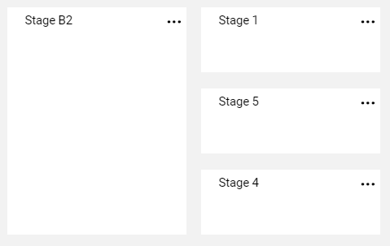
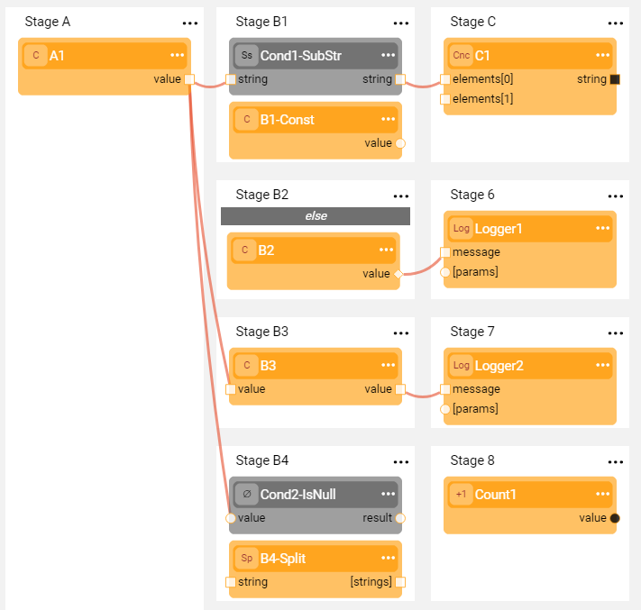

# Broadway Flow - Stages

A Broadway flow is a graph / tree built of several **Stages** where each Stage is a step of the flow that can include one or more [Actors](03_broadway_actor.md).
This article describes the following Stage's abilities:
- A Stage can be [added to or deleted from](19_broadway_flow_stages.md#how-do-i-add-or-delete-a-stage) the flow.
- A Stage can be split to create [more than one Stage on the same level](19_broadway_flow_stages.md#how-do-i-split-or-merge-the-stages).
- [Stage conditions](19_broadway_flow_stages.md#what-is-a-stage-condition) can be added to the flow to create different scenarios (branches) of the same flow.  
- Actors can be [executed in parallel](19_broadway_flow_stages.md#support-parallel-actors-execution) within a Stage.

The flow's Stages are executed consecutively from left to right. When there are several Stages on the same level, the execution order is top down. The Actors within each Stage are also executed top down.

### How Do I Add or Delete a Stage?

A Stage can be added anywhere in the flow.

- To add a Stage to the end of the flow, click the big **+** in the empty Stage area.

- To add a Stage in the middle of the flow, click  in the right corner of the Stage to open the [Stage context menu](18_broadway_flow_window.md#stage-context-menu) and select either **Insert After** or **Insert Before**.
- To delete a Stage, click **Delete** in the [Stage context menu](18_broadway_flow_window.md#stage-context-menu). If the Stage has a dependent branch, it is also deleted.

### How Do I Split or Merge the Stages?

Each Stage can be split into two (and so on) to create several stages on the same dependency level.

To split a Stage, click  in the right corner of the Stage to open the [Stage context menu](18_broadway_flow_window.md#stage-context-menu) and select  **Split**.

The Split's logic depends on the position of the Stage in the flow and includes the following rules:
- The first Stage in the flow (root) cannot be split.
- If the Stage before the current Stage is not split, the current Stage is split into two.
- If the Stage before the current Stage is split (for example, there are four Stages on the same level), the current Stage is split into the same number of Stages.

Stages can be merged under the following conditions:
- The Stage belongs to a group of Stages with the same parent Stage.
- The parent Stage is not a root.

**Valid Merge Example**

Stages 1, 4 and 5 can be merged.

**Invalid Merge Example**

Stages 1 and 6 cannot be merged since they do not have a common parent.

### What is a Stage Condition?

If a condition is required in the flow, the flow can be split and a **Stage condition** Actor can be added to one or more Stages that have been created as a result of the split.

The condition Actor can have any number of output parameters; however a True / False check is always performed on the first output parameter. Note that this parameter does not need to be Boolean, since Broadway automatically casts its type to Boolean. For example, an empty string is considered to be false while a string that is not empty is considered to be true.

[Click for more information about Broadway data types](05_data_types.md).

The **else** condition can be set on a Stage on the same level as the Stage Condition and is only executed if all conditions are false. Stages without a Stage condition are always executed and do not impact the **else** Stage.

The Stage's conditions impact all subsequent Stages in the same branch. Thus:
-  If a Stage condition is false, the execution of its branch stops.
-  A merged Stage will run after all its parent Stages have been executed.
-  If no parent Stages have been executed (all conditions are false), the merged Stage is not executed.

### How Do I Define a Stage Condition?

To add a Stage condition to the flow, click  in the right corner of the Stage to open the [Stage context menu](18_broadway_flow_window.md#stage-context-menu) and select **Stage Condition** to [add an Actor to the Stage](03_broadway_actor.md#how-do-i-add-actor-to-stage). The added Actor is grey.

To mark a Stage as **else**, click  > **Else**.

Note that although any Actor can be used as a condition, a **JavaScript** Actor is a powerful actor for expressing complex conditions. The script returns the value of the last line and does not expect the **return** keyword.

### Stage Conditions Example

**Example 1**

The following example shows a flow with four Stages on the second flow level:
-  Two Stages have conditions.
-  One Stage is marked as **else**.
-  One Stage has no conditions.

Both conditions are checked, and each related branch is executed only if the condition is true. The **else** branch is executed when both conditions are false. The Stage without any conditions and its branch are always executed.

Depending on the flow input, the execution order of the Actors in this flow is:

- If both **Cond1 and Cond2 are true**: A1 -> Cond1 (true) -> B1-Const -> B3 -> Cond2 (true) -> B4-Split -> C1 -> Logger2 -> Count1
- If only **Cond1 is true**: A1 -> Cond1 (true) -> B1-Const -> B3 -> Cond2 (false) -> C1 -> Logger2
- If only **Cond2 is true**: A1 -> Cond1 (false) -> B3 -> Cond2 (true) -> B4-Split -> Logger2 -> Count1
- If both **Cond1 and Cond2 are false**: A1 -> Cond1 (false) -> Cond2 (false) -> B2 -> B3 -> Logger1 -> Logger2

**Example 2**

The following example displays a split flow with a condition and an else Stage where each branch is then also split into a condition and an else Stage.

Depending on the flow's input, the execution can run via one of four alternatives on the third level.

### Support Parallel Actors Execution

Broadway enables running several Actors of the same Stage in parallel. 

To set the parallel execution, click  in the right corner of the Stage to open the [Stage context menu](18_broadway_flow_window.md#stage-context-menu) and select **Parallel** to populate the number of parallel threads. Once submitted, the orange mark is displayed above the Stage name:

To remove the parallel execution, click  > **Parallel** and set the number to zero. 

**Example**

The following example displays a flow with two Inner Flows on Stage 2 that are executed in parallel.

