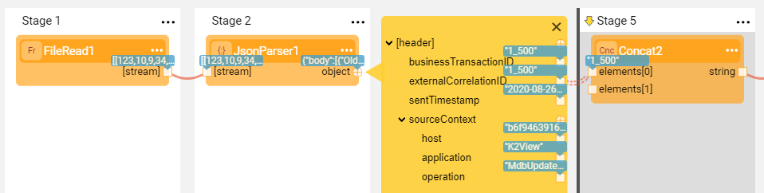

# Iterations
### Overview

Iterations are used to repeatedly perform a section of a Broadway flow in a data set. Iterations are similar to a **for...each loop** in the sense that a logic is repeatedly run until no data remains to act upon.

Broadway enables to:

* Loop over:
  * A field of a result set using a [single connection line](21_iterations.md#single-connection-line).
  * [Multiple elements of a result set](21_iterations.md#multiple-connection-lines-from-a-result-array) with various combination of connection lines.
  * [Multiple JSON elements](21_iterations.md#multiple-connection-lines-from-a-json-object) with various combination of connection lines and data elements on different levels in the object's hierarchy, for example a field and a nested array.
  * Multiple result sets of different Actors in the same iteration - [Split Iterations](21_iterations.md#split-iterations).
* Execute a [nested iteration](21_iterations.md#nested-iterations) within an iteration.
* [Control the loops programmatically](21_iterations.md#programmatic-control) using JavaScript.

The common use cases are iterating over a database result set, over a data returned by an HTTP call or an API or over Kafka messages. For example, [Broadway population flow](/articles/07_table_population/14_table_population_based_Broadway.md) includes an iteration over the source DB data for loading it into the target DB. 

### How Do I Define an Iteration in a Flow?

To start the iteration, draw the line from the originating Actor's output and set the line's [Link Type](07_broadway_flow_linking_actors.md#link-object-properties) to **Iterate**. The connection line becomes double-dotted, the background of the loop's scope is highlighted grey and a thick divider line is displayed at the starting point.

The scope of the iteration's logic starts immediately after the iteration line and continues until the end of the flow or until the **Iterate Close** Stage. To mark an iteration Stage as closed, click  in the [Stage context menu](18_broadway_flow_window.md#stage-context-menu) >  **Iterate Close** to display a second thick divider line at the iteration ending point.

In the below example, the **StringsArray** Actor is the iteration's originating Actor that returns an array of strings and the **Iterate on array** Stage runs on each array element. Then the iteration is closed and the flow continues.

### Single Connection Line

A simple iteration is when there is a single connection line from the originating Actor's output.

The originating Actor's output can be a simple object such as an array of strings or a complex object that includes an array of fields and nested arrays, such as an SQL query result set or a JSON object. 

The **Iterate** connection can be drawn from the output object itself or from any of its elements. 

#### Iterate Over a Row in a Result Array

The **result** output returns an array of maps. In each iteration, take the values of the entire map.

#### Iterate Over a Field in a Result Array

Iterate on all the values of the **CUSTOMER_ID** field in the **result** output array.

#### Iterate Over a Field in a Nested Array in a JSON Object

Iterate on all the values of the **externalCorrelationID** field in the **[header]** internal array in the output JSON object.

### Multiple Connection Lines from a Result Array

In a flow there may be a need to iterate over several elements of the result set whereby it is possible to combine different link types. Note that the data flow changes based on the connection types.

#### Combination of Two or More **Iterate** Link Types

- Takes the values of the connected elements from the same iteration.

- In the below example: iterate over the **result** output array and take the values of CUSTOMER_ID, CONTRACT_REF_ID and CONTRACT_DESCRIPTION of the **current** iteration.

  

#### Combination of **Iterate** and **Value** (or **First**) Link Types

- The elements connected using an **Iterate** link type, will have the value of the **current** iteration.
- The elements connected using a **Value** (or **First**) link type, will have the value of the **first** iteration during all iterations.

### Multiple Connection Lines from a JSON Object

When the originating Actor's output is a JSON object, the iteration's complexity increases because a JSON object usually includes an internal hierarchy of fields and nested arrays. Thus the iteration logic over a JSON object with multiple links is impacted by the answers to the following questions:

* Are the connected elements on the same level of hierarchy of the JSON object or on different levels?
* Are the link types the same (all **Iterate**) or different (**Iterate** combined with other)?
* Do the connected elements belong to different nested arrays? See the explanation and the examples of this scenario in the [Split Iterations](21_iterations.md#split-iterations) section.

If the connected elements of the JSON are on the same level of hierarchy (such as two fields of the same array), the iteration behavior is the same as the iterations over [multiple connection lines in a result array](). 

#### Iterate Over Both a Field and a Nested Array

* The connected elements are on different levels of hierarchy: **entityType** field in [resources] array and **objectType** field in [hardware] nested array.
* Both are connected using the **Iterate** link type. 
* The iteration runs over all **entityTypes** of the [resources] array, and for each one - over all the elements of the [hardware] nested array.

#### Iterate Over a Field and Take a Nested Array by Value

- The connected elements are on different levels of hierarchy: **entityType** field in [resources] array and the **[hardware]** nested array.
- The **entityType** is connected using the **Iterate** link type, while the **[hardware]** nested array is connected using the **Value** link type.
- The iteration runs over all **entityTypes** of the [resources] array, and for each **entityType** takes all its hardware (the nested array's data).

#### Iterate Over a Field and Take a First Value of a Nested Array

* This is a private case of the previous scenario with the same connected elements.
* The **entityType** is connected using the **Iterate** link type, while the **[hardware]** nested array is connected using the **First** link type.
* The iteration runs over all **entityTypes** of the [resources] array, and for each **entityType** takes the first element of its hardware nested array.

#### Take an Array by Value and Iterate Over a Field in the Same Array

* The connected elements are on different levels of hierarchy: **entityType** field in [resources] array and the whole **[resources]** array.
* The **entityType** is connected using the **Iterate** link type, while the **[resources]** array is connected using the **Value** link type.
* The iteration runs over all **entityTypes** of the [resources] array while during each iteration - the whole [resources] array is passed by value (the same data in all iterations).

### Split Iterations

*TO BE UPDATED AFTER THE DESIGN IS FINILIZED*

A Stage can have more than one collection. A common case is a JSON data structure that contains more than one array.
Using the Stage Split functionality you can split the flow and manage several loops over the same data structure.

### Nested Iterations

Iterations can also be nested. For example, a value in an iteration can be used as an input for another iteration. The depth of the iteration is highlighted in shades of grey. To limit the loop's scope using **Iterate Close**, add a closing Stage to each level of the loop.
There are no limitations on the iteration nesting level. However, to make a flow more readable, consider limiting a flow to 3-4 nesting levels and using [Inner Flows](22_broadway_flow_inner_flows.md) when more are needed.

In the following image, the first name is an input to a query that gets a list of relevant phone numbers. Stage 2 is run on every entry in Stage 1 and Stage 3 on every entry in Stage 2.

### ForLoop Actor

The **ForLoop** Actor can be used to create a virtual data set of integers in a given range. This enables creating a loop that runs N times over a synthetic data set and is useful for repeat iterations when there is no data set to traverse.

### Programmatic Control

The Broadway Context object enables an Actor to programmatically access and control the loop using the Loop interface.
A Loop Context object can be accessed via the **Context.loop()** method in Java or using the **contextLoop** instance in JavaScript.

The following methods are supported:
* **Loop.stop()**, stops the current loop and continues execution after the loop. All Actors in the same Stage as the calling Actor are still invoked.

* **Loop.skip()**, skips the current loop iteration and continues to the next data entry. All Actors in the current Stage are still invoked.

* **Loop.index()**, returns the current loop index. The index of the first iteration = 0.

In a nested loop, you can only access the inner-most (deepest) loop that is running in the current Stage.

For more information, refer to the iterate-for-each.flow Broadway example.

