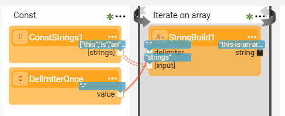
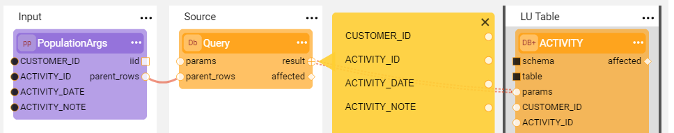
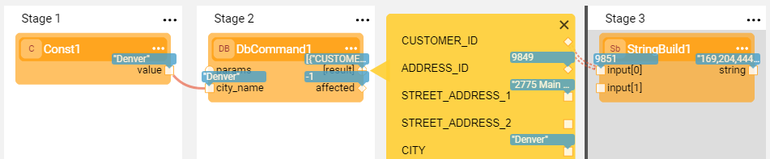
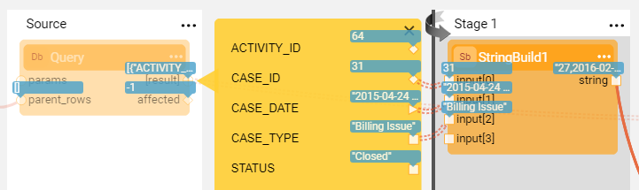
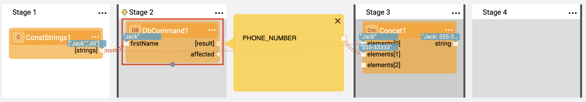

# Iterations
### Overview

Iterations are used to repeatedly perform a section of a Broadway flow in a data set. Iterations are similar to a **for...each loop** in the sense that a logic is repeatedly run until no data remains to act upon.

Common use cases are iterating over a database result set, over data returned by an HTTP call or an API or, over Kafka messages. For example, the [Broadway population flow](/articles/07_table_population/14_table_population_based_Broadway.md) includes an iteration over the data in the source DB to load it into the target DB. 

This article describes how Broadway performs the following:

* Defines an iteration in a flow.
* Loops over one or more elements of a result set.
* Creates a [nested iteration](21_iterations.md#nested-iterations) within an iteration.
* [Controls the loops programmatically](21_iterations.md#programmatic-control) using JavaScript.

To learn about more complex iteration scenarios, such as iterating on different levels of the output object's hierarchy or combining multiple result sets, refer to the [Complex Iteration Flows](21a_complex_iteration_flows.md) article.

### How Do I Define an Iteration in a Flow?

To start the iteration, draw the line from the originating Actor's output and set the line's [Link Type](07_broadway_flow_linking_actors.md#link-object-properties) to **Iterate**. The connection line becomes double-dotted, the background of the loop's scope is highlighted grey and a thick divider line is displayed at the starting point.

The scope of the iteration's logic starts immediately after the iteration line and continues until the end of the flow or until the **Iterate Close** Stage. To mark an iteration Stage as closed, click  in the [Stage context menu](18_broadway_flow_window.md#stage-context-menu) >  **Iterate Close** to display a second thick divider line on the iteration's ending point.

In the following example, the **StringsArray** Actor is the iteration's originating Actor that returns an array of strings and the **Iterate on array** Stage runs on each array element. The iteration is closed at the end of **Iterate on array** Stage.

### How Do I Iterate Over a Data Set?

Iteration over the data set starts once the originating Actor's output is connected to another Actor's input using an **Iterate** link type. 

The originating Actor's output can be a simple object (for example, an SQL query result set) or a complex object that includes internal hierarchy (for example, a JSON object). 

The **Iterate** connection can be drawn from the output object or from any of its elements. 

#### Iterate Over a Row in a Result Array

The **result** output returns an array of maps. In each iteration, takes the values of the entire map.

#### Iterate Over an Element in a Result Array

Iterate on all the values of the **CASE_ID** and **NOTE_ID** fields in the **result** output array.

#### Iterate Over Two or More Elements

Iterate over several elements of the result set to combine different link types. 

- Broadway takes the values of the connected elements from the same iteration.

- In the following example: iterate over the **result** output array and in each iteration take the values of the **current** iteration.

  

Note that combining the link types changes the data flow as follows:

- Elements connected by an **Iterate** link type, return the value of the **current** iteration.
- Elements connected by a **Value** (or **First**) link type, return the value of the **first** iteration during all iterations.

[Click for more information about Complex Iteration Flows](/articles/19_Broadway/21a_complex_iteration_flows.md).

### How Can I Create a Nested Iteration?

Iterations can also be nested. For example, a value in an iteration can be used as an input for another iteration. The depth of the iteration is highlighted in shades of grey. To limit the loop's scope using **Iterate Close**, add a closing Stage to each level of the loop.
There are no limitations on the iteration nesting level. However, to make a flow more readable, consider limiting a flow to 3-4 nesting levels and using [Inner Flows](22_broadway_flow_inner_flows.md) when more are needed.

In the following image, the first name is an input to a query that gets a list of relevant phone numbers. Stage 2 is run on every entry in Stage 1 and Stage 3 on every entry in Stage 2.

### ForLoop Actor

The **ForLoop** Actor can be used to create a virtual data set of integers in a given range. This enables creating a loop that runs N times over a synthetic data set and is useful for repeat iterations when there is no data set to traverse.

### Programmatic Control

The Broadway Context object enables an Actor to programmatically access and control the loop using the Loop interface.
A Loop Context object can be accessed via the **Context.loop()** method in Java or using the **contextLoop** instance in JavaScript.

The following methods are supported:
* **Loop.stop()**, stops the current loop and continues execution after the loop. All Actors in the same Stage as the calling Actor are still invoked.

* **Loop.skip()**, skips the current loop iteration and continues to the next data entry. All Actors in the current Stage are still invoked.

* **Loop.index()**, returns the current loop index. The index of the first iteration = 0.

In a nested loop, only the inner-most (deepest) loop that is running in the current Stage can be accessed.

For more information, refer to the **iterate-for-each.flow** Broadway example.

