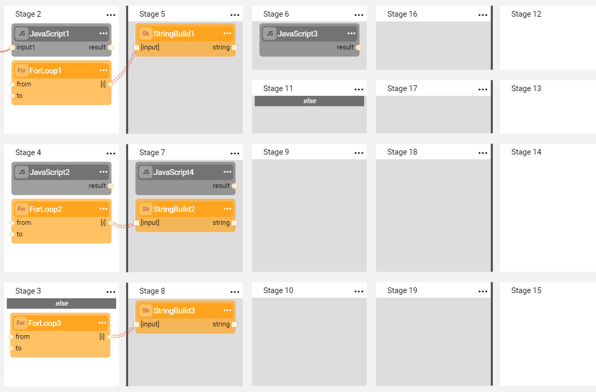
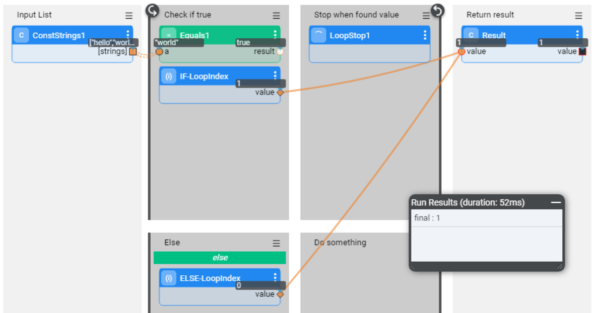
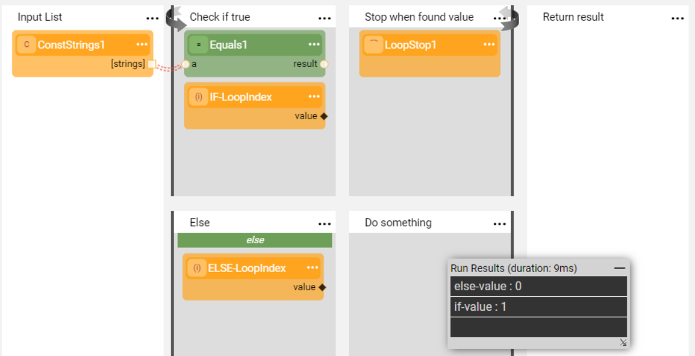

# Iterations With Conditions

This article describes various use cases when a combination of an iteration and conditions is used in a flow. It provides recommendations for correct handling of such use cases.

### Split Due to Stage Condition in Iteration

When a flow is split into branches due to conditions and it includes an additional split inside the iteration, the split inside the loop is only applicable for the duration of the loop.

The following flow displays an example for a flow of iterations with conditions. If Stage 2 is true, its branch will start and execute Stage 5. Then, either Stage 8 or 11 will be executed starting an additional split. 

Note: Following the completion of the loop, both Stages 17 and 18 will run as they depend on Stage 2 and not on the conditions inside the loop.

### Using Outputs of Actors in Split Iteration

When a flow has an iteration and it is split into branches due to conditions within the iteration, you need to carefully define your required output. 

The following flow displays an example of a match search in the input list and an iteration index return once the match has been found. The best practice for this kind of flow is not to define the external output inside the iteration but rather outside. Note that **Result** Actor at the **Return Result** Stage is linked to both IF and ELSE branches. The returned value belongs to the Actor that runs the last, **IF-LoopIndex** in this case.

If however you need to get the last index of both IF and ELSE branches (when each of them was true), the flow should be as below. 

