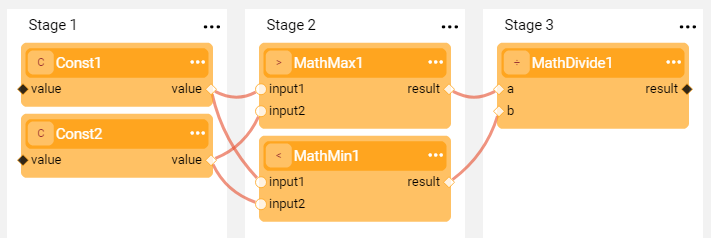
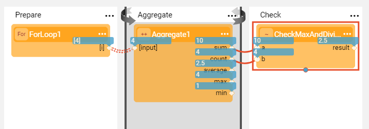
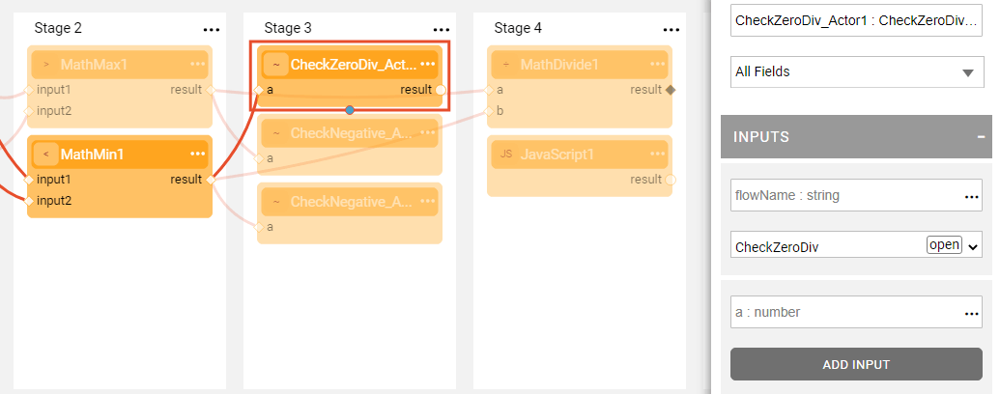

# Inner Flows

### Inner Flow Actor Types
A Broadway flow can be executed as part of another Broadway flow. This function can be used when the same logic needs to be executed in several flows or several Stages of the same flow. 

An inner flow can be run using of the following [built-in Actor types](04_built_in_actor_types.md):

* **InnerFlow** Actor, executes an attached flow or an Actor. Input and output arguments reflect the inputs and outputs of external arguments to and from the inner flow.
* **InnerFlowDynamic** Actor, extends an **InnerFlow** Actor. The Actor can receive a flow (or an Actor) name and a map of input arguments with their values **at run time**. The output is a map of inner flow or Actor's output arguments and their respective values.
* **InnerFlowAsync** Actor, executes a Broadway flow or an Actor asynchronously in a thread pool. When called, the **InnerFlowAsync** Actor returns immediately once a working thread becomes available. When the execution of the attached flow or an Actor is completed, the **InnerFlowAsync** Actor waits for all threads to be completed. Then it returns non-empty results obtained from completed flows. Empty results are not saved.
* **InnerFlowJoin** Actor, waits for all pending tasks of an **InnerFlowAsync** Actor to be completed. The **remaining** output argument (number of flows remaining to be completed) of the **InnerFlowAsync** Actor must be connected to the **remaining** input argument of the **InnerFlowJoin** Actor. The execution is completed once the number of remaining tasks is 0.

When running a flow with inner flows, the inner flows can also be debugged. You can either debug the inner flow by supplying the debug arguments or run the outer flow while opening an inner flow in a separate tab and setting its break points. The flow’s execution stops when it reaches the inner flow's break points.

[Click for more information about debugging Broadway flows](25_broadway_flow_window_run_and_debug_flow.md).

### Save As Actor

An inner Broadway flow can also be created using the **Save as Actor** action in the [Main menu](18_broadway_flow_window.md#main-menu) of the Broadway flow window. This method saves the current flow as a new Actor whereby its logic can be reused in another Broadway flow. When a new Actor is created, it inherits from the **InnerFlow** Actor. 

**Example of Saving an Actor and Using it in Another Flow**

1. Create a flow that encapsulates a specific business logic. For example, given two input numbers, divide a bigger number by a smaller number. 

   

2. Save the flow as a new Actor providing a new Actor's name. For example, **CheckMaxAndDivide**.

4. Add the new Actor to another flow.

   

Full example of a Broadway flow with inner flow Actors can be found in the Demo project.

### Open an Inner Flow

When a flow has inner flows, an inner flow can be opened from the main flow:

1. Click the **InnerFlow** Actor to display the **Open** button in the Actor properties menu next to the inner flow's name.
2. Click **Open** to open the inner flow.

