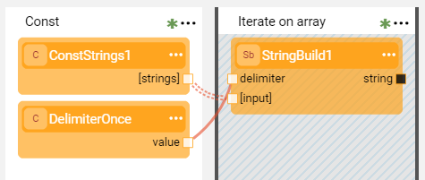
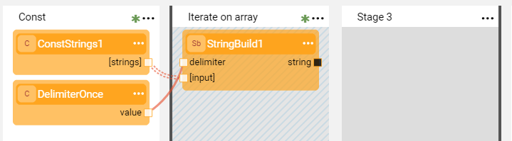
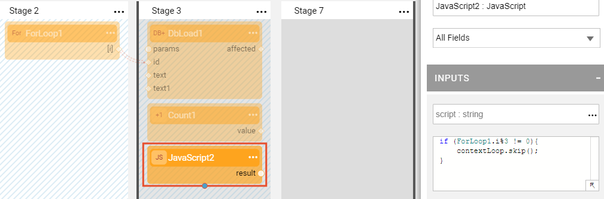
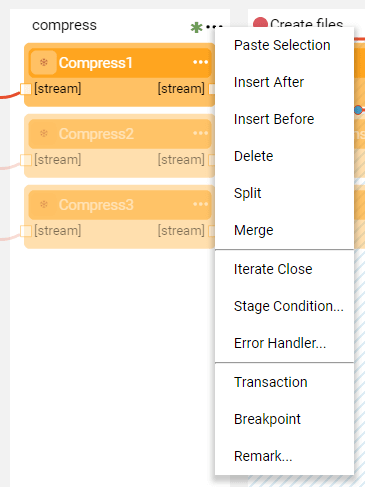
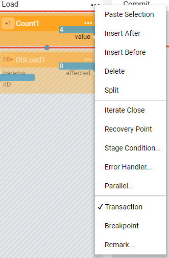

# Transactions

### Transaction Definition

- Broadway has a built-in Transactions Management mechanism. The transaction starts when the [Actor](03_broadway_actor.md) in a [Stage](19_broadway_flow_stages.md) marked as a transaction requests to start a connection. 
- Several sequential Stages marked as transactions are part of the same transaction.
- The transaction ends after the last Stage marked as a transaction or at the end of the flow and is followed by a commit (or by a rollback if there are errors). 

### Inner Flows Behavior

Transactions can include [inner flows](22_broadway_flow_inner_flows.md). If a transactional Stage executes an inner flow, it automatically becomes a part of the outer transaction and can use its shared resource.

When the outer flow starts the transaction and then invokes an inner flow, the inner flow does not close the transaction. The transaction is closed by the outer flow.

### Iteration Behavior

A transaction's behavior within an iteration is based on the flow principal to return to the Stage holding the [**Iterable** Line](21_iterations.md#iterable-line-type) and check if there is a next value there. If this Stage is transactional, the transaction continues and commits after the loop is completed. Otherwise it commits. 

**One Commit Example**

Begin the transaction on the **source data** Stage and commit it at the end of the data set.

**Commit per Iteration Example**

Only the **insert data** Stage inside the loop is transactional.

**Batch Commit Example**

When the data set is very big (for example, 1M records) and a commit is required every X records, you can perform the commit per batch. 

The following example shows how to perform a commit every 3 records using the **JavaScript** Actor and the **contextLoop.skip()** method. Due to the code in the **JavaScript** Actor, the Stage 7 is only reached every 3rd record. Then, the transaction is committed because Stage 7 is not marked as transactional and a new one begins due to return to Stage 2.

Alternative way to implement the transaction per batch is adding a **JavaScript** Stage Condition to Stage 7 instead of the **JavaScript** Actor in Stage 3.

**Many Commits per Each Iteration Example**

The following is an example of a transaction's behavior in the loop when not all Stages inside the loop are transactional. There are two transactions in each iteration: 

- The first transaction begins at the **insert data** Stage and is followed by a commit because the **Additional Step**s Stage is not transactional.
- The second transaction begins at the **query params** Stage and is followed by a commit because the **source data** Stage is not transactional. 

### Impact of Error Handling on Transactions

When an [Error Handler](24_error_handling.md) is defined in the transactional Stage of the flow and it catches an error, the Error Handler can either true to continue the flow or false to stop the flow. If the Error Handler returns false, the transaction ends with a rollback and the flow execution stops. The error message displays the failure reason.

### Impact of Stage Conditions on Transactions

When the flow is split due to [Stage conditions](/articles/19_Broadway/19_broadway_flow_stages.md#what-is-a-stage-condition), the transaction can be defined for only some branches. For example, for an IF-ELSE condition, you can define that the transaction occurs only when the condition is true. 

In the example below, the transaction starts in Stage B1 if the condition is true and ends after the completion of Stage C1. If the condition is false, there is no transaction in this flow.

In the second example, the transaction starts in Stage A. If the condition is true, the transaction ends after the completion of Stage C1. If the condition is false, the transaction ends at the end of Stage A.

Note that if there are several conditions or too many parallel branches in the flow, it is not recommended to use the Transactions mechanism across the branches.

### Shared and Non-Shared Transactional Interfaces

Fabric [Interfaces](/articles/05_DB_interfaces/01_interfaces_overview.md) used in a Broadway flow can be shared or non-shared during the transaction.

* Using a **shared** interface in a flow, the Fabric opens a connection only once within the same transaction, when the first Actor calls this interface. All other Actors will use the same connection. The shared interfaces used by Broadway are DB Interface, file system or SFTP.
* Using  a **non-shared** interface, the Fabric establishes a connection each time an Actor calls the interface in the flow. A non-shared interface used by Broadway is HTTP.  

### How Do I Mark or Unmark a Stage as a Transaction?

In a Broadway flow window, a **Transaction** is marked by blue diagonal lines in the Stage's background and can span across several [Stages](19_broadway_flow_stages.md).

<table>
<tbody>
<tr>
<td valign="center" ><strong>To mark</strong> a Stage, click  > Transaction.</td>
<td valign="center" ><strong>To unmark</strong> a Stage, uncheck Transaction.</td>
</td>
</tr>
<tr>
<td valign="center" ></td>
<td valign="center" ></td>
</td>
</tr>
</tbody>
</table>

